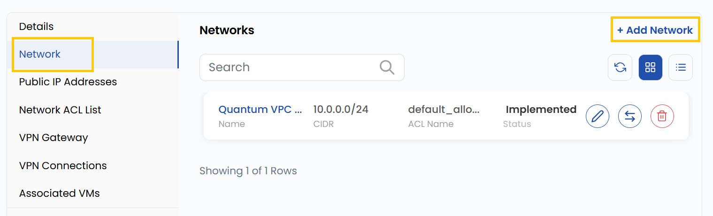
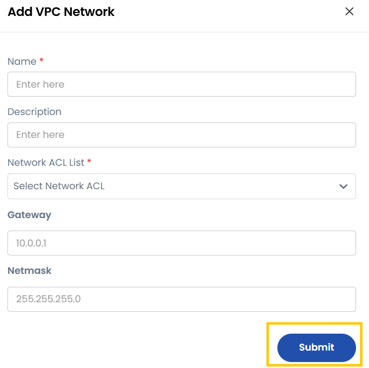

# Add Network

## Add VPC Network

The Network tab displays all networks already created inside the VPC. You can also add a new network if needed.

- Navigate to the **Network** tab. Click **Add Network** to create a new network.

- To add VPC network you need to fill the form with network details.

- **Name**: The identifier for the network.
- **Description**: A summary of the network's purpose.
- **Network**: The subnet CIDR block (e.g., 192.168.1.0/24).
- **ACL (Access Control List)**: A predefined or new ACL to control inbound/outbound traffic.
- **Gateway**: The network gateway for routing traffic.
- **Network Mask**: Network mask in which the network is situated.
- Click **Submit** to create the new network.

### Conclusion

Adding a **VPC Network** allows you to define custom subnets, gateways, and ACLs for better traffic control and organization. With proper configuration, you can create secure and efficient network environments tailored to your project needs.

> [!TIP]
> **See also:**
>
> - **[VPC Network Overview](network-overview.md)**
> - **[Network ACL List](network-acl-list.md)**
> - **[VPN Gateway](vpn-gateway.md)**
> - **[VPN Connections](vpn-connections.md)**
