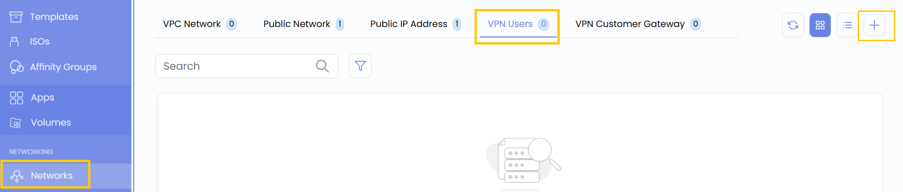
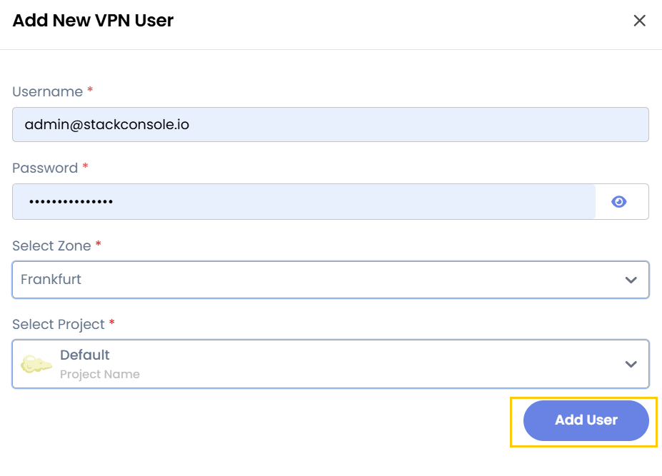

# VPN Users

## VPN Users

A **VPN User** in UzCloud refers to an authenticated individual who connects to the cloud environment via a Virtual Private Network (VPN). This ensures secure remote access to private cloud resources.

- From the left-hand menu, click on the **Networks** tab.
- You will be redirected to the **Networks** page. Go to the **VPN Users** tab.

- Click on the **plus (+)** icon to add a new VPN User. A form will appear where you need to enter the configuration details.
- Enter a **Username** and **Password** for the VPN user, then select the **Project** and **Zone**.
- Click on **Add User** to add the VPN user.

### Conclusion

The **VPN Users** feature allows you to securely add and manage authenticated users for remote access to cloud resources, ensuring safe connectivity and controlled access within your projects.

> [!TIP]
> **See also:**
>
> - **[VPN Customer Gateway](vpn-customer-gateway.md)**
