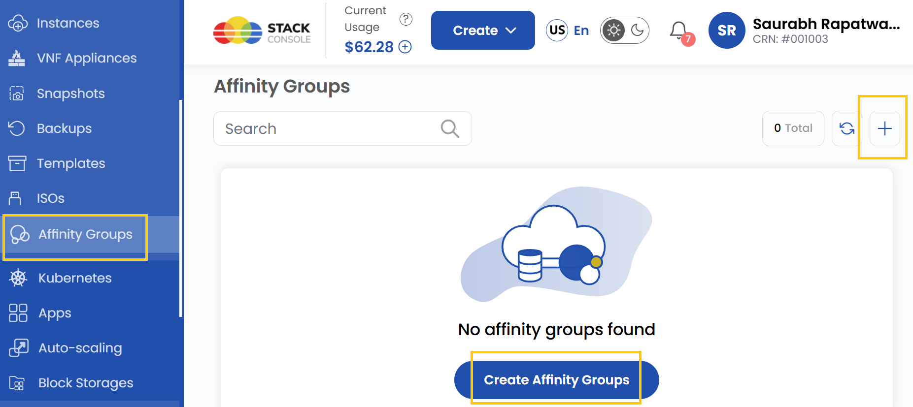
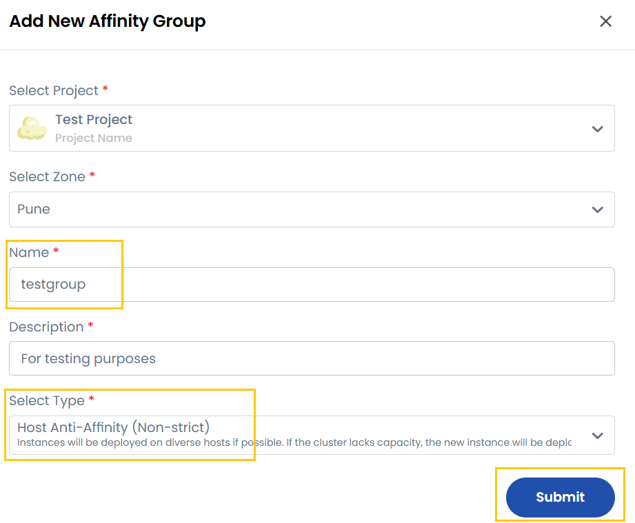

# Создание групп привязки

## Группы привязки (Affinity Groups) в UzCloud

**Группы привязки** (Affinity Groups) позволяют управлять размещением рабочих нагрузок (виртуальных машин, приложений или сервисов) в инфраструктуре по заданным правилам. Они помогают оптимизировать производительность, обеспечивать высокую доступность и эффективно распределять ресурсы.

В **UzCloud** группы привязки управляют размещением виртуальных машин (ВМ) на хостах гипервизора. С их помощью можно задать правила, по которым ВМ размещаются вместе на одном хосте или распределяются по разным хостам.

---

### Создание группы привязки

- В меню слева откройте вкладку **Affinity Groups**.
- Чтобы создать группу, нажмите **Create Affinity Groups** или значок **плюс (+)** в правой части страницы. Откроется форма создания группы.

### Добавление группы привязки

- Выберите проект и нужную зону доступности.

- Введите уникальное имя группы (**Affinity Group**) и краткое описание ее назначения.

- Выберите тип группы в зависимости от требований к развертыванию:

  - **Host Affinity (Strict)** — ВМ из группы всегда должны работать на одном хосте гипервизора. Подходит для нагрузок, которым нужны связь с низкой задержкой и общие ресурсы. Если требование невыполнимо, ВМ не будут развернуты.
  - **Host Anti-Affinity (Strict)** — ВМ всегда должны размещаться на разных хостах гипервизора. Это повышает отказоустойчивость, исключая единую точку отказа. Если отдельных хостов нет, ВМ не будут развернуты.
  - **Host Anti-Affinity (Non-Strict)** — ВМ предпочтительно размещаются на разных хостах, но это не обязательно. Если в кластере не хватает ресурсов, новые ВМ могут быть размещены на том же хосте, что и существующие.
  - **Host Affinity (Non-Strict)** — ВМ предпочтительно размещаются на одном хосте, но при необходимости могут быть размещены на других. Если на основном хосте не хватает ресурсов, новые ВМ будут размещены на доступном хосте.

- Нажмите **Submit** — группа привязки будет создана.

### Заключение

Следуя этому руководству, вы легко создадите группы привязки в UzCloud и сможете управлять ими. Группы привязки — мощный инструмент управления размещением виртуальных машин, обеспечивающий оптимальную производительность, высокую доступность и эффективное распределение ресурсов. Если нужна помощь, изучите документацию UzCloud или обратитесь в поддержку.
