# Создание автомасштабирования

## Автомасштабирование

**Автомасштабирование** (auto-scaling) автоматически изменяет количество виртуальных машин (ВМ) в зависимости от текущей нагрузки. Оно обеспечивает доступность и оптимальную производительность приложений и снижает затраты, увеличивая или уменьшая ресурсы по мере необходимости.

---

### Создание группы автомасштабирования

- В меню слева откройте вкладку **Auto-scaling**.
- Чтобы создать группу автомасштабирования, нажмите **Auto-scaling** или **Create New** в правой части страницы. Откроется меню создания.

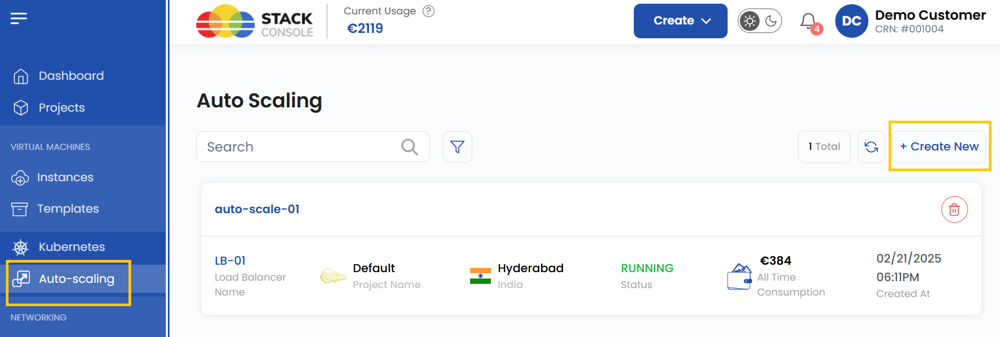

### Привязка к проекту

- Привяжите группу автомасштабирования к одному из ваших проектов, чтобы удобно организовывать ресурсы и управлять ими.

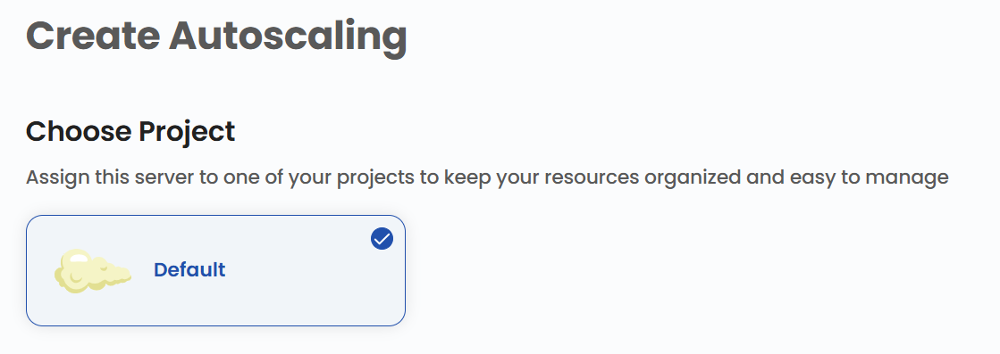

### Выбор расположения

- Выберите дата-центр, в котором будут физически размещены серверы.
- Выберите одно из доступных расположений.

### Выбор сети

- Настройте или выберите сеть для серверов. Это может быть изолированная частная сеть; также можно создать эластичную сеть для связи нескольких регионов.
- Новую сеть можно создать, выбрав **Create New Network**.

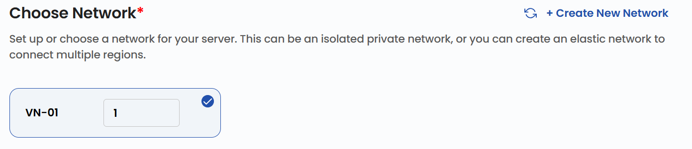

### Выбор балансировщика нагрузки

- Балансировщик нагрузки распределяет входящий трафик между несколькими ВМ. Выберите нужный **Load Balancer** из списка.

### Правила перенаправления

- Настройте правила перенаправления, определяющие, как трафик распределяется между серверами.
- Укажите диапазон портов для входящего трафика: **Public** (публичный) и **Private** (частный) порты.

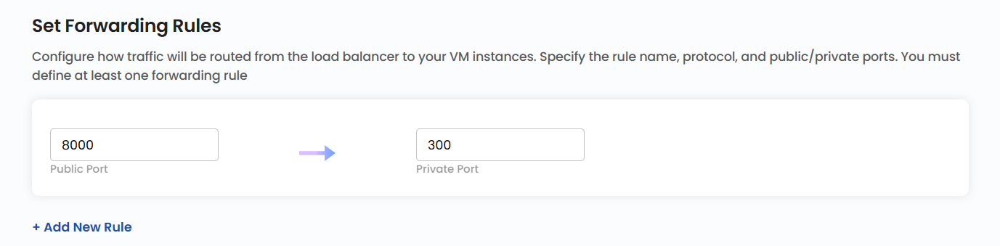

### Выбор образа

- Выберите операционную систему или шаблон приложения для установки на серверы. Для большей гибкости можно загрузить собственный ISO-образ.

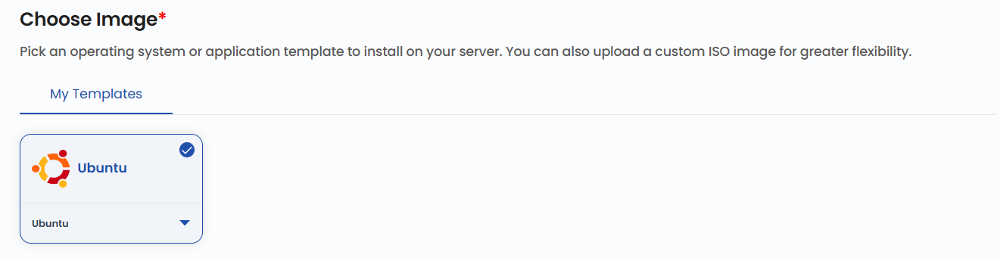

### Выбор тарифного плана

- Выберите план в соответствии с требованиями к CPU, памяти, хранилищу и пропускной способности. При необходимости можно создать собственный план.
- Стоимость будет зависеть от выбранных ресурсов.

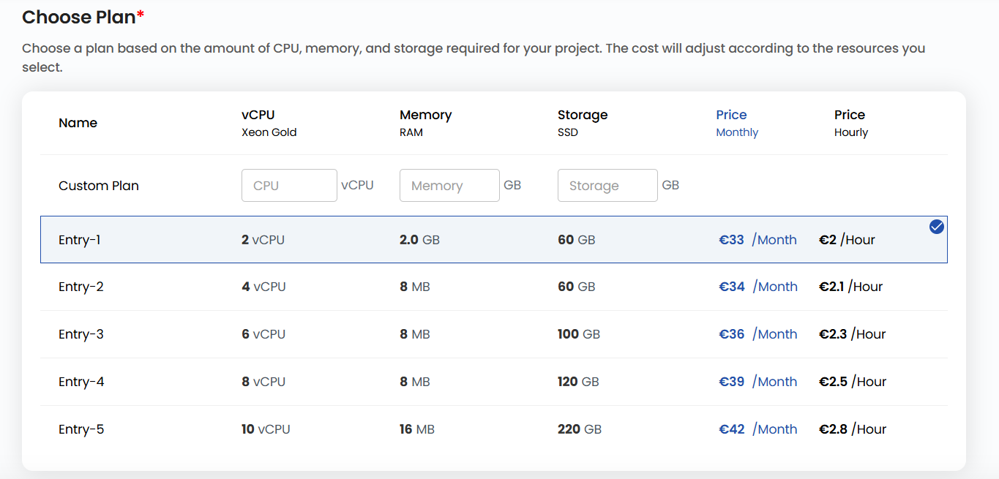

### Настройки сервера

- В настройках сервера можно задать пароль для повышения безопасности. Нажмите **Set now**.
- Введите **Username** и **Password** и нажмите **Confirm**, чтобы сохранить пароль.

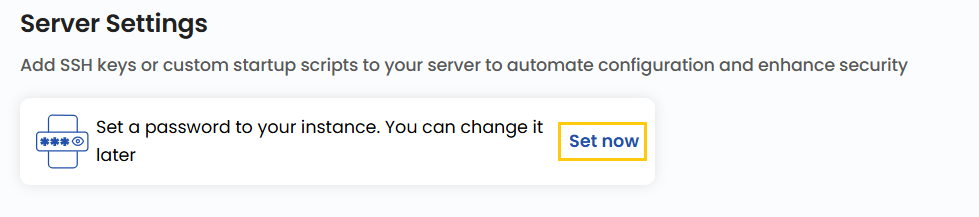

### Планирование мощности

- Укажите минимальное и максимальное количество ВМ и период ожидания (grace period) в секундах.

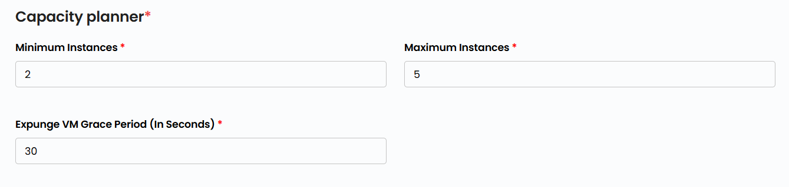

### Настройка политик

- Политика **Scale Up** срабатывает, когда использование ресурсов превышает заданный порог, и добавляет ВМ для обработки возросшей нагрузки.

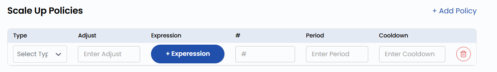

- Политика **Scale Down** срабатывает при снижении нагрузки и уменьшает количество активных ВМ для экономии.

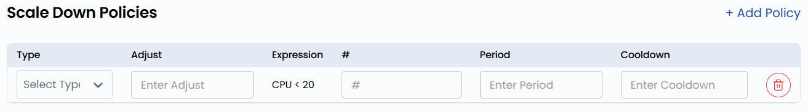

- Нажмите **Expression**, чтобы добавить условие к политикам Scale Up и Scale Down. Укажите **Counter** (счетчик), **Operator** (оператор) и **Threshold** (порог) и нажмите **Submit**.

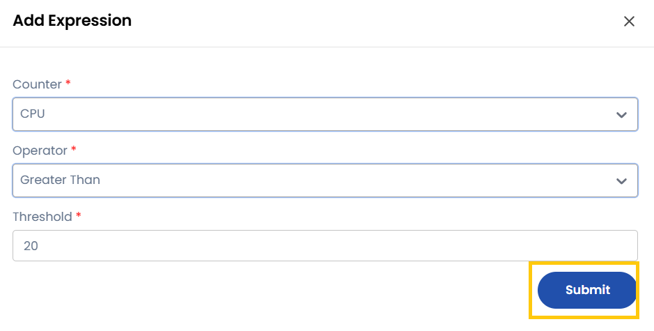

- **Scheduled Policies** (политики по расписанию) выполняют заранее заданные действия масштабирования в определенное время, а не в ответ на текущие метрики.

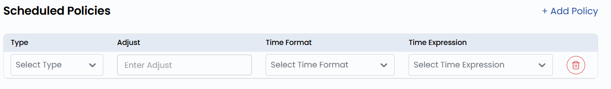

### Имя группы автомасштабирования

- Укажите уникальное **Auto-scaling Name**, чтобы легко находить группу в панели управления.

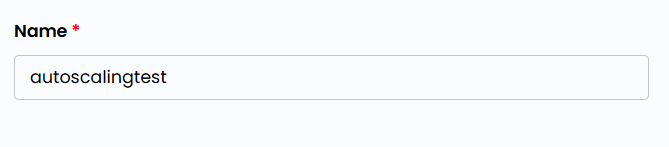

### Создание группы автомасштабирования

- Выберите нужный **Billing Cycle**. Для автомасштабирования поддерживаются периоды: ежемесячный, ежеквартальный, раз в полгода, ежегодный, раз в два года и раз в три года.
- Поддерживаемые правила биллинга: Date to Date, Fixed Calendar Month, Unfixed Calendar Month, Fixed Prorata и Unfixed Prorata.
- Автомасштабирование использует ту же модель оплаты, что и другие масштабируемые сервисы, и адаптируется к нагрузке.
- Проверьте все параметры и итоговую стоимость. Нажмите **Create**, чтобы создать группу автомасштабирования.

### Заключение

Автомасштабирование помогает поддерживать производительность, доступность и экономическую эффективность приложений, автоматически подстраивая ресурсы под нагрузку. Тщательно настроив сети, балансировщики нагрузки, параметры серверов и политики масштабирования, вы обеспечите плавную адаптацию нагрузок к изменениям трафика.
