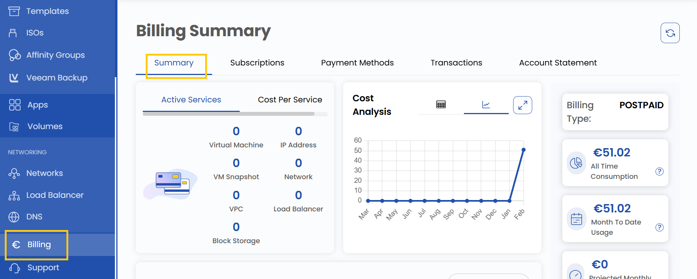
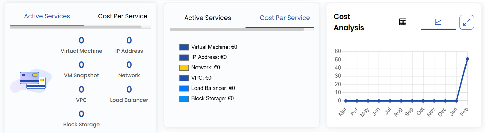
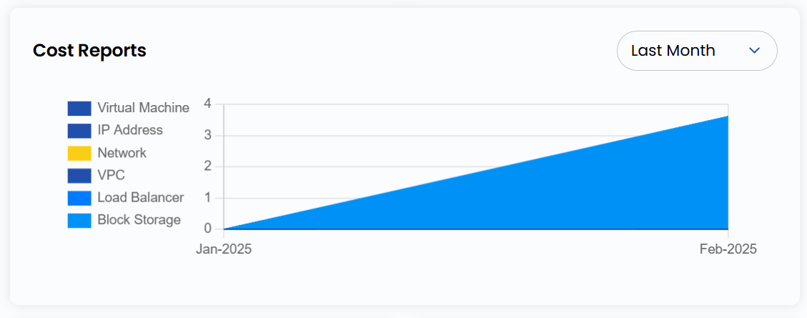
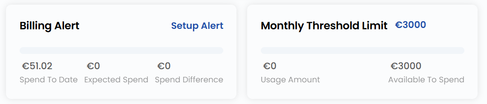
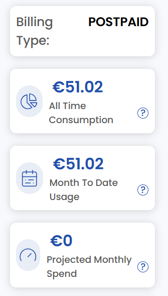
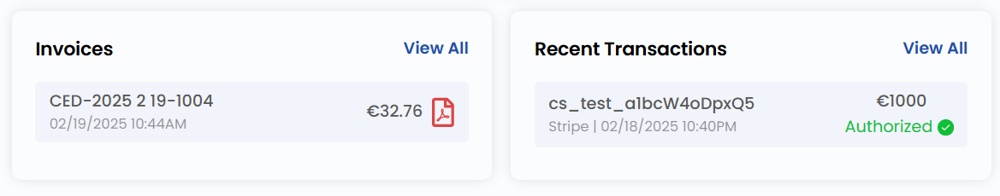

# Сводка по биллингу

## Руководство по сводке биллинга

В этом руководстве пошагово описана работа с разделом **Billing Summary** в UzCloud: активные сервисы, анализ затрат, кошелек, месячный лимит, счета и другие вкладки, связанные с оплатой.

- В меню слева откройте **Billing**.
- Нажмите **Summary**, чтобы открыть сводку по биллингу.

### Активные сервисы

- Раздел **Active Services** содержит сводку по активным сервисам: количество виртуальных машин, IP-адресов, сетей и т. д.
- На вкладке **Cost Per Service** отображаются затраты по каждому сервису.

### Отчеты о затратах

- Используйте раздел **Cost Reports**, чтобы подробно изучить расходы по каждому ресурсу.

### Месячный лимит

- **Monthly Threshold Limit** показывает установленный лимит расходов на месяц и помогает контролировать траты.
- Функция **Billing Alert** помогает контролировать расходы с помощью уведомлений по заданным условиям. Нажмите **Setup Alert**, чтобы получать уведомления при достижении порога расходов или приближении срока оплаты.

### Тип биллинга и использование

- В правой части страницы указан **Billing Type** — Prepaid (предоплата) или Postpaid (постоплата).
- Здесь же отображаются расходы за всё время, использование за месяц и прогноз расходов на месяц.

### Счета

- В разделе **Invoices** отображаются все счета аккаунта: прошлые, текущие неоплаченные и сроки оплаты. Регулярно просматривайте счета, чтобы быть в курсе обязательств и не допускать просрочек.

### Последние транзакции

- Раздел **Recent Transactions** содержит подробный список последних финансовых операций по аккаунту. Он помогает сохранять прозрачность истории платежей и отслеживать недавние оплаты.

