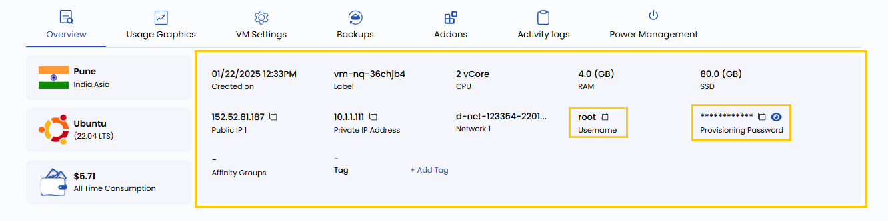

# Подключение по RDP

## Доступ к Windows-ВМ по RDP в UzCloud

**Remote Desktop Protocol (RDP)** позволяет безопасно подключаться к виртуальной машине (ВМ) с Windows и управлять ею удаленно. В этом руководстве пошагово описано, как получить учетные данные в UzCloud и подключиться к Windows-ВМ по RDP.

---

### Откройте обзор виртуальной машины

- В меню слева нажмите **Instances**.
- На странице **Virtual Machine Instance** выберите нужную ВМ.
- На вкладке **VM Overview** найдите поля **Username** и **Password** и скопируйте их значения.

### Запустите RDP-клиент

Для подключения к ВМ откройте RDP-клиент на своем компьютере:

- **Windows**:

  - Нажмите Win + R, введите `mstsc` и нажмите Enter.
  - Или найдите **Remote Desktop Connection** (Подключение к удаленному рабочему столу) в меню «Пуск».

- **macOS**:

  - Установите **Microsoft Remote Desktop** из Mac App Store, если приложение еще не установлено.
  - Откройте Microsoft Remote Desktop.

- **Linux**:

  - Установите RDP-клиент, например **Remmina** (в Ubuntu/Debian: `sudo apt install remmina`).
  - Откройте Remmina и выберите протокол **RDP**.

### Подключитесь к Windows-ВМ

- Запустите на своем компьютере RDP-клиент.
- Найдите **Public IP Address** ВМ на вкладке **Overview** в UzCloud.
- Укажите **Public IP Address** в RDP-клиенте.
- Когда появится запрос, введите **Username** и **Password**, скопированные из UzCloud.
- Если появится предупреждение безопасности о подлинности удаленного компьютера, отметьте **«Don't ask me again for connections to this computer»** и нажмите **Yes**.
- Нажмите **OK** или **Connect**, чтобы установить удаленный сеанс.

### Работа с Windows-ВМ

После подключения по RDP вы можете:

- полностью управлять Windows-ВМ, как физическим компьютером;
- устанавливать программы и настраивать систему;
- передавать файлы между компьютером и ВМ через копирование и вставку или общие папки.

### Заключение

Следуя этому руководству, вы легко подключитесь к Windows-ВМ в UzCloud по протоколу RDP. RDP — безопасный и эффективный способ доступа к виртуальным машинам для администрирования, установки ПО и передачи файлов. Если нужна помощь, изучите документацию UzCloud или обратитесь в поддержку.

> [!TIP]
> **См. также:**
>
> - **[Подключение по SSH](connect-with-ssh.md)**
> - **[Доступ к консоли](console-access.md)**
