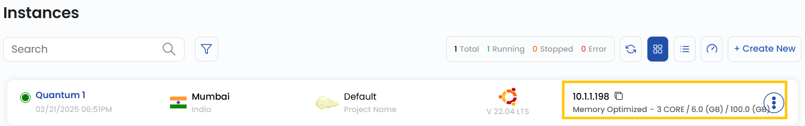
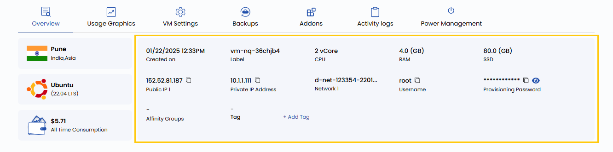

# Подключение по SSH

## Подключение по SSH в UzCloud

Управлять виртуальной машиной можно через терминал по SSH. Это позволяет безопасно подключаться и выполнять административные задачи удаленно — с помощью SSH-клиента или напрямую из терминала. В этом руководстве пошагово описано, как подключиться к облачной ВМ по SSH.

---

### Подготовка к подключению по SSH

Перед подключением убедитесь, что у вас есть следующая информация:

- **IP-адрес** — указан на карточке ВМ или на странице Virtual Machine Overview.

- **Имя пользователя по умолчанию** — зависит от операционной системы (`root`, `ubuntu`, `ec2-user`).

- **Способ аутентификации**:

  - **SSH-ключ (рекомендуется)** — убедитесь, что у вас есть файл приватного ключа.
  - **Пароль по умолчанию** — указан на странице Virtual Machine Overview, если SSH-ключ не используется.



### Информация о виртуальной машине

- **IP-адрес** ВМ отображается на ее карточке после создания. Наведите на него курсор, чтобы скопировать.
- Подробная информация о ВМ находится на странице **Virtual Machine Overview** — откройте ее, нажав на имя ВМ на карточке.



### Подключение к виртуальной машине

- Откройте терминал:

  - **В Windows**: Command Prompt, PowerShell или Git Bash.
  - **В macOS или Linux**: встроенный терминал.

- Выполните команду SSH для подключения:

  - **Если вы используете SSH-ключ**:

    ```bash
    ssh -i /path/to/your/private/key [username]@[ip_address]
    ```

  - **Если вы используете пароль**:

    ```bash
    ssh [username]@[ip_address]
    ```

- Введите пароль, если он будет запрошен. **Пример подключения с паролем**:

  ```bash
  ssh root@192.168.1.1
  ```

### Заключение

Следуя этому руководству, вы сможете безопасно подключаться к облачной ВМ по SSH. Используете ли вы SSH-ключ или пароль, SSH — надежный и безопасный способ удаленного доступа и управления. Если нужна помощь, изучите документацию UzCloud или обратитесь в поддержку.

> [!TIP]
> **См. также:**
>
> - **[Подключение по RDP](connect-with-rdp.md)**
> - **[Доступ к консоли](console-access.md)**
> - **[SSH-ключи](vm-settings/ssh-keys.md)**
