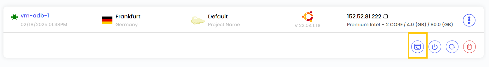
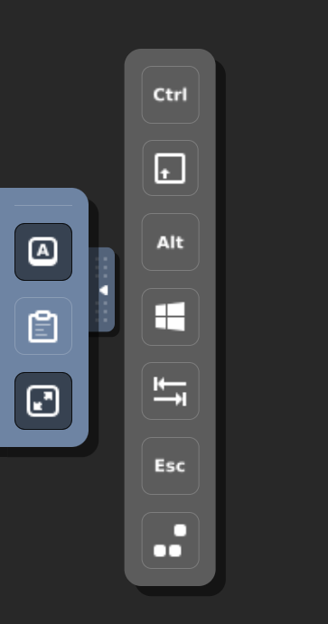
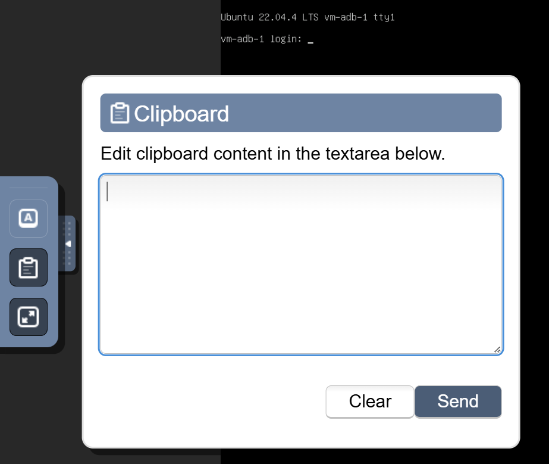

# Доступ к консоли

## Доступ к консоли виртуальных машин

Функция **Console Access** позволяет управлять виртуальной машиной (ВМ) и работать с ней через веб-интерфейс. Это особенно полезно для диагностики проблем при загрузке, настройки системы и работы с операционной системой ВМ так, как если бы вы находились непосредственно у машины.

- Чтобы открыть консоль, нажмите на значок консоли в меню действий.

### Сочетания клавиш

Интерфейс консоли содержит инструменты для удобного управления ВМ: специальные клавиатурные действия, работу с буфером обмена и полноэкранный режим. Доступные действия:

- **Toggle Control (Ctrl)** — имитирует нажатие клавиши Control для выполнения команд с Ctrl внутри ВМ.
- **Toggle Alt** — имитирует нажатие клавиши Alt.
- **Toggle Shift** — имитирует нажатие клавиши Shift.
- **Toggle Windows Key** — имитирует клавишу Windows, позволяя открыть меню «Пуск» или использовать системные сочетания клавиш в Windows.
- **Send Tab** — отправляет в ВМ нажатие Tab, обычно для перехода между полями форм и элементами интерфейса.
- **Send Escape (Esc)** — отправляет нажатие Escape.
- **Send Ctrl+Alt+Delete** — отправляет сочетание Ctrl+Alt+Delete.
- **Clipboard** — позволяет копировать текст между локальным компьютером и ВМ.

- **Full-Screen Mode** — разворачивает консоль ВМ на весь экран, обеспечивая работу без отвлечений, как за физическим компьютером.

### Управление виртуальной машиной

Через консоль можно выполнять практически любые задачи, требующие прямого доступа к машине, например:

- установку программного обеспечения;
- изменение настроек;
- диагностику операционной системы.

Эта функция упрощает администрирование ВМ и особенно полезна системным администраторам, которым нужно обслуживать серверы через веб-интерфейс без внешних программ вроде SSH или RDP.

### Заключение

Функция **Console Access** — мощный и понятный способ работать с виртуальными машинами прямо через веб-интерфейс. Диагностируете ли вы проблемы загрузки, настраиваете систему или выполняете административные задачи, консоль обеспечивает удобное и эффективное управление ВМ. Если нужна помощь, изучите документацию UzCloud или обратитесь в поддержку.

> [!TIP]
> **См. также:**
>
> - **[Подключение по SSH](connect-with-ssh.md)**
> - **[Подключение по RDP](connect-with-rdp.md)**
