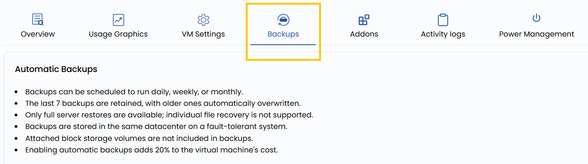

# Резервные копии ВМ

## Резервное копирование виртуальных машин в UzCloud

**Резервные копии** сохраняют данные виртуальной машины и защищают от случайного удаления, сбоев ПО и угроз безопасности. Включив резервное копирование, вы всегда будете иметь версию ВМ, из которой можно восстановиться.

**UzCloud** поддерживает автоматическое резервное копирование ежедневно, еженедельно или по собственному расписанию — данные можно восстановить без ручной работы. Резервное копирование критически важно для защиты данных и сокращения простоев при непредвиденных проблемах.

- Чтобы настроить автоматическое резервное копирование ВМ, откройте вкладку **Backups**.
- На вкладке **Backups** можно включить автоматическое резервное копирование ВМ или запланировать резервную копию на определенное время.

> [!TIP]
> **См. также:**
>
> - **[Виртуальная машина](compute-instance.md)**
> - **[Обзор виртуальной машины](instance-overview.md)**
> - **[Создание резервных копий](../backups/create-backups.md)**
