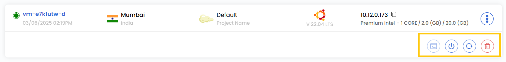
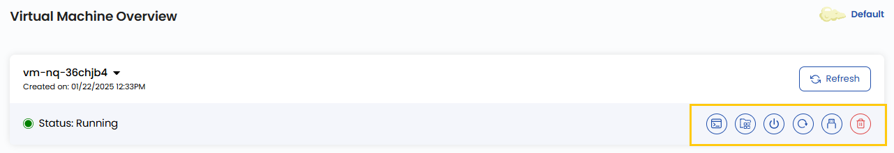
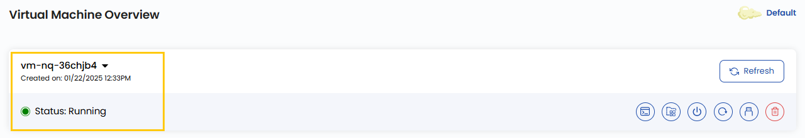
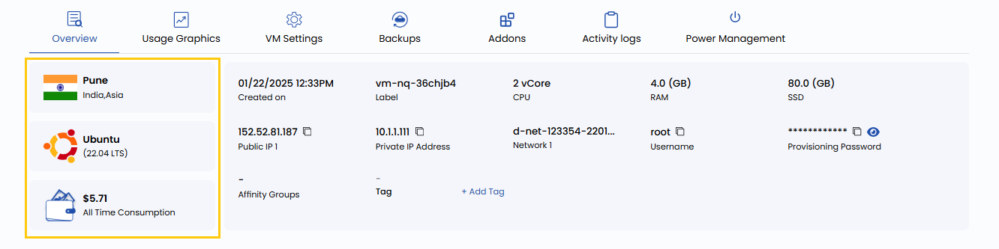
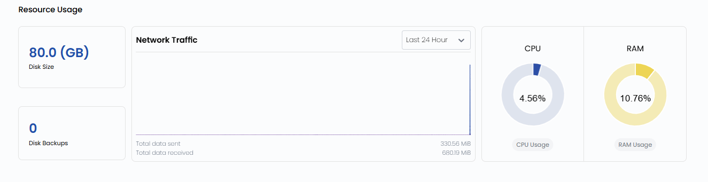

# Обзор виртуальной машины

## Обзор виртуальной машины в UzCloud

Страница **Instance Overview** содержит подробную сводку о виртуальной машине (ВМ) и инструменты управления ею: сведения о статусе, расположении, операционной системе, производительности, а также быстрые действия.

---

### Кнопки действий

- Кнопки действий — это быстрый доступ к типовым операциям с ВМ.
- Для быстрых действий нажмите на три точки справа, чтобы открыть меню действий.

- Чтобы увидеть все кнопки действий, нажмите на виртуальную машину — откроется страница **Virtual Machine Overview**.

- **Refresh** — обновляет статус ВМ и информацию на странице.
- **Console Access** — открывает консоль для прямой работы с ВМ.
- **VM Volume Snapshots** — показывает список снимков или позволяет сделать снимок текущего состояния ВМ для резервного копирования или последующего восстановления.
- **Power Off** — выключает виртуальную машину.
- **Reboot** — перезагружает виртуальную машину.
- **Attach ISO for VM** — подключает ISO-файл к ВМ для установки или восстановления системы.
- **Delete** — безвозвратно удаляет виртуальную машину.

### Информация о виртуальной машине

- **Instance Name** — имя виртуальной машины.
- **Created on** — дата и время создания.
- **Status** — текущий статус работы ВМ.

### Сведения о виртуальной машине

- **Location** — дата-центр, в котором расположена ВМ.
- **Operating System** — операционная система ВМ.
- **Cost** — стоимость потребления ВМ за всё время.

### Характеристики ресурсов

- **Label** — пользовательская метка ВМ.
- **CPU** — количество выделенных vCPU.
- **RAM** — объем доступной памяти.
- **Disk Size** — размер диска.
- **Public IP Address** — публичный IP-адрес ВМ.
- **Private IP Address** — внутренний IP-адрес в сети.
- **Network** — связанная сеть.
- **Username** — имя пользователя по умолчанию для входа.
- **Password** — пароль ВМ.
- **Affinity Group** — правила размещения ВМ в рамках группы для оптимальной производительности.
- **Tag** — теги для категоризации и организации. Чтобы добавить тег, нажмите **Add Tag**, укажите Key (ключ) и Value (значение) и нажмите **Submit**.

### Использование ресурсов

- Блок использования ресурсов помогает отслеживать нагрузку на CPU, RAM, диск и сеть во времени.

- **Disk Size** — заполненность диска.
- **Network Traffic** — метрики сетевого трафика за выбранный период (по умолчанию — последние 24 часа).
- **CPU Usage** — текущая загрузка процессора в процентах.
- **RAM Usage** — объем потребляемой памяти.

### Заключение

Страница **Instance Overview** дает полное и при этом наглядное представление о конфигурации ВМ и возможностях управления ею. Кнопки действий позволяют быстро управлять состоянием ВМ, а характеристики ресурсов помогают следить за ее производительностью и поведением. Если нужна помощь, изучите документацию UzCloud или обратитесь в поддержку.

> [!TIP]
> **См. также:**
>
> - **[Виртуальная машина](compute-instance.md)**
> - **[Мониторинг ресурсов](monitoring-resources.md)**
> - **[Доступ к консоли](console-access.md)**
