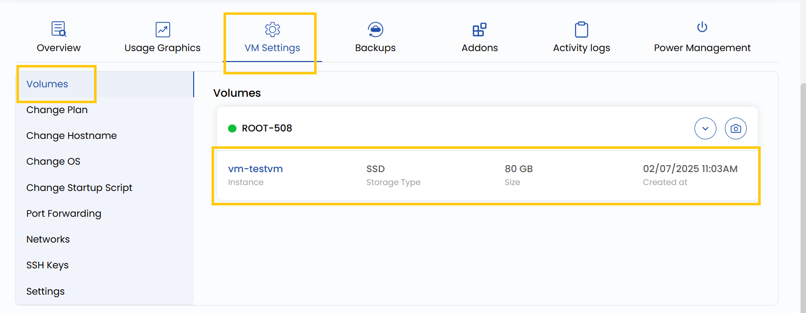

# Блочное хранилище

## Обзор блочного хранилища

Блочное хранилище позволяет подключать к виртуальной машине дополнительные тома. Такие тома работают как независимые масштабируемые диски, на которых можно хранить данные приложений, резервные копии и другие файлы. Их можно отключать и подключать к другим виртуальным машинам без потери данных. Это удобно, чтобы отделить операционную систему от данных приложений.

---

- Чтобы посмотреть тома виртуальной машины, откройте **VM settings** и перейдите в раздел **Volume** — здесь отображаются тома и их размер.
- Чтобы увидеть ранее созданные снимки тома, нажмите на стрелку вправо, чтобы развернуть список.
- Чтобы создать новый снимок, нажмите на значок камеры справа. Будет зафиксировано текущее состояние тома, и при необходимости его можно будет восстановить.

---

### Заключение

Блочное хранилище — надежный и модульный способ управлять данными независимо от виртуальных машин. Возможность создавать снимки, масштабировать тома и подключать их к разным ВМ обеспечивает как гибкость, так и защиту данных. Регулярно делайте снимки, чтобы защитить важные данные, и управляйте хранилищем через панель настроек ВМ.

> [!TIP]
> **См. также:**
>
> - **[Создание тома](../../volumes/create-volume.md)**
> - **[Снимок тома](../../volume-snapshots/create-volume-snapshot.md)**
> - **[Снимок ВМ](../../vm-snapshots/create-instance-snapshot.md)**
