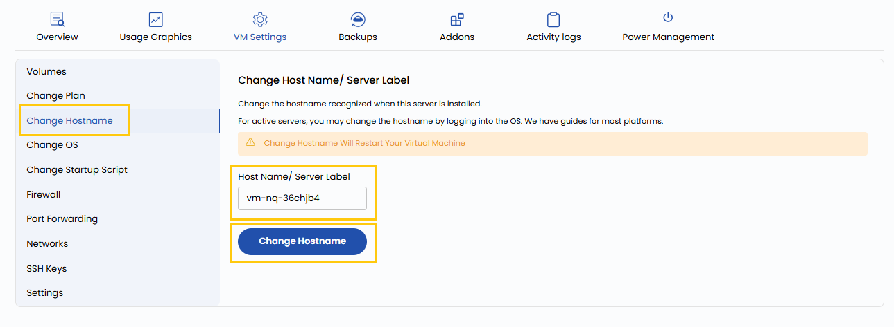

# Изменение имени хоста

## Настройка имени хоста

Имя хоста (hostname) — уникальный идентификатор виртуальной машины в сети. С помощью этой настройки можно изменить имя хоста ВМ в соответствии со стандартами вашей организации или требованиями проекта. Смена имени хоста упрощает идентификацию, интеграцию с доменными службами и соблюдение правил именования.

---

- Чтобы изменить имя хоста, откройте **VM settings** и перейдите в раздел **Change Hostname**.
- Введите новое имя хоста и нажмите **Change Hostname**.
- Так изменяется имя хоста, которое используется при установке сервера. На работающем сервере имя хоста также можно изменить, войдя в операционную систему.

> [!WARNING]
> Изменение имени хоста приведет к перезагрузке виртуальной машины.

---

### Заключение

Изменение имени хоста виртуальной машины — простой, но важный шаг для поддержания порядка и единообразия в инфраструктуре. Это упрощает идентификацию, интеграцию с доменом и соблюдение правил именования. Убедитесь, что новое имя соответствует внутренним стандартам и единообразно используется во всей среде.
