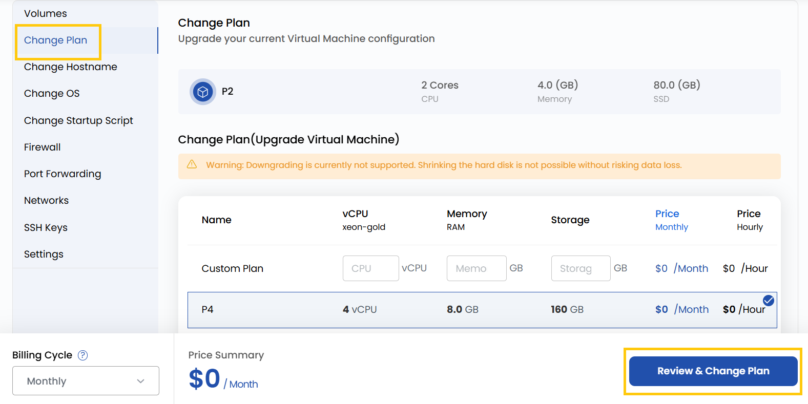

# Смена тарифного плана

## Смена тарифного плана ВМ

С помощью этой настройки можно увеличить или уменьшить ресурсы ВМ: количество ядер CPU, объем RAM и хранилища. Это полезно, когда требования к ресурсам меняются, — например, чтобы повысить производительность в периоды пиковой нагрузки или сократить расходы, когда ресурсов нужно меньше. При смене плана ВМ может быть перезагружена.

---

- Чтобы сменить тарифный план, откройте **VM settings** и перейдите в раздел **Change Plan**.
- Выберите один из доступных вариантов или создайте собственный план.

> [!WARNING]
> Понижение тарифного плана сейчас не поддерживается. Уменьшить размер диска без риска потери данных невозможно.

- Проверьте выбранные параметры и нажмите **Review and Change Plan**, чтобы применить новый план.

---

### Заключение

Изменение тарифного плана позволяет эффективно масштабировать ресурсы в соответствии с текущими потребностями. Оптимизируете ли вы производительность или затраты, смена плана помогает поддерживать инфраструктуру в соответствии с задачами бизнеса. Внимательно проверяйте параметры плана и учитывайте, что некоторые изменения могут потребовать перезагрузки ВМ.
