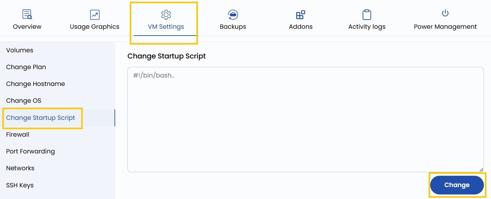

# Изменение скрипта запуска

## Изменение скрипта запуска

Скрипты запуска (startup scripts) выполняются автоматически при инициализации или перезагрузке виртуальной машины. Эта настройка позволяет обновить или заменить скрипт, который настраивает ВМ в эти моменты. Типичные сценарии — установка ПО, применение системных обновлений или настройка конфигурации приложений.

---

- Чтобы изменить скрипт запуска, откройте **VM settings** и перейдите в раздел **Change Startup Script**.
- Добавьте нужный скрипт и нажмите **Change**.

---

### Заключение

Изменение скрипта запуска позволяет автоматизировать ключевые настройки при каждой загрузке ВМ. Будь то развертывание ПО или инициализация переменных окружения, хорошо написанный скрипт обеспечивает единообразие и эффективность работы виртуальной машины. Перед применением изменений проверяйте синтаксис скрипта, чтобы избежать ошибок при загрузке.
