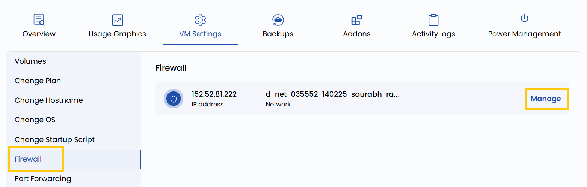

# Межсетевой экран

## Настройка межсетевого экрана

Межсетевой экран (firewall) позволяет задать правила безопасности для входящего и исходящего сетевого трафика виртуальной машины. Можно разрешать или запрещать доступ для определенных IP-адресов, портов или протоколов. Например, можно заблокировать весь трафик, кроме SSH (порт 22) и веб-трафика (порты 80/443). Это важно для защиты ВМ от несанкционированного доступа.

---

- Чтобы изменить настройки межсетевого экрана, откройте **VM settings** и перейдите в раздел **Firewall**.
- Нажмите **Manage**, чтобы изменить настройки межсетевого экрана для этой сети.

---

### Заключение

Правильная настройка межсетевого экрана критически важна для безопасности и целостности виртуальных машин. Задавая точные правила для разрешенного и запрещенного трафика, вы уменьшаете поверхность атаки и допускаете только доверенные подключения. Регулярно проверяйте настройки межсетевого экрана на соответствие политикам безопасности.
