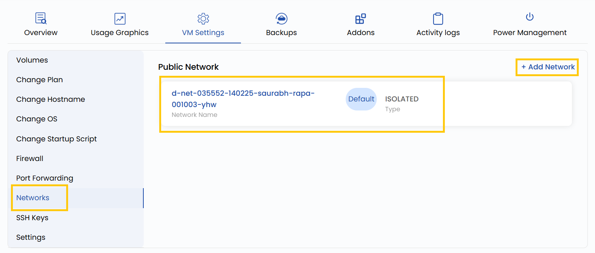

# Сети

## Настройка сети

Эта настройка позволяет управлять сетевыми интерфейсами ВМ, в том числе частными и публичными сетями. Частные сети используются для связи между виртуальными машинами без выхода в интернет, а публичные предоставляют внешние IP-адреса для доступа в интернет. Здесь же можно изменять ограничения пропускной способности и назначать или удалять IP-адреса.

---

- Чтобы добавить или изменить сетевые настройки, откройте **VM settings** и перейдите в раздел **Networks**.
- Нажмите **Add Network**, чтобы добавить сеть, или нажмите на сеть, чтобы изменить ее настройки.

---

### Заключение

Управление сетевыми настройками важно для связности и безопасности виртуальных машин. Настраиваете ли вы внутреннюю связь через частные сети или публикуете сервисы через публичные, гибкое назначение интерфейсов позволяет адаптировать инфраструктуру под конкретные задачи. Проверяйте настройки пропускной способности и доступа, чтобы избежать конфликтов и обеспечить оптимальную производительность.

> [!TIP]
> - **[Создание VPC-сетей](../../networks/vpc-network/create-vpc-network.md)**
> - **[Создание публичных сетей](../../networks/public-network/create-public-network.md)**
