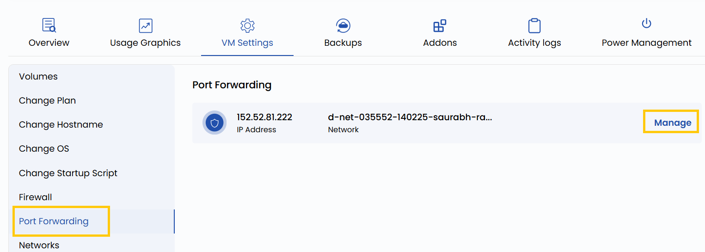

# Проброс портов

## Проброс портов

Проброс портов (port forwarding) позволяет перенаправлять трафик с определенного порта хоста или публичного IP-адреса на порт виртуальной машины. Например, можно перенаправить внешний трафик с порта 8080 на порт 80 ВМ для доступа к веб-серверу. Это удобно, чтобы открыть доступ извне к сервисам на ВМ, сохраняя гибкость настройки.

---

- Чтобы перенаправить трафик сети, откройте **VM settings** и перейдите в раздел **Port Forwarding**.
- Нажмите **Manage**, чтобы изменить настройки портов для этой сети.

---

### Заключение

Проброс портов — мощная возможность для внешнего доступа к сервисам на ВМ. Будь то веб-сервер, SSH или собственное приложение, правильная настройка обеспечивает удобное и безопасное подключение. Всегда проверяйте правила портов, чтобы избежать конфликтов и открывать только необходимые порты.
