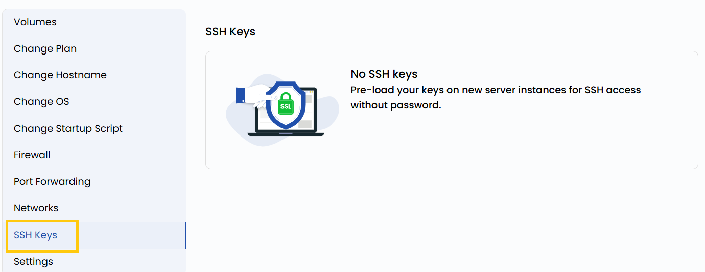

# SSH-ключи

## Доступ по SSH-ключу

SSH-ключи обеспечивают безопасный доступ к виртуальной машине без пароля. Эта настройка позволяет просматривать публичные SSH-ключи, которым разрешен вход на ВМ. Аутентификация по ключу избавляет от необходимости помнить пароли и снижает риск несанкционированного доступа в результате атак перебором.

---

- Чтобы просмотреть SSH-ключ, откройте **VM settings** и перейдите в раздел **SSH Keys**.

> [!WARNING]
> Чтобы сбросить SSH-ключ, необходимо остановить виртуальную машину.

---

### Заключение

Аутентификация по SSH-ключу — более безопасная и удобная альтернатива входу по паролю. Управляя разрешенными ключами через настройки ВМ, вы контролируете доступ к виртуальной машине. Регулярно проверяйте SSH-ключи и отзывайте неиспользуемые или устаревшие.

> [!TIP]
> **См. также:**
>
> - **[Подключение по SSH](../connect-with-ssh.md)**
