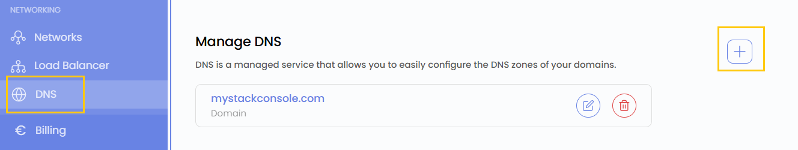
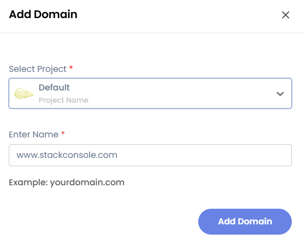

# Создание DNS

## Система доменных имен (DNS) в UzCloud

**Система доменных имен (DNS)** — важнейший компонент интернета, который преобразует понятные человеку доменные имена (например, google.com) в IP-адреса (например, 142.250.190.14). Благодаря DNS пользователи открывают сайты и онлайн-сервисы, не запоминая числовые IP-адреса.

---

### Создание DNS-зоны

- В меню слева откройте вкладку **DNS**.
- Откроется страница **DNS**. Чтобы добавить домен, нажмите значок **плюс (+)** в правой части страницы.

### Добавление домена

- В форме выберите **Project** (проект) и введите имя домена.
- Нажмите **Add Domain** — домен будет создан.

### Заключение

Следуя этому руководству, вы легко добавите домены с помощью функции **DNS** в UzCloud и сможете управлять ими. DNS упрощает доступ к сайтам и онлайн-сервисам, преобразуя доменные имена в IP-адреса. Если нужна помощь, изучите документацию UzCloud или обратитесь в поддержку.

> [!TIP]
> **См. также:**
>
> - **[Управление DNS](manage-dns.md)**
