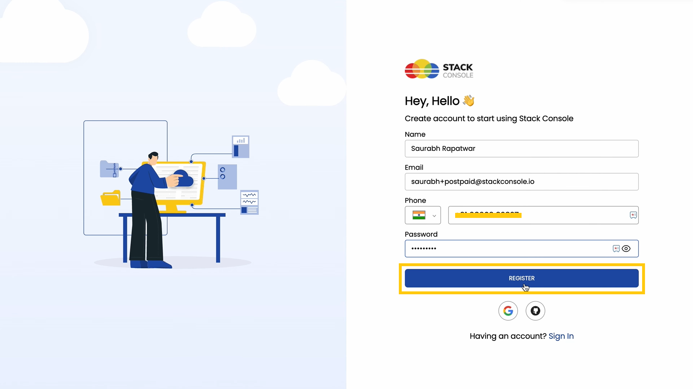
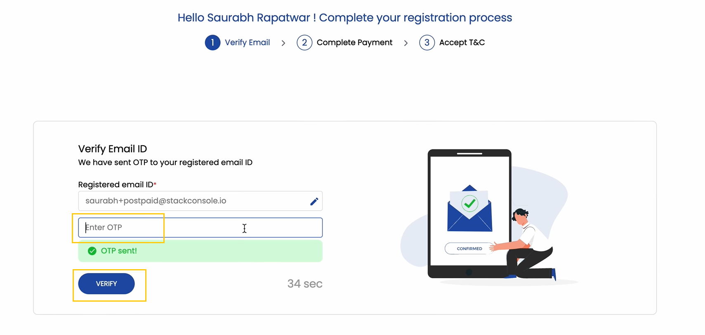
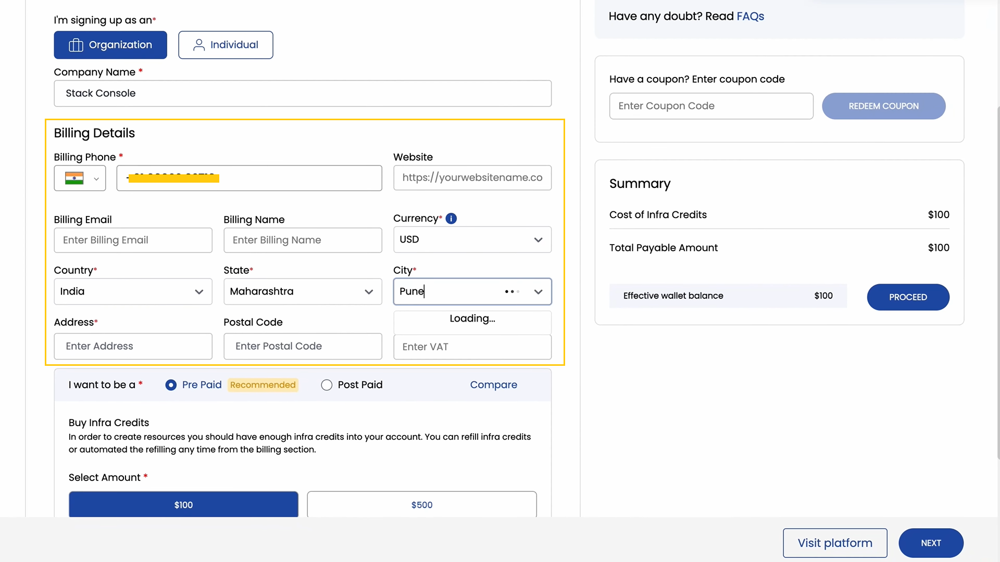
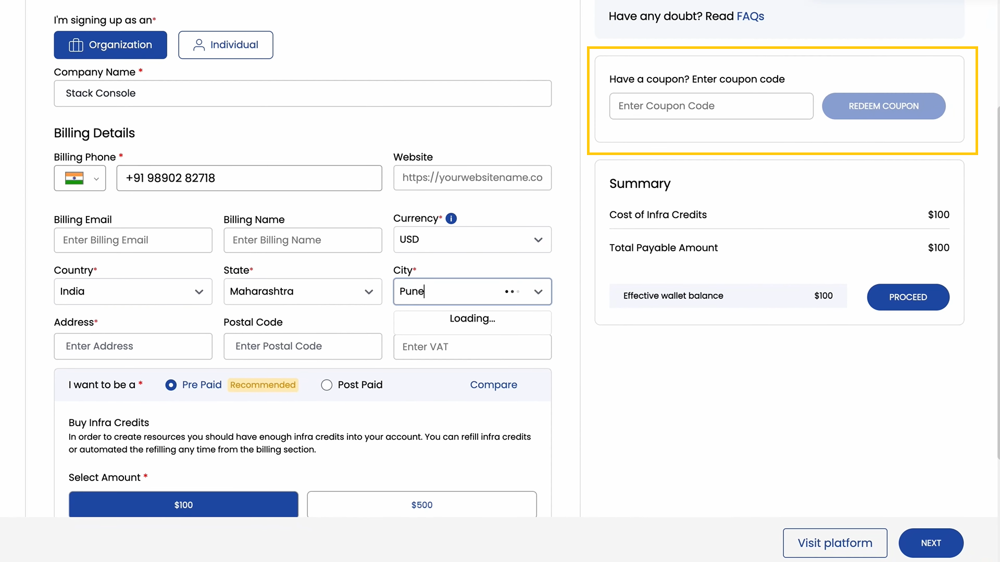
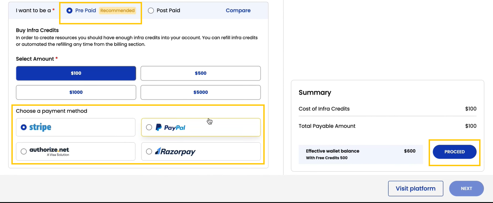
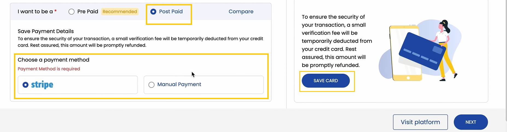
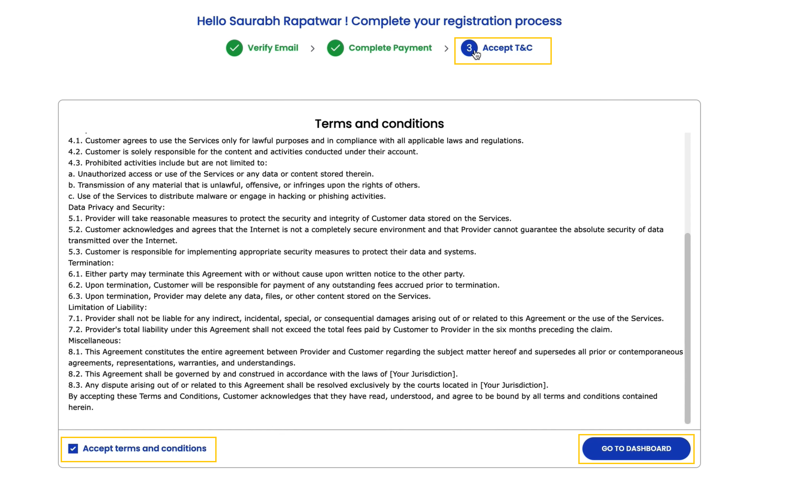
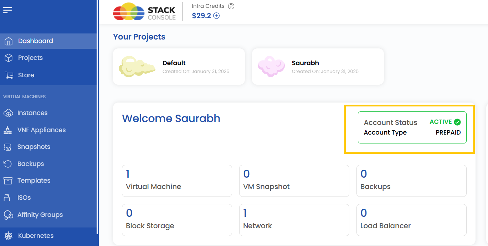
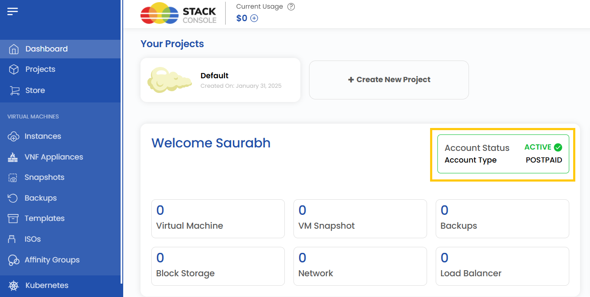

# Регистрация аккаунта

## Руководство по созданию аккаунта UzCloud

В этом руководстве пошагово описано, как создать аккаунт UzCloud, настроить биллинг и подтвердить аккаунт.

### Регистрация аккаунта

- Откройте консоль UzCloud по адресу [console.uzcloud.uz](https://console.uzcloud.uz) и перейдите в раздел **Sign-In** или **Create Account**.
- Введите необходимые данные: имя, адрес электронной почты и пароль.
- Нажмите **Register**, чтобы перейти к следующему шагу.

### Подтверждение email

- Проверьте почтовый ящик: вы получите от UzCloud письмо с одноразовым паролем (OTP).
- Введите **OTP** в соответствующее поле на сайте.
- Нажмите **Verify**, чтобы подтвердить адрес и перейти к настройке биллинга.

### Настройка платежных данных

- После подтверждения аккаунта вам будет предложено указать платежную информацию.

- Выберите тип плательщика:

  - **Individual** — для личного использования; укажите, например, свой адрес.
  - **Company** — для организаций; укажите название компании, сайт и адрес.

- Если у вас есть купон, примените его при оформлении, чтобы получить скидку или промо-предложение.

### Выбор тарифного плана

#### Предоплата (Prepaid, рекомендуется)

- При предоплатной схеме вы заранее пополняете баланс кредитами, которые затем расходуются на создание ресурсов на платформе.
- Чтобы использовать ресурсы, приобретите кредиты на инфраструктуру, выбрав нужную сумму.
- Выберите один из доступных способов оплаты и нажмите **Proceed**, чтобы завершить платеж.

#### Постоплата (Postpaid)

- При постоплатной схеме вы оплачиваете ресурсы после их использования. Для этого варианта может потребоваться дополнительная проверка, например подробные платежные данные или проверка кредитоспособности.
- Выберите один из доступных способов оплаты и нажмите **Save Card**, чтобы завершить настройку.

### Завершение регистрации

- Внимательно ознакомьтесь с **Terms & Conditions** (условиями использования) платформы.
- Примите условия, чтобы завершить регистрацию.

- **Пользователи с предоплатой**: статус аккаунта отобразится как активный, тип аккаунта — prepaid.

- **Пользователи с постоплатой**: после проверки статус аккаунта отобразится как активный, тип аккаунта — postpaid.

### Заключение

Настроить аккаунт UzCloud просто. Следуя шагам этого руководства, вы зарегистрируетесь, подтвердите email, настроите биллинг и выберете подходящую схему оплаты. После этого вы получите полный доступ к панели управления UzCloud и всем ее возможностям для эффективного управления ресурсами.
