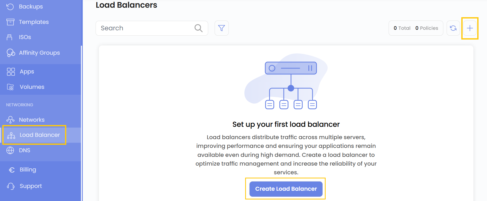
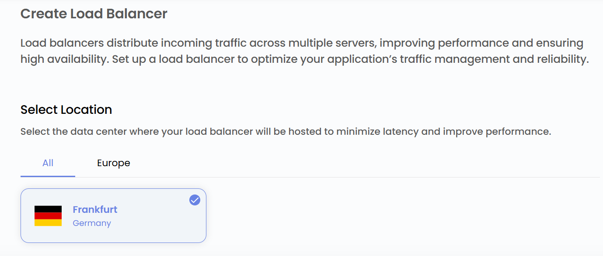
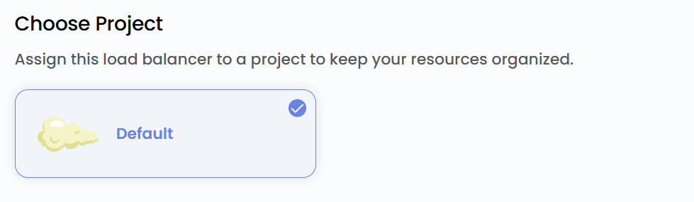
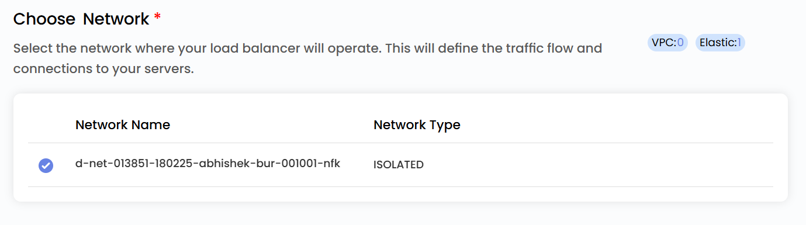
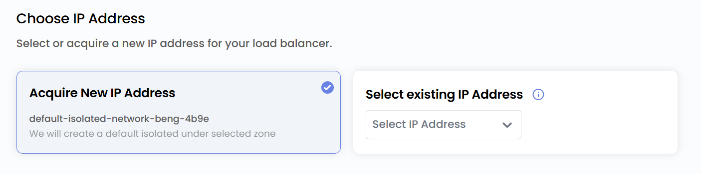
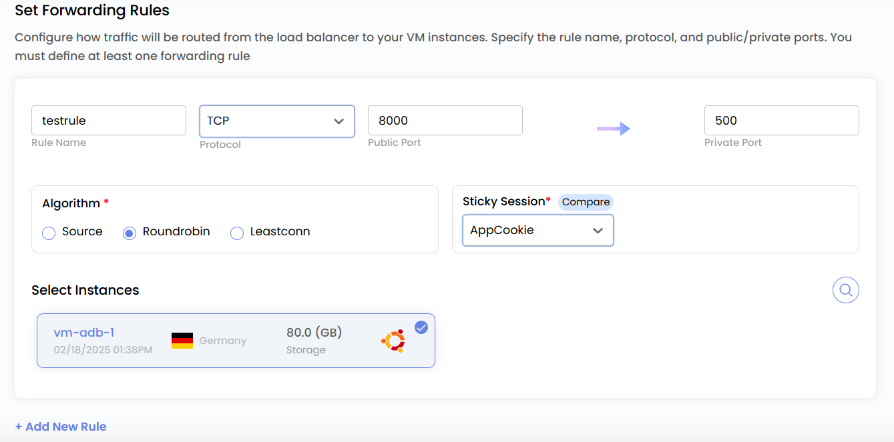
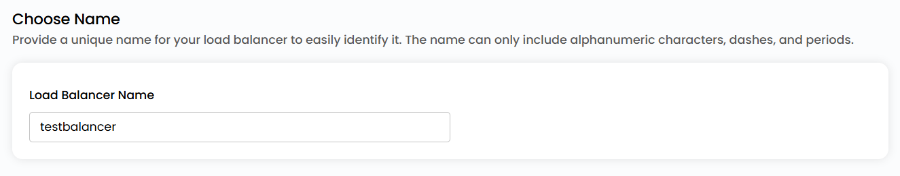
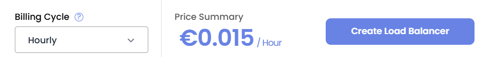
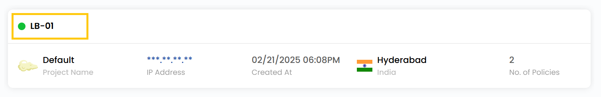
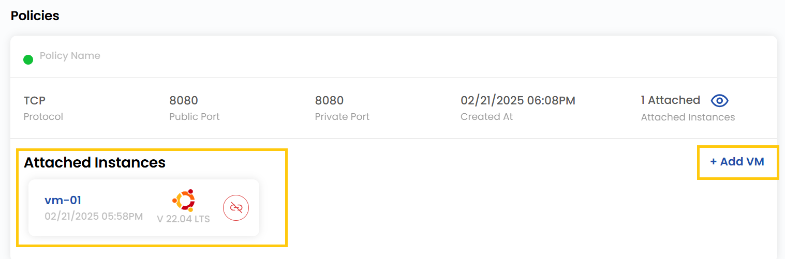

# Балансировщик нагрузки

## Балансировщик нагрузки

**Балансировщик нагрузки** (Load Balancer) распределяет входящий трафик между несколькими серверами, обеспечивая высокую доступность, надежность и производительность. В UzCloud балансировщик можно настроить для веб-приложений, баз данных и других сервисов. В этом руководстве пошагово описано, как настроить балансировщик нагрузки в UzCloud.

---

### Создание балансировщика нагрузки

- В меню слева откройте вкладку **Load Balancer**.
- Чтобы создать балансировщик, нажмите **Load Balancer** или значок **плюс (+)** в правой части страницы. Откроется меню создания.

### Выбор расположения

- Выберите дата-центр, в котором будет физически размещен балансировщик.
- Выберите одно из доступных расположений.

### Привязка к проекту

- Привяжите балансировщик к одному из ваших проектов, чтобы удобно организовывать ресурсы и управлять ими.

### Выбор сети

- Выберите сеть, в которой будет работать балансировщик. Она определяет маршрут трафика и подключения к серверам.

### Выбор IP-адреса

- Выберите IP-адрес балансировщика: **Existing IP Address** (существующий) или **Acquire New IP Address** (новый).
- **Примечание**: при выборе **Acquire New IP** в выбранной зоне будет создан изолированный IP-адрес по умолчанию.

### Правила перенаправления

- Настройте правила перенаправления, определяющие, как трафик распределяется между серверами.

- Укажите уникальное **Rule Name** (имя правила). Выберите **Protocol** (например, TCP, UDP, HTTP, HTTPS). Задайте диапазон портов для входящего трафика.

- Выберите алгоритм распределения запросов между ВМ:

  - **Source** — направляет трафик на одну и ту же ВМ в зависимости от IP-адреса клиента.
  - **Round Robin** — равномерно распределяет трафик между всеми доступными ВМ.
  - **Least Connections** — направляет трафик на ВМ с наименьшим числом активных соединений.

- Можно включить **Sticky sessions** (привязку сессий), чтобы запросы пользователя всегда направлялись на одну и ту же ВМ:

  - **LB Cookie** — привязка сессии с помощью cookie, создаваемой балансировщиком.
  - **App Cookie** — привязка сессии с помощью cookie приложения.
  - **Source-Based** — привязка сессии к ВМ по IP-адресу клиента.
  - **None** — без привязки сессий; запросы распределяются обычным образом.

- Выберите виртуальные машины, которые будут обрабатывать входящий трафик.

### Имя балансировщика

- Укажите уникальное имя балансировщика. Имя может содержать только буквы и цифры, дефисы и точки.

### Создание балансировщика нагрузки

- Выберите нужный **Billing Cycle**. Для балансировщика поддерживаются периоды: почасовой, ежемесячный, ежеквартальный, раз в полгода, ежегодный, раз в два года и раз в три года.
- Поддерживаемые правила биллинга: Date to Date, Fixed Calendar Month, Unfixed Calendar Month, Fixed Prorata и Unfixed Prorata.
- В каждой зоне доступен только один пакет балансировщика — это упрощает настройку и обеспечивает единообразное поведение в зоне.
- Проверьте все параметры и итоговую стоимость. Нажмите **Create Load Balancer**, чтобы создать балансировщик для сети.

### Просмотр балансировщика

- Чтобы посмотреть подробности, нажмите на балансировщик.

- Здесь отображаются связанные с балансировщиком политики.
- Чтобы подключить к балансировщику виртуальную машину, откройте **Add VM** и выберите нужную ВМ.

### Заключение

Следуя этому руководству, вы легко настроите балансировщик нагрузки в UzCloud и сможете управлять им. Балансировщики обеспечивают высокую доступность, надежность и производительность, распределяя входящий трафик между несколькими серверами. Если нужна помощь, изучите документацию UzCloud или обратитесь в поддержку.

> [!TIP]
> **См. также:**
>
> - **[Публичная сеть](../networks/public-network/create-public-network.md)**
> - **[VPC-сеть](../networks/vpc-network/create-vpc-network.md)**
> - **[Группы привязки](../affinity-groups/create-affinity-groups.md)**
> - **[Публичный IP-адрес](../networks/public-ip-address.md)**
> - **[Создание шаблонов](../templates/create-templates.md)**
