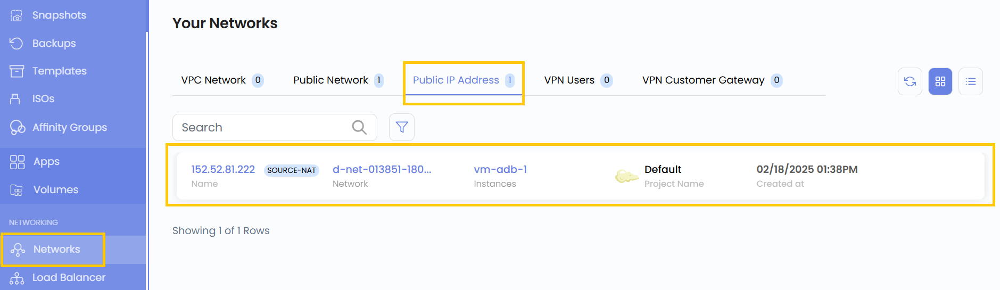
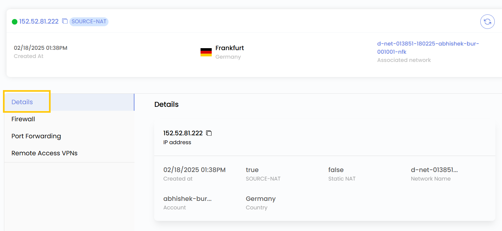
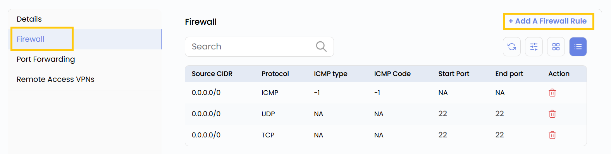
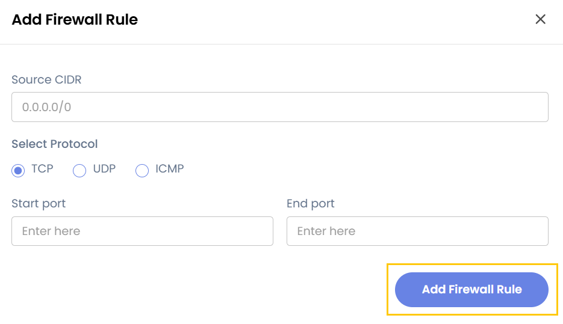
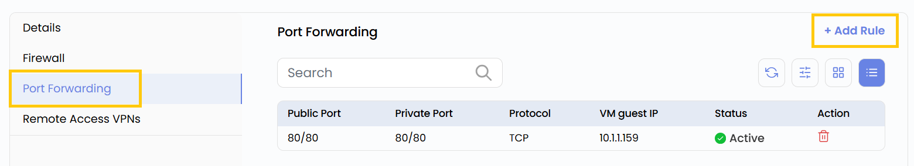
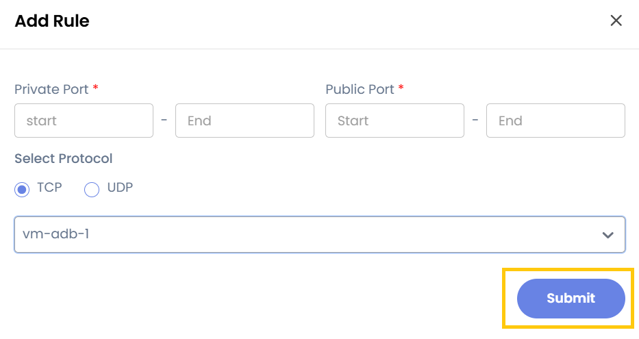
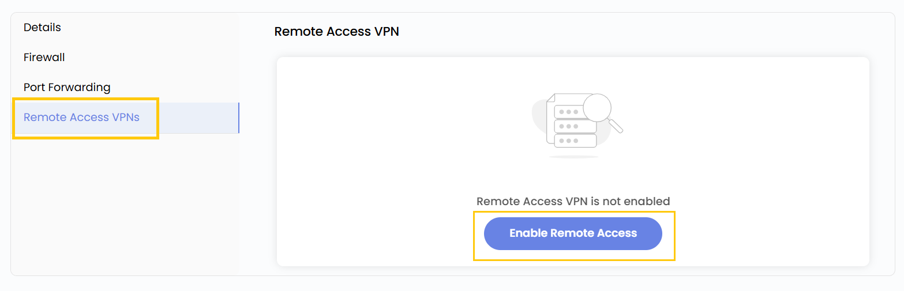

# Публичный IP-адрес

## Публичный IP-адрес

**Публичный IP-адрес** в UzCloud — это IP-адрес, доступный из интернета и назначаемый облачным ресурсам, чтобы к ним можно было обращаться извне частной сети. Публичные IP-адреса необходимы для веб-серверов, API и других сервисов, которым нужен прямой доступ в интернет.

---

### Просмотр публичных IP-адресов

- В меню слева откройте вкладку **Networks**.
- Откроется страница **Networks**. Перейдите на вкладку **Public IP Address** — здесь перечислены публичные IP-адреса.

### Сведения о публичном IP-адресе

- Чтобы увидеть подробности, нажмите на публичный IP-адрес.
- На вкладке **Details** отображаются IP-адрес, имя сети, сведения об аккаунте и зона.

### Добавление правила межсетевого экрана

- Перейдите на вкладку **Firewall** — здесь отображаются ранее заданные правила межсетевого экрана.
- Чтобы добавить правило, нажмите **Add Firewall Rule**.

- Укажите Source CIDR (источник) и выберите протокол: TCP, UDP или ICMP.
- Укажите начальный и конечный порты (Start и End) и нажмите **Add Firewall Rule**.

### Добавление правила проброса портов

- Перейдите на вкладку **Port Forwarding** — здесь отображаются ранее заданные правила проброса портов.
- Чтобы добавить правило, нажмите **Add Rule**.

- **Private Port Range (Start - End)** — диапазон портов во внутренней (частной) сети, на которые будет перенаправляться трафик.
- **Public Port Range (Start - End)** — внешние (публичные) порты, доступные из интернета.
- **Protocol** — TCP, UDP или Both (оба) в зависимости от требований сервиса.
- **Instance** — виртуальная машина, которая будет получать перенаправленный трафик.
- Нажмите **Submit**, чтобы сохранить и создать правило.

### Включение VPN удаленного доступа

- Перейдите на вкладку **Remote Access VPNs** — здесь настраивается VPN удаленного доступа.
- Если нужен защищенный удаленный доступ к частной сети, нажмите **Enable Remote Access VPN**, чтобы включить VPN-соединение.

---

### Заключение

Следуя этому руководству, вы сможете эффективно управлять публичными IP-адресами в UzCloud: назначать IP-адреса, применять правила межсетевого экрана, настраивать проброс портов и включать VPN-доступ. Эти возможности обеспечивают доступность и безопасность виртуальной инфраструктуры.
