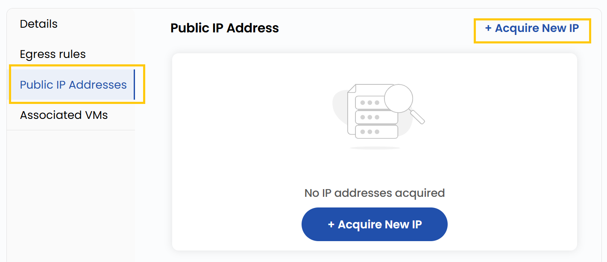

# Публичные IP-адреса

## Публичные IP-адреса

- Публичные IP-адреса позволяют ресурсам публичной сети взаимодействовать с интернетом.
- На вкладке **Public IP Addresses** отображаются все назначенные публичные IP-адреса.

- Нажмите **Aquire New IP**, чтобы запросить новый публичный IP-адрес. Выберите нужный **Billing Cycle** и нажмите **Buy IP**.

### Заключение

**Публичные IP-адреса** позволяют облачным ресурсам взаимодействовать с интернетом. На вкладке Public IP можно легко просматривать, получать и управлять IP-адресами с гибкими вариантами оплаты.

> [!TIP]
> **См. также:**
>
> - **[Обзор публичной сети](network-overview.md)**
> - **[Создание публичной сети](create-public-network.md)**
