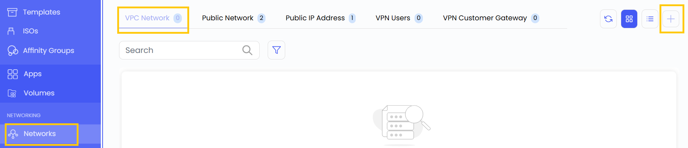
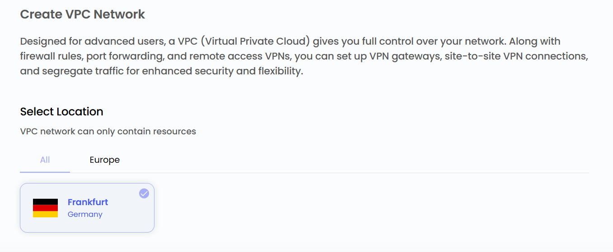
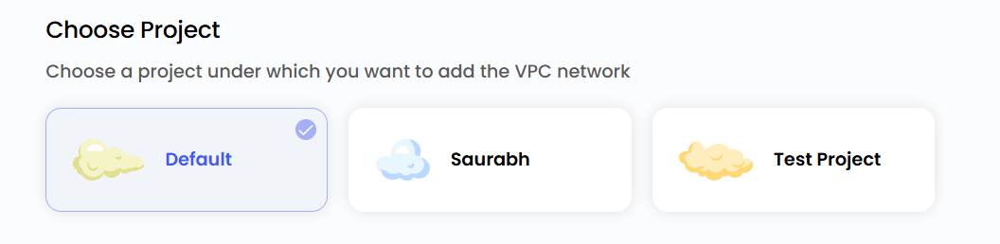
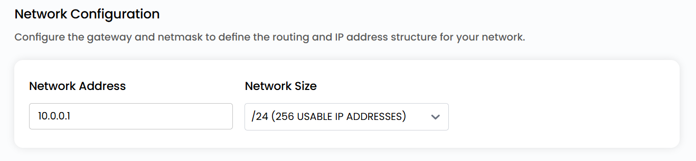
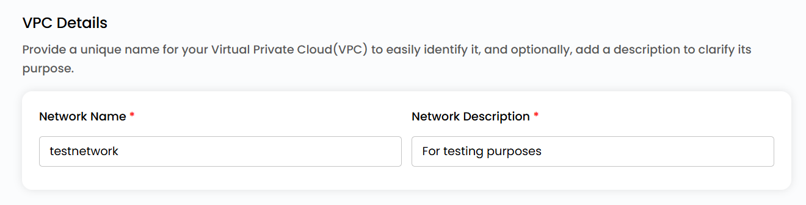
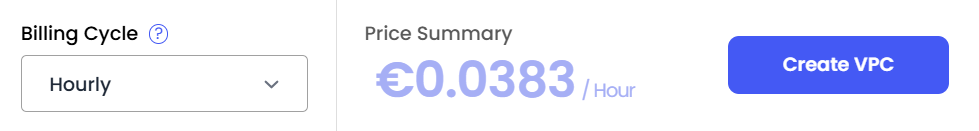

# Создание VPC-сетей

## Создание VPC-сетей

Сеть **Virtual Private Cloud (VPC)** в UzCloud — изолированная, защищенная и масштабируемая среда для облачных ресурсов. Она позволяет эффективно управлять сетевой инфраструктурой и обеспечивает связь между виртуальными машинами при сохранении безопасности и производительности.

- В меню слева откройте вкладку **Networks**.
- Откроется страница **Networks**. Перейдите на вкладку **VPC Network**.

- Чтобы создать VPC-сеть, нажмите значок **плюс (+)** в правой части страницы.

### Выбор расположения

- Выберите дата-центр, в котором будет физически размещена сеть.
- Выберите одно из доступных расположений.

### Привязка к проекту

- Привяжите сеть к одному из ваших проектов, чтобы удобно организовывать ресурсы и управлять ими.

### Настройки сети

- Задайте шлюз и маску сети, чтобы определить маршрутизацию и структуру IP-адресов. Размер сети можно выбрать из доступных вариантов.

### Имя VPC-сети

- Укажите уникальное имя VPC, чтобы легко ее находить, и при желании добавьте описание ее назначения.

### Создание VPC-сети

- Выберите нужный **Billing Cycle**. Для VPC поддерживаются периоды: почасовой, ежемесячный, ежеквартальный, раз в полгода, ежегодный, раз в два года и раз в три года.
- Поддерживаемые правила биллинга: Date to Date, Fixed Calendar Month, Unfixed Calendar Month, Fixed Prorata и Unfixed Prorata.
- Доступны разные пакеты VPC с различными сетевыми возможностями — это позволяет строить гибкие сетевые топологии под требования к производительности, безопасности и связности.
- Проверьте все параметры и итоговую стоимость. Нажмите **Create VPC**, чтобы создать VPC-сеть.

### Заключение

Создание **VPC-сети** в UzCloud дает защищенную, изолированную и гибкую среду для управления облачными ресурсами. Настраиваемые расположение, привязка к проекту, параметры сети и различные варианты оплаты обеспечивают оптимальную производительность, масштабируемость и контроль над облачной инфраструктурой.

> [!TIP]
> **См. также:**
>
> - **[Обзор VPC-сети](network-overview.md)**
> - **[Список сетевых ACL](network-acl-list.md)**
> - **[VPN-шлюз](vpn-gateway.md)**
> - **[VPN-соединения](vpn-connections.md)**
