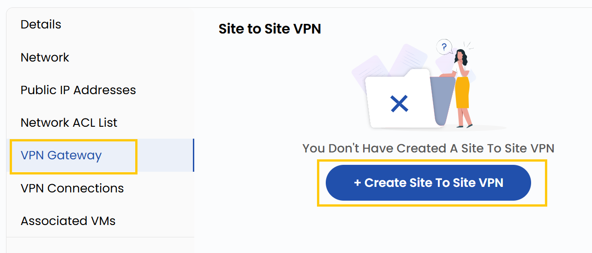

# VPN-шлюз

## VPN-шлюз

**VPN-шлюз** обеспечивает защищенную связь между VPC и внешними сетями, например локальными дата-центрами или другими облачными сетями.

- Перейдите на вкладку **VPN Gateway**, чтобы управлять VPN-шлюзом.
- Здесь можно управлять VPN-соединением site-to-site, которое безопасно связывает две сети.

### Заключение

**VPN-шлюз** — защищенный мост между VPC и внешними сетями, обеспечивающий безопасную передачу данных и интеграцию с локальной инфраструктурой или другими облаками.

> [!TIP]
> **См. также:**
>
> - **[Обзор VPC-сети](network-overview.md)**
> - **[Список сетевых ACL](network-acl-list.md)**
> - **[VPN-соединения](vpn-connections.md)**
