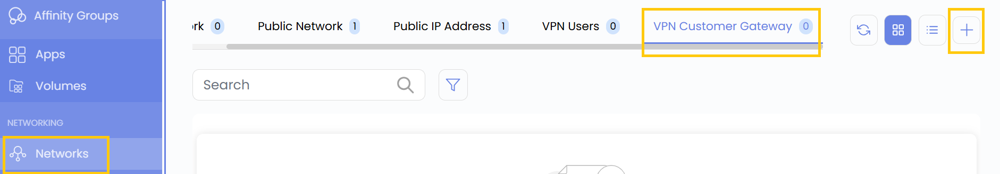
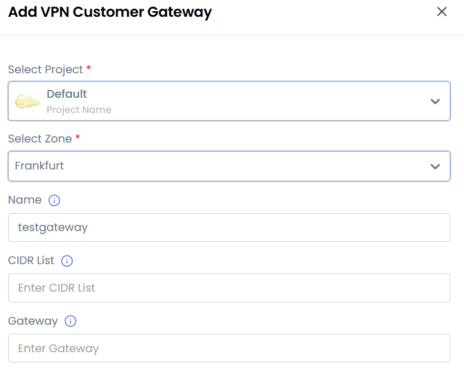
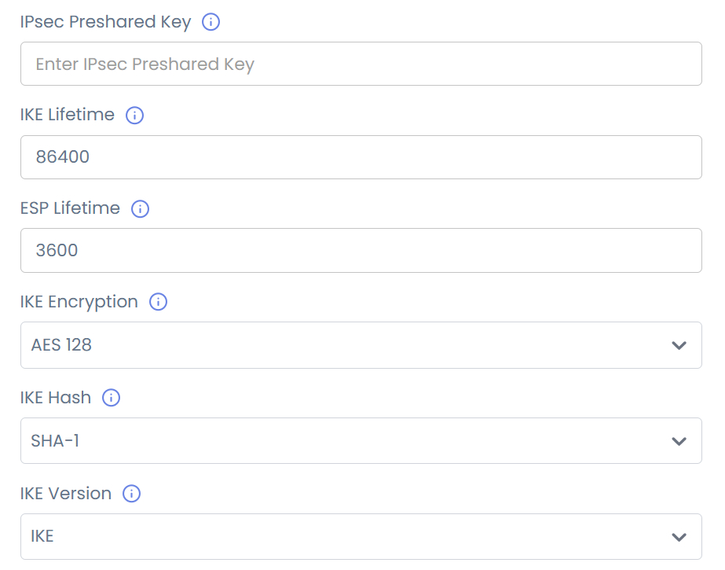
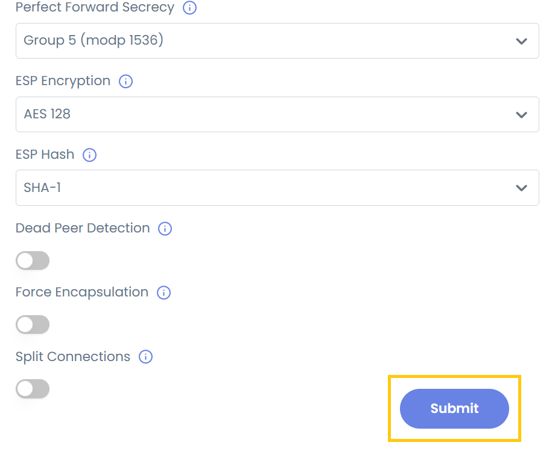

# Клиентский VPN-шлюз

## Клиентский VPN-шлюз (VPN Customer Gateway)

**Клиентский VPN-шлюз** — ключевой компонент для установки защищенного VPN-соединения между вашей локальной сетью и облаком. В UzCloud он обеспечивает защищенную связь между вашей частной сетью и виртуальным частным облаком (VPC). Ниже пошагово описано, как настроить и добавить клиентский VPN-шлюз в UzCloud.

- В меню слева откройте вкладку **Networks**.
- Откроется страница **Networks**. Перейдите на вкладку **VPN Customer Gateway**.
- Нажмите значок **плюс (+)**, чтобы добавить клиентский VPN-шлюз. Откроется форма для ввода параметров.

- **Select Project** — проект, в котором будет создан шлюз.
- **Select Zone** — зона или регион для VPN-шлюза.
- **Name** — уникальное понятное имя шлюза.
- **CIDR List** — диапазон IP-адресов (в формате CIDR), разрешенный для обмена между вашей сетью и облаком.
- **Gateway** — публичный IP-адрес вашего локального VPN-устройства (маршрутизатора или межсетевого экрана).

### Настройки шлюза

Для установки защищенного соединения задайте параметры IPsec и IKE (Internet Key Exchange):

- **IPsec Pre-Shared Key** — общий секретный ключ для аутентификации между VPN-устройствами.
- **IKE Lifetime** — время жизни сессии IKE в секундах (например, 28800).
- **ESP Lifetime** — время жизни сессии ESP (Encapsulating Security Payload).
- **IKE Encryption Algorithm** — алгоритм шифрования для фазы IKE (например, AES-256, AES-128).
- **IKE Hash Algorithm** — алгоритм хеширования для контроля целостности (например, SHA-256, SHA-512).
- **IKE Version** — IKEv1 или IKEv2 (IKEv2 рекомендуется как более безопасный).
- **IKE DH (Diffie-Hellman Group)** — группа Диффи — Хеллмана для защиты обмена ключами (например, Group 14, Group 19).
- **Perfect Forward Secrecy (PFS)** — включите PFS, чтобы каждый обмен ключами был независимым.
- **ESP Encryption Algorithm** — алгоритм шифрования для ESP (например, AES-256).
- **ESP Hash Algorithm** — алгоритм хеширования для проверки целостности ESP (например, SHA-256).

### Дополнительные возможности (необязательно)

UzCloud поддерживает дополнительные функции безопасности и производительности, которые включаются в расширенных настройках:

- **Dead Peer Detection (DPD)** — отслеживает и автоматически восстанавливает потерянные VPN-соединения.
- **Force Encapsulation** — обеспечивает прохождение VPN-трафика через межсетевые экраны и NAT.
- **Split Connections** — позволяет использовать несколько VPN-туннелей для резервирования и производительности.

- Нажмите **Submit** — клиентский VPN-шлюз будет создан.

### Заключение

**Клиентский VPN-шлюз** обеспечивает защищенное соединение между локальной инфраструктурой и облачным VPC. Настраиваемые шифрование, аутентификация и дополнительные функции гарантируют надежную, приватную и производительную связь в гибридных средах.

> [!TIP]
> **См. также:**
>
> - **[Пользователи VPN](vpn-users.md)**
