# Управление объектным хранилищем

## Управление объектным хранилищем Ceph

После активации объектного хранилища Ceph используйте панель управления, чтобы отслеживать производительность, заполненность и количество объектов.

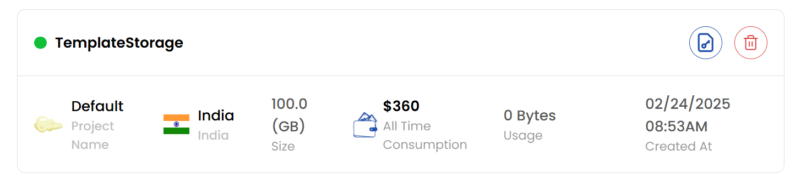

### Кнопки действий

- Кнопки действий — быстрый доступ к типовым операциям с хранилищем.
- Для быстрых действий используйте кнопки справа от хранилища.

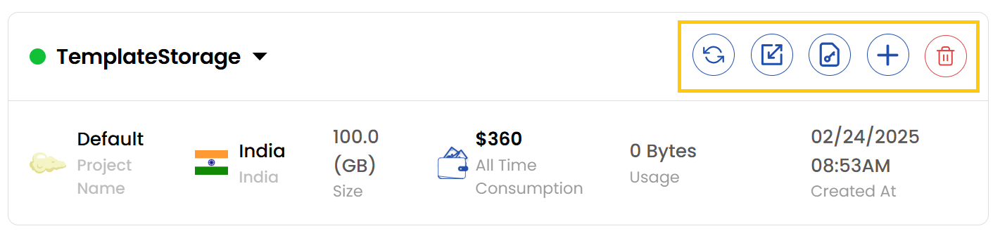

- **Refresh** — обновляет статус хранилища и информацию на странице.
- **Auto-scaling** — включает автомасштабирование хранилища.
- **Credentials** — показывает учетные данные хранилища.
- **Resize** — изменяет размер хранилища.
- **Delete** — безвозвратно удаляет хранилище.

### Автомасштабирование хранилища

- Чтобы включить автомасштабирование, нажмите на значок автомасштабирования. Включите или выключите переключатель **Auto Scaling** и нажмите **Submit**, чтобы подтвердить изменения.

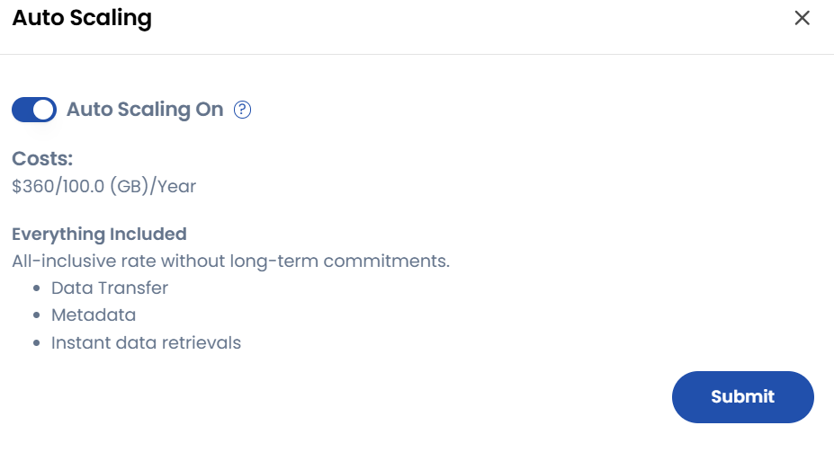

### Просмотр учетных данных

- Чтобы посмотреть учетные данные, нажмите на значок учетных данных. Откроется меню **S3 Object Store Credentials**, где отображаются **Secret Key** и **Password** хранилища.

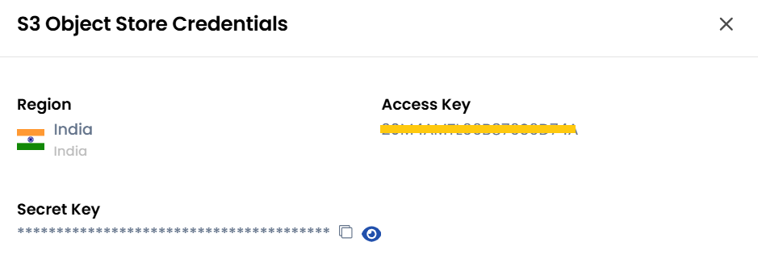

### Изменение размера хранилища

- Чтобы увеличить или уменьшить размер хранилища, нажмите на значок изменения размера. Откроется меню **Resize Object Store**, где можно задать нужный размер.
- Выберите нужный **Billing Cycle**: почасовой (Hourly) или ежемесячный (Monthly).
- Проверьте все параметры и итоговую стоимость. Нажмите **Resize**, чтобы изменить размер.

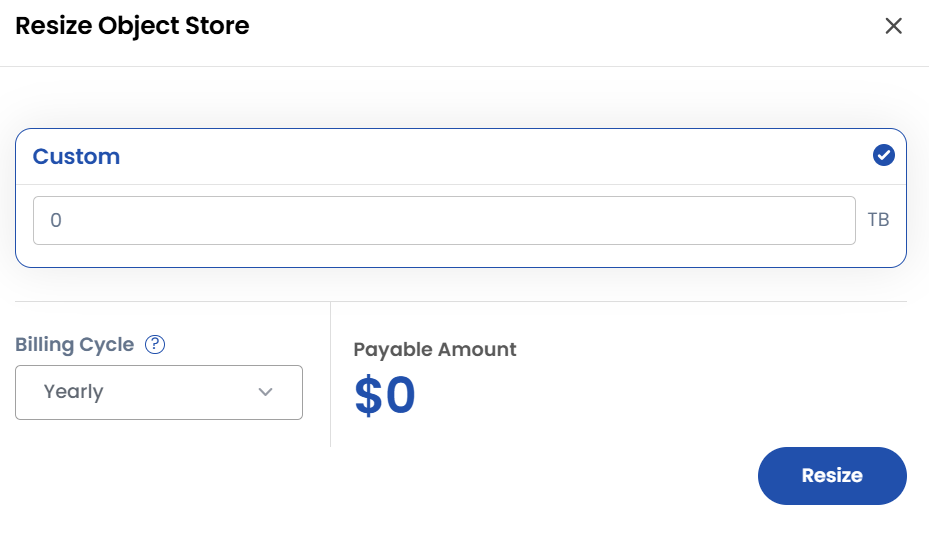

### Создание бакета

- Нажмите **Create Bucket**, чтобы создать новый бакет.

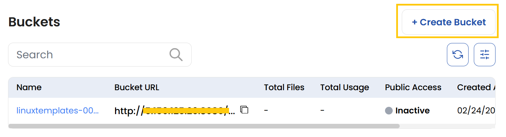

- Введите **Bucket Name** и при необходимости включите **Bucket Versioning**. Версионирование позволяет хранить и восстанавливать предыдущие версии объектов.

> [!NOTE]
> - Для блокировки объектов необходимо включить версионирование бакета.
> - Версии объектов учитываются в общей стоимости хранения данных.

- При необходимости включите **Object Locking**, чтобы защитить объекты от удаления или перезаписи на заданный срок.
- Объекты хранятся по модели WORM (write-once-read-many — однократная запись, многократное чтение): их нельзя удалить или перезаписать в течение заданного времени или бессрочно.
- Нажмите **Create**, чтобы завершить создание бакета.

> [!NOTE]
> - Блокировка объектов работает только в бакетах с версионированием.

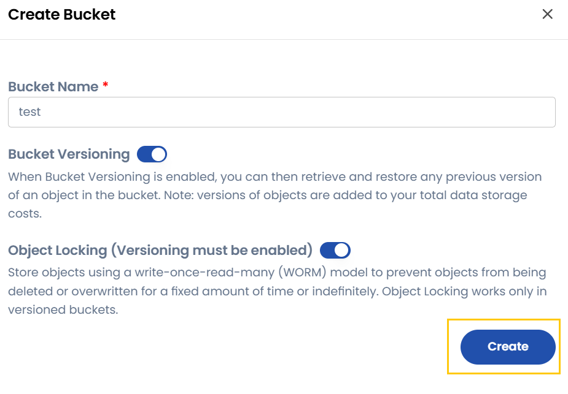

### Обзор бакета

- Чтобы посмотреть сведения о бакете, нажмите на его имя: количество файлов, URL бакета, использование, дата создания и настройки публичного доступа.

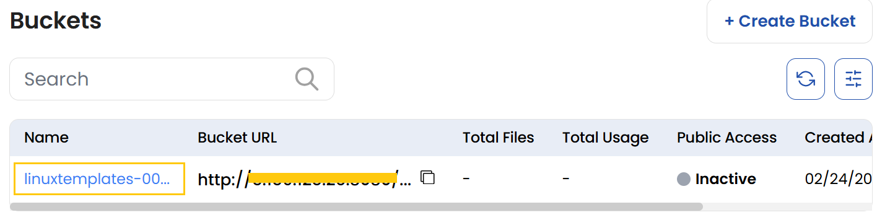

- Используйте быстрые действия, чтобы поделиться бакетом, изменить или удалить его. Чтобы поделиться бакетом, нажмите на значок «Поделиться» — можно включить публичный доступ.

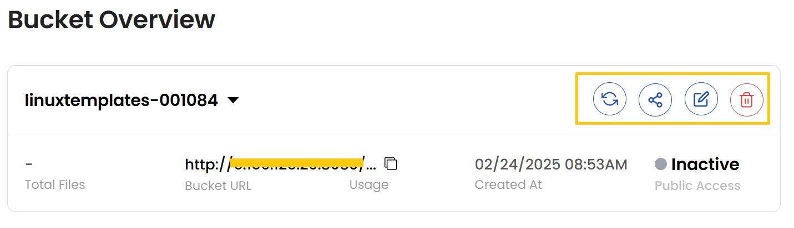

- При включенном публичном доступе любой, у кого есть ссылка на объект, может открыть его без специальных прав. Настройку можно применить к отдельным файлам или ко всему бакету; доступ осуществляется по обычным HTTP- или HTTPS-запросам. Нажмите **Update**, чтобы сохранить изменения.

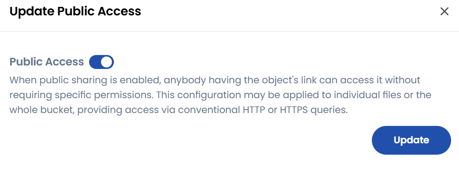

- Внутри бакета можно создавать папки или загружать файлы с помощью значков **Upload Files** или **Create Folder**.

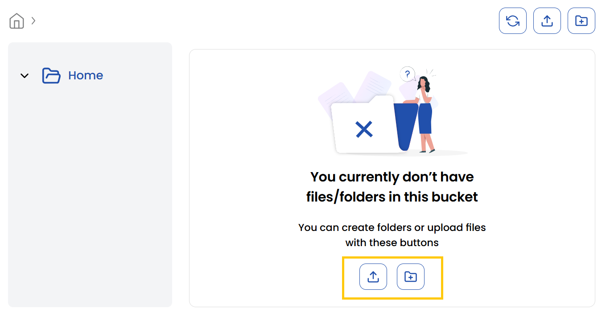

### Заключение

Следуя этому руководству, вы сможете эффективно управлять объектным хранилищем Ceph: настраивать автомасштабирование, менять размер, создавать бакеты и отслеживать использование. Эти возможности обеспечивают оптимальную производительность, масштабируемость и безопасность хранения данных. Если нужна помощь, изучите документацию UzCloud или обратитесь в поддержку.
