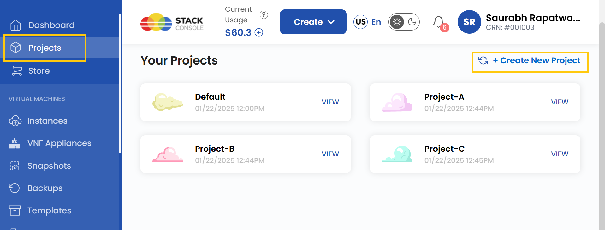
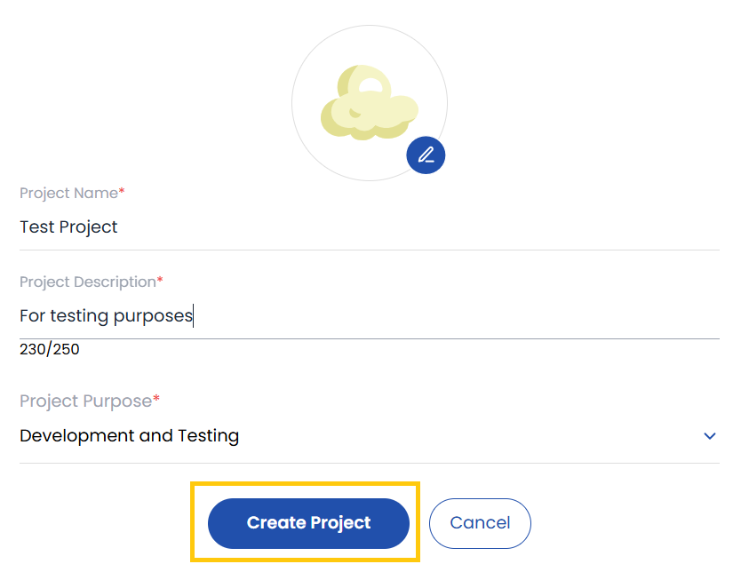
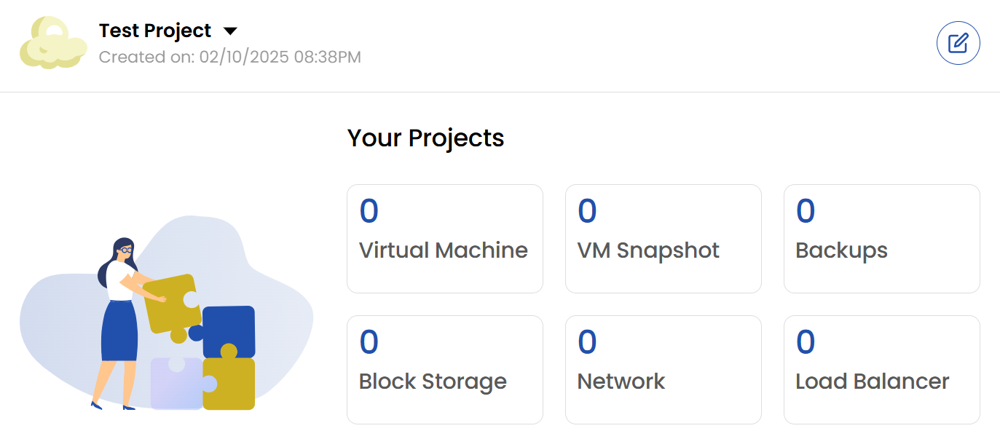
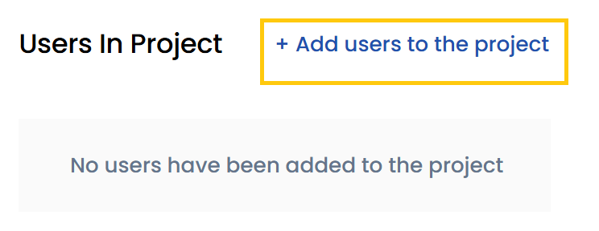
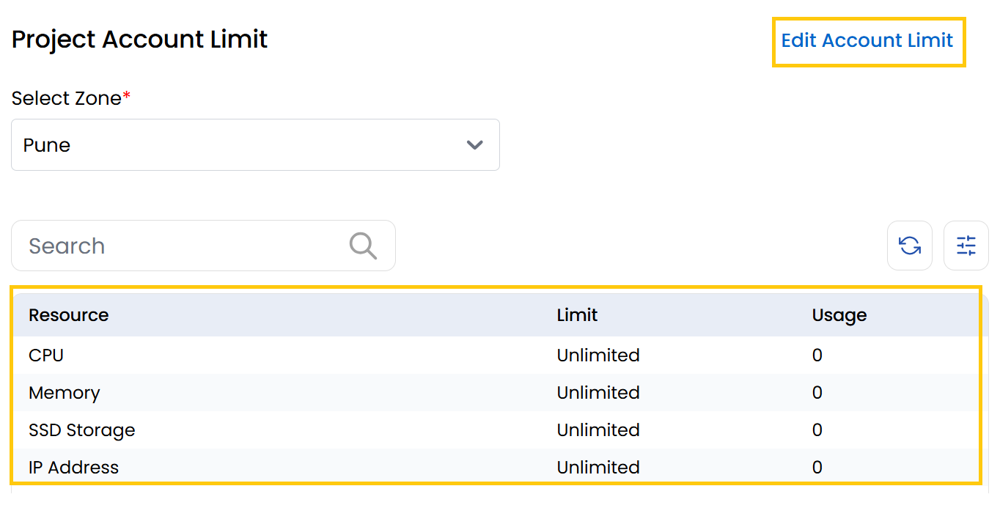
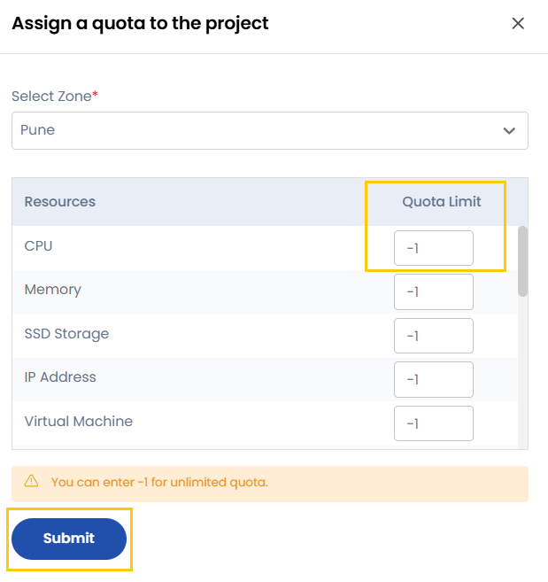

# Создание проекта

## Создание проекта и управление им

В этом руководстве пошагово описано, как создать проект в UzCloud, добавить в него пользователей и настроить лимиты аккаунта и квоты для проекта.

### Создание нового проекта

- В меню слева нажмите **Projects**.
- Нажмите **Create a New Project**.

- Введите данные проекта: **Project Name** (название), **Project Description** (описание) и **Project Purpose** (назначение).
- Нажмите **Create Project**. Проект будет создан.

### Просмотр ресурсов проекта

После создания проекта вы сможете просматривать связанные с ним ресурсы.

- **Virtual Machine** — полностью настраиваемый облачный сервер для запуска приложений или размещения сайтов.
- **VM Snapshot** — снимок состояния и данных виртуальной машины на определенный момент времени.
- **Backup** — управляемое резервное копирование для защиты данных и обеспечения непрерывности бизнеса.
- **Block Storage** — дополнительные тома хранения, подключаемые к виртуальным машинам.
- **Network** — публичные и частные сети для подключения облачных ресурсов и управления ими.
- **Load Balancer** — распределяет трафик между несколькими виртуальными машинами для обеспечения высокой доступности.

### Добавление пользователей в проект

- Чтобы добавить пользователей в проект, нажмите **Add Users to the Project**.
- Найдите нужного пользователя с помощью строки поиска.
- Нажмите **Add**, чтобы включить пользователя в проект.

### Настройка лимитов аккаунта для проекта

- Лимиты ресурсов проекта задаются через лимиты аккаунта.
- Перейдите в раздел **Project Account Limit**. Здесь отображаются лимиты и текущее использование ресурсов.
- Выберите **Zone** (зону), для которой нужно задать лимит.

- Нажмите **Edit Account Limit**. Откроется страница **Assign a Quota to the Project**.
- Выберите **Zone** и **Resource** (ресурс), квоту для которого нужно изменить.
- Введите нужное значение **Quota Limit**. Значение `-1` означает **неограниченную** квоту для этого ресурса.
- Нажмите **Submit**.

Следуя этому руководству, вы сможете эффективно создавать проекты в UzCloud и управлять ими, обеспечивая удобную совместную работу и оптимальное распределение ресурсов.
