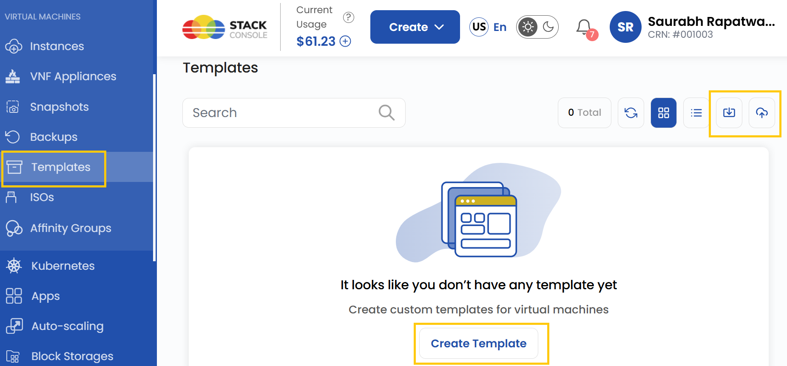
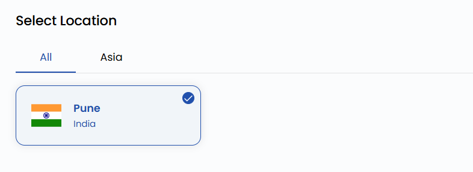
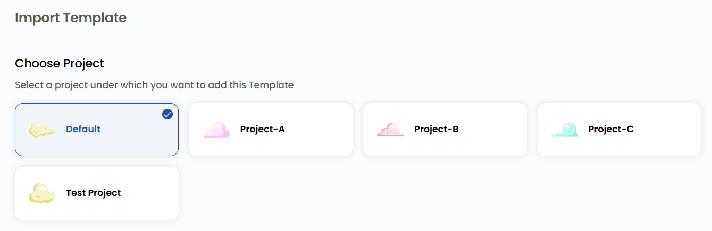
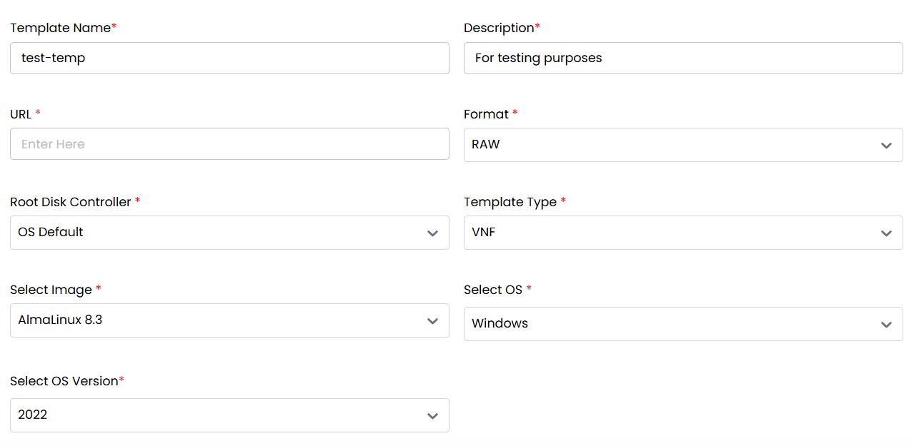
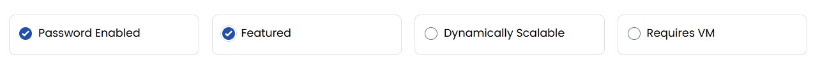

# Создание шаблонов

## Шаблоны виртуальных машин

**Шаблон** — это преднастроенный образ диска для быстрого развертывания виртуальных машин (ВМ) или контейнеров. Шаблон содержит установленную операционную систему с заранее заданными настройками, программами и параметрами, поэтому новые ВМ можно создавать без ручной установки и настройки ОС каждый раз.

---

### Создание шаблона виртуальной машины

- В меню слева откройте вкладку **Templates**.
- Чтобы создать шаблон, нажмите **Templates** или значок **плюс (+)** в правой части страницы. Откроется меню создания шаблона.

### Выбор расположения

- Выберите дата-центр, в котором будет храниться шаблон.
- Выберите одно из доступных расположений.

### Привязка к проекту

- Привяжите шаблон к одному из ваших проектов, чтобы удобно организовывать ресурсы и управлять ими.

### Параметры шаблона

При создании шаблона нужно заполнить несколько обязательных полей:

- **Template Name** — имя для идентификации шаблона.
- **Description** — описание назначения и содержимого шаблона.
- **URL** — ссылка на место размещения шаблона (если применимо).
- **Format** — формат шаблона, например RAW или другой поддерживаемый формат.
- **Root Disk Controller** — контроллер корневого диска, используемый для загрузки шаблона (зависит от архитектуры системы).
- **Template Type** — категория шаблона (например, VNF).
- **Image** — файл образа, связанный с шаблоном.
- **Operating System** — ОС шаблона (например, Linux, Windows).
- **OS Version** — точная версия ОС.

### Дополнительные параметры

Для шаблона также можно выбрать дополнительные параметры:

- **Password Enabled** — для доступа к шаблону или его использования потребуется пароль, что добавляет уровень защиты.
- **Featured** — помечает шаблон как рекомендуемый, чтобы его было проще найти.
- **Dynamically Scalable** — позволяет динамически масштабировать ресурсы в зависимости от нагрузки; полезно для облачных развертываний.
- **Requires VM** — указывает, что шаблон должен использоваться в среде виртуальной машины, а не на физическом оборудовании.

### Создание шаблона

- Выберите нужный **Billing Cycle**. Для шаблонов поддерживается почасовая оплата.
- Поддерживаемые правила биллинга: Date to Date, Fixed Calendar Month, Unfixed Calendar Month, Fixed Prorata и Unfixed Prorata.
- Для шаблонов поддерживается только один пакет на зону — это помогает стандартизировать развертывания в разных средах.
- Проверьте все параметры и итоговую стоимость. Нажмите **Create**, чтобы создать шаблон для проекта.

### Заключение

Следуя этому руководству, вы легко создадите шаблоны в UzCloud и сможете управлять ими. Шаблоны позволяют быстро развертывать виртуальные машины или контейнеры с преднастроенными параметрами, экономя время и обеспечивая единообразие. Если нужна помощь, изучите документацию UzCloud или обратитесь в поддержку.

> [!TIP]
> **См. также:**
>
> - **[VNF-устройства](../vnf-appliances/vnf-appliances.md)**
> - **[Виртуальная машина](../compute/compute-instance.md)**
> - **[ISO-образы](../isos/import-iso.md)**
