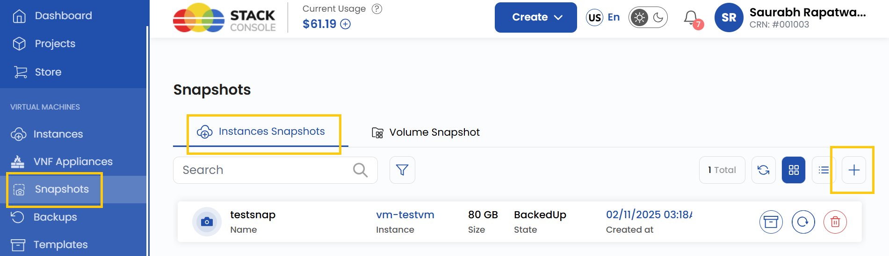
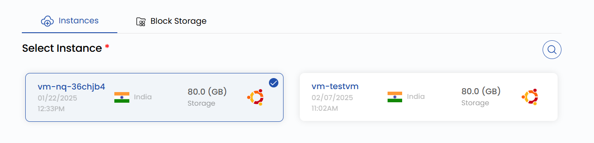

# Создание снимка ВМ

## Снимок виртуальной машины

**Снимки виртуальных машин** фиксируют текущее состояние ВМ, включая конфигурацию и данные, на определенный момент времени. Снимки — мощный инструмент для резервного копирования, аварийного восстановления и тестирования. Они позволяют быстро вернуть ВМ в точно такое же состояние, как в момент создания снимка, обеспечивая согласованность данных и минимизируя простой при сбоях или случайных изменениях.

**UzCloud** предоставляет удобный интерфейс для создания снимков ВМ и управления ими, помогая защитить данные и сохранить непрерывность работы. В этом руководстве описано, как создать снимок ВМ в **UzCloud**.

---

### Создание снимка виртуальной машины

- В меню слева откройте вкладку **Snapshots**.
- Откроется страница **Snapshots**. Перейдите на вкладку **Instances Snapshot**.

- Чтобы создать снимок, нажмите **Take Snapshot** или значок **плюс (+)** в правой части страницы.

### Выбор расположения

- Выберите дата-центр, в котором будет физически размещен ресурс.
- Выберите одно из доступных расположений.

### Привязка к проекту

- Привяжите снимок к одному из ваших проектов, чтобы удобно организовывать ресурсы и управлять ими.

### Выбор виртуальной машины

- В списке **Instances** выберите виртуальную машину, для которой нужно создать снимок.

### Имя снимка

- Укажите уникальное **Snapshot Name**, чтобы легко находить снимок в панели управления.

### Создание снимка

- Выберите нужный **Billing Cycle**. Для снимков и резервных копий поддерживается только почасовая оплата и единственное правило биллинга — Fixed Prorata.
- Для снимков ВМ, снимков блочного хранилища и резервных копий ВМ поддерживается только один пакет на зону. Автоматические резервные копии ВМ, если они включены администратором, стоят 20% от цены виртуальной машины.
- Проверьте все параметры и итоговую стоимость. Нажмите **Take Snapshot**, чтобы создать снимок виртуальной машины.

### Заключение

Следуя этому руководству, вы легко создадите снимки ВМ в UzCloud и сможете управлять ими. Снимки — надежный способ резервного копирования виртуальных машин, который обеспечивает согласованность данных и быстрое восстановление после сбоев или случайных изменений. Если нужна помощь, изучите документацию UzCloud или обратитесь в поддержку.

> [!TIP]
> **См. также:**
>
> - **[Снимок тома](../volume-snapshots/create-volume-snapshot.md)**
> - **[Виртуальная машина](../compute/compute-instance.md)**
> - **[Создание резервных копий](../backups/create-backups.md)**
