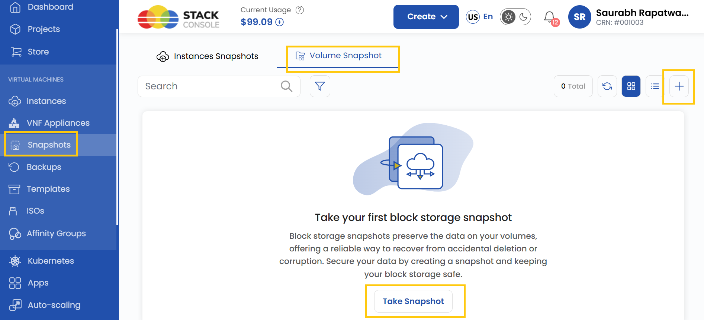
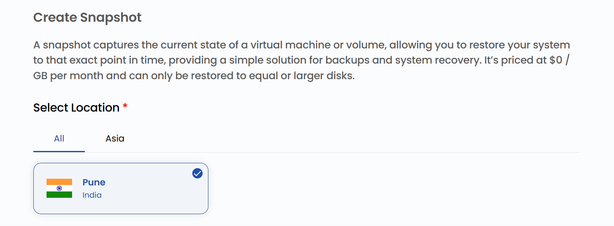
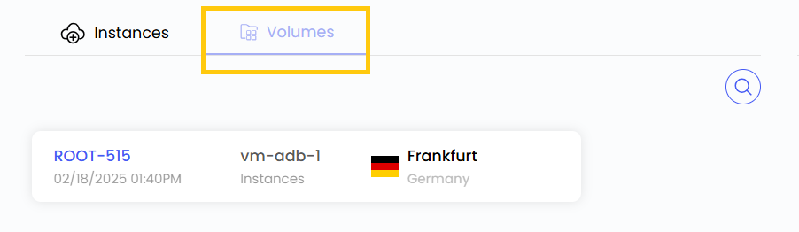

# Создание снимка тома

## Снимок тома виртуальной машины

**Снимки томов** фиксируют состояние тома на определенный момент времени, обеспечивая целостность данных и надежное резервное копирование и восстановление. Снимок позволяет быстро вернуть том в точно такое же состояние, как в момент создания снимка, — например, после случайного удаления, повреждения данных или сбоя системы.

В **UzCloud** снимки томов легко создавать и управлять ими через понятный интерфейс. В этом руководстве пошагово описано, как создать снимок тома.

---

### Создание снимка тома блочного хранилища

- В меню слева откройте вкладку **Snapshots**.
- Откроется страница **Snapshots**. Перейдите на вкладку **Volume Snapshot**.

- Чтобы создать снимок, нажмите **Take Snapshot** или значок **плюс (+)** в правой части страницы.

### Выбор расположения

- Выберите дата-центр, в котором будет физически размещен ресурс.
- Выберите одно из доступных расположений.

### Привязка к проекту

- Привяжите снимок к одному из ваших проектов, чтобы удобно организовывать ресурсы и управлять ими.

### Выбор блочного хранилища

- В списке **Volumes** выберите том, для которого нужно создать снимок.

### Имя снимка

- Укажите уникальное **Snapshot Name**, чтобы легко находить снимок в панели управления.

### Создание снимка

- Выберите нужный **Billing Cycle**. Для снимков и резервных копий поддерживается только почасовая оплата и единственное правило биллинга — Fixed Prorata.
- Для снимков ВМ, снимков блочного хранилища и резервных копий ВМ поддерживается только один пакет на зону. Автоматические резервные копии ВМ, если они включены администратором, стоят 20% от цены виртуальной машины.
- Проверьте все параметры и итоговую стоимость. Нажмите **Take Snapshot**, чтобы создать снимок тома.

### Заключение

Следуя этому руководству, вы легко создадите снимки томов в UzCloud и сможете управлять ими. Снимки томов — надежный способ резервного копирования, который обеспечивает целостность данных и быстрое восстановление после случайного удаления, повреждения данных или сбоев системы. Если нужна помощь, изучите документацию UzCloud или обратитесь в поддержку.

> [!TIP]
> **См. также:**
>
> - **[Создание тома](../volumes/create-volume.md)**
> - **[Снимок ВМ](../vm-snapshots/create-instance-snapshot.md)**
> - **[Создание резервных копий](../backups/create-backups.md)**
