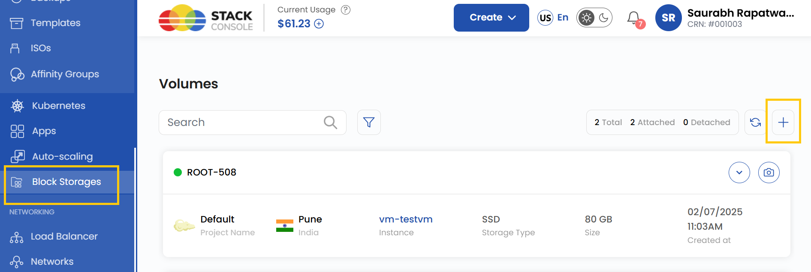
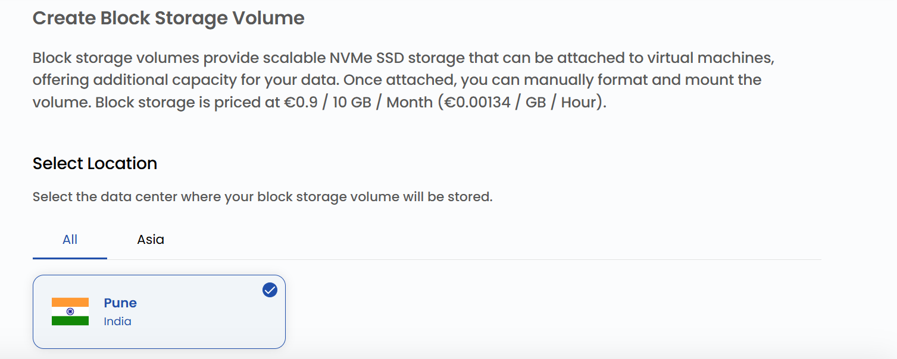
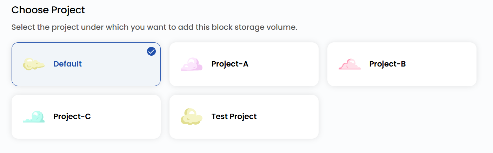
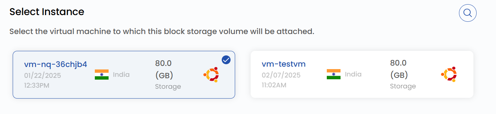
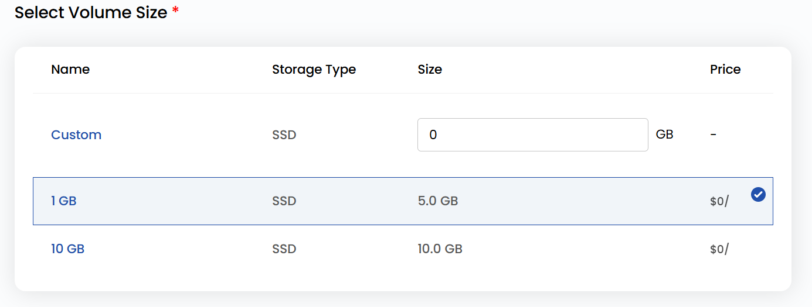
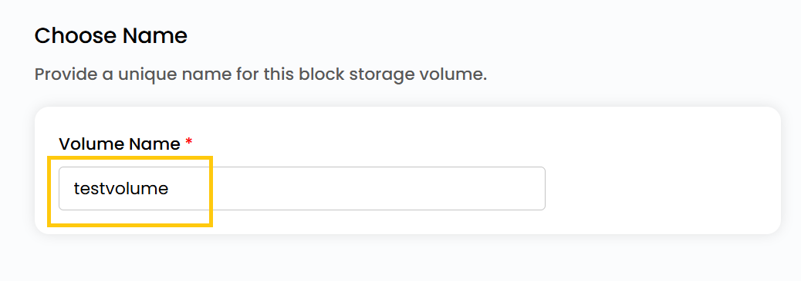
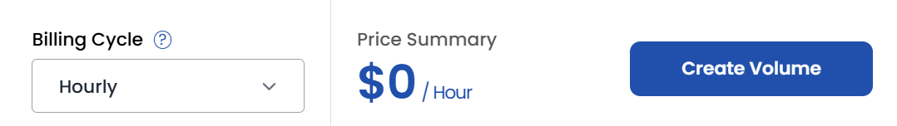

# Создание тома

## Тома блочного хранилища

**Тома блочного хранилища** — масштабируемое хранилище на NVMe SSD, которое подключается к виртуальным машинам и дает дополнительное место для данных. После подключения том нужно вручную отформатировать и смонтировать, чтобы расширить хранилище ВМ.

**UzCloud** упрощает развертывание блочного хранилища и управление им, позволяя масштабировать инфраструктуру в соответствии с потребностями. В этом руководстве описано, как создать и подключить том блочного хранилища в **UzCloud**.

---

### Создание тома блочного хранилища в UzCloud

- В меню слева откройте вкладку **Block Storages**.
- Откроется страница **Create Block Storage Volume**.

- Чтобы создать том, нажмите **Create Block Storage** или значок **плюс (+)** в правой части страницы.

### Выбор расположения

- Выберите дата-центр, в котором будет физически размещен ресурс.
- Выберите одно из доступных расположений.

### Привязка к проекту

- Привяжите том к одному из ваших проектов, чтобы удобно организовывать ресурсы и управлять ими.

### Выбор виртуальной машины

- Выберите виртуальную машину, к которой нужно подключить том.

### Выбор размера тома

- Выберите параметры тома: **Storage Type** (тип хранилища) и **Size** (размер). При необходимости можно задать собственный размер.
- Доступные варианты и планы:

### Имя тома

- Укажите уникальное **Volume Name**, чтобы легко находить том в панели управления.

### Создание тома

- Выберите нужный **Billing Cycle** (период оплаты). Для томов поддерживаются периоды: почасовой, ежемесячный, ежеквартальный, раз в полгода, ежегодный, раз в два года и раз в три года.
- Поддерживаемые правила биллинга: Date to Date, Fixed Calendar Month, Unfixed Calendar Month, Fixed Prorata и Unfixed Prorata.
- Доступны разные пакеты в зависимости от размера SSD и расположения дата-центра — это дает гибкость в выборе производительности и региона хранения данных.
- Проверьте все параметры и итоговую стоимость. Нажмите **Create Volume**, чтобы создать том.

### Заключение

Следуя этому руководству, вы легко создадите тома блочного хранилища в UzCloud и сможете управлять ими. Тома дают виртуальным машинам масштабируемое и производительное хранилище для эффективного решения задач хранения данных. Если нужна помощь, изучите документацию UzCloud или обратитесь в поддержку.

> [!TIP]
> **См. также:**
>
> - **[Снимок тома](../volume-snapshots/create-volume-snapshot.md)**
> - **[Снимок ВМ](../vm-snapshots/create-instance-snapshot.md)**
> - **[Создание резервных копий](../backups/create-backups.md)**
