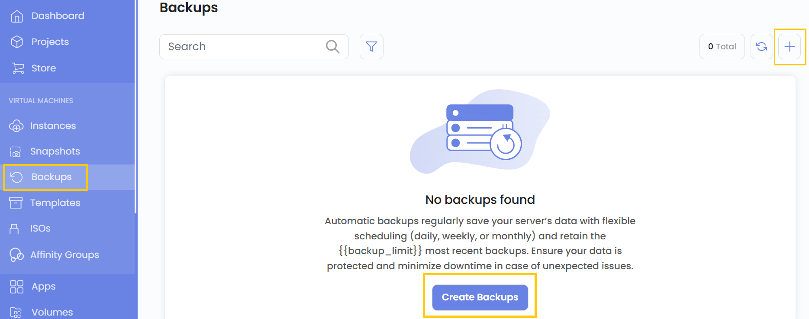
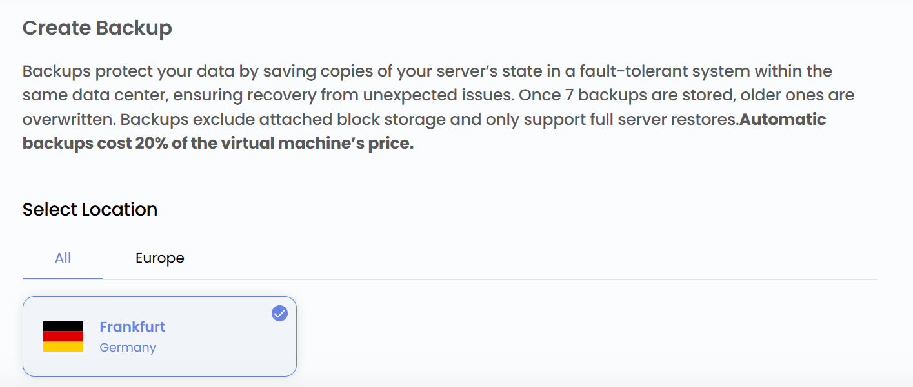
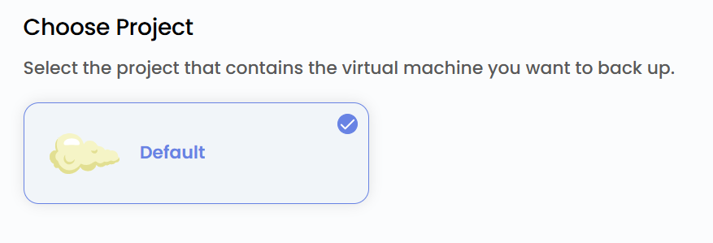
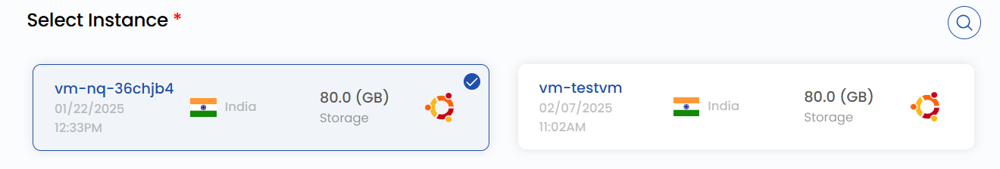
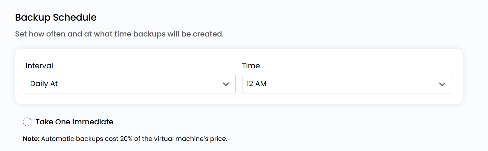

# Zaxira nusxalar yaratish

## Virtual mashinalarning zaxira nusxalari

**Zaxira nusxalar** virtual mashina maʼlumotlarini saqlaydi va tasodifiy oʻchirish, dasturiy nosozliklar va xavfsizlik tahdidlaridan himoya qiladi. Zaxiralashni yoqib, siz har doim tiklash mumkin boʻlgan VM versiyasiga ega boʻlasiz.

**UzCloud** har kuni, har hafta yoki oʻz jadvalingiz boʻyicha avtomatik zaxiralashni qoʻllab-quvvatlaydi — maʼlumotlarni qoʻlda ishlamasdan tiklash mumkin. Zaxiralash maʼlumotlarni himoya qilish va kutilmagan muammolarda ishlamay qolish vaqtini qisqartirish uchun juda muhim.

---

### VM zaxira nusxasini yaratish

- Chap menyuda **Backups** yorligʻini oching.
- Zaxira nusxa yaratish uchun sahifaning oʻng tomonidagi **Create Backups** yoki **plyus (+)** belgisini bosing. Zaxira nusxa yaratish menyusi ochiladi.

### Joylashuvni tanlash

- Resurs jismoniy joylashadigan maʼlumotlar markazini tanlang.
- Mavjud joylashuvlardan birini tanlang.

### Loyihaga biriktirish

- Virtual mashina joylashgan loyihani tanlang.

### Virtual mashinani tanlash

- **Instances** roʻyxatidan zaxira nusxasi yaratiladigan virtual mashinani tanlang.

### Zaxiralash jadvali

- Zaxiralash davriyligini belgilang: intervallar va nusxalar yaratilish vaqti.

> [!NOTE]
> Avtomatik zaxiralash virtual mashina narxining 20% ini tashkil qiladi.

- Jadval yaratish bilan birga darhol zaxira nusxa olish uchun **Take One Immediate** ni tanlang.

### Zaxira nusxani yaratish

- Kerakli **Billing Cycle** ni tanlang. Snapshotlar va zaxira nusxalar uchun faqat soatlik toʻlov va yagona billing qoidasi — Fixed Prorata qoʻllab-quvvatlanadi.
- VM snapshotlari, blokli xotira snapshotlari va VM zaxira nusxalari uchun har bir zonada faqat bitta paket qoʻllab-quvvatlanadi. Avtomatik VM zaxira nusxalari administrator tomonidan yoqilgan boʻlsa, virtual mashina narxining 20% ini tashkil qiladi.
- Barcha parametrlarni va umumiy narxni tekshiring. Virtual mashinaning zaxira nusxasini yaratish uchun **Create Backup** tugmasini bosing.

### Xulosa

Ushbu qoʻllanmaga amal qilib, siz UzCloud’da zaxira nusxalarni osongina yaratishingiz va boshqarishingiz mumkin. Zaxira nusxalar maʼlumotlarni himoya qilish va tasodifiy oʻchirish, dasturiy nosozliklar yoki xavfsizlik tahdidlaridan keyin tez tiklashning ishonchli usulidir. Yordam kerak boʻlsa, UzCloud hujjatlarini oʻrganing yoki qoʻllab-quvvatlash xizmatiga murojaat qiling.
