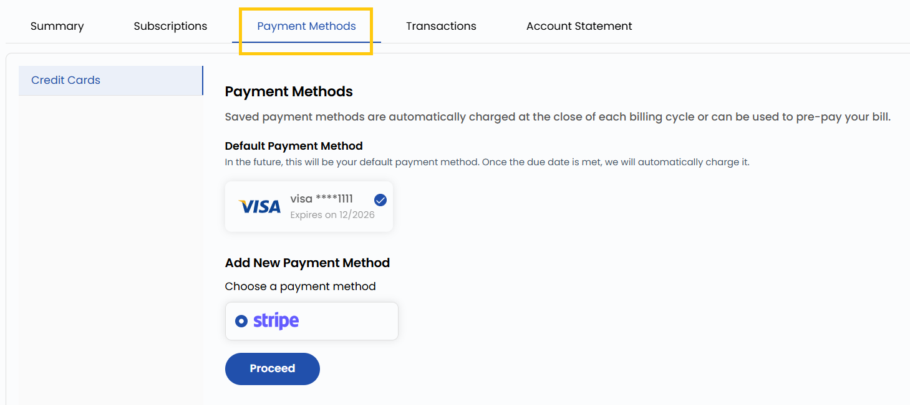

# Toʻlov usullari

## Toʻlov usullari

**Payment Methods** yorligʻi toʻlov usullarini boshqarish imkonini beradi. Toʻlov usulini belgilab, **Infra Credits** (infratuzilma kreditlari) sotib olish mumkin: kerakli summani kiritish kifoya, u akkauntning asosiy toʻlov usulidan yechib olinadi. Bu xizmatlar uchun uzluksiz toʻlovni taʼminlaydi.

