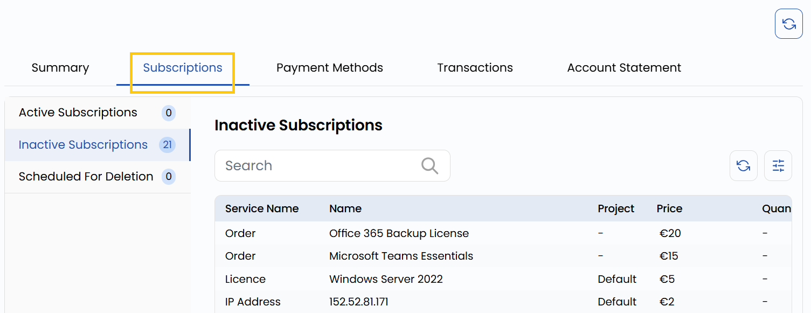

# Obunalar

## Obunalar

**Subscription** yorligʻi barcha xizmat obunalarini boshqarish va kuzatish imkonini beradi. Obuna — bulutli yoki infratuzilma xizmatidan joriy foydalanish. Obunalar uch xil holatda boʻladi:

- **Active Subscriptions** — ishlayotgan va muntazam toʻlov hisoblanadigan xizmatlar.
- **Inactive Subscriptions** — bekor qilingan obunalar. Bekor qilingan paytdan boshlab ular uchun toʻlov hisoblanmaydi; ularni qayta tiklab boʻlmaydi.
- **Scheduled for Deletion** — oʻchirish uchun belgilangan xizmatlar; tez orada ular tizimdan oʻchiriladi va toʻlov hisoblanishi toʻxtaydi.

