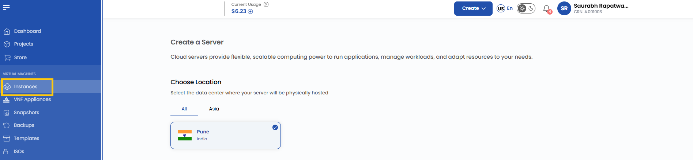
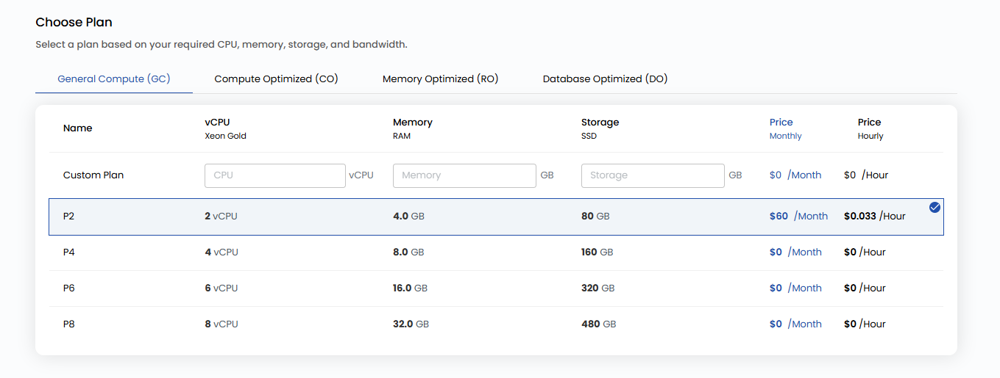
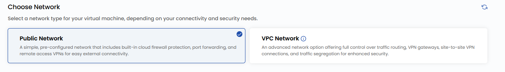

# Virtual mashina

## UzCloud’da virtual mashinalar

**Virtual mashina** (Compute Instance) — bu bulutdagi virtual server boʻlib, u jismoniy kompyuter kabi ishlaydi. Uning oʻz protsessori, xotirasi va disk maydoni bor, shuning uchun unga dasturlar oʻrnatish, ilovalarni ishga tushirish yoki veb-saytlarni joylashtirish mumkin. Server muhitini toʻliq oʻzingiz boshqarasiz, bu esa virtual mashinani turli vazifalar uchun moslashuvchan vositaga aylantiradi. Virtual mashinalar bulutli xizmatlarning asosiy komponenti boʻlib, serverlarni tezda ishga tushirish va kerak boʻlganda masshtablash imkonini beradi.

---

### UzCloud’da virtual mashina yaratish

Ushbu qoʻllanmada bulutli server — ilovalarni ishga tushirish, disklar bilan ishlash va resurslarni ehtiyojlaringizga moslash uchun moslashuvchan va masshtablanuvchi hisoblash quvvatini yaratish bosqichma-bosqich tushuntiriladi.

- Chap menyuda **Instances** yorligʻini oching.
- **Instances** sahifasi ochiladi.

- Virtual mashina yaratish uchun Instances sahifasining oʻng tomonidagi **plyus (+)** belgisini bosing. Virtual mashina yaratish sahifasi ochiladi.

### Joylashuvni tanlash

- Server jismoniy joylashadigan maʼlumotlar markazini tanlang.
- Mavjud joylashuvlardan birini tanlang.

### Obrazni tanlash

- Serverga oʻrnatiladigan operatsion tizim yoki ilova shablonini tanlang.
- Mashhur OT obrazlari mavjud. Shuningdek, oʻzingizning ISO obrazingizni import qilishingiz mumkin.
- **Eslatma**: Microsoft Windows uchun faqat rasmiy sinov (evaluation) versiyalari mavjud.

### CPU ajratish turini tanlash

- Yuklamangizga mos protsessor resurslarini ajratish turini tanlang:

- **Shared CPU** — arzon variant, resurslar foydalanuvchilar oʻrtasida taqsimlanadi. Ishlab chiqish, testlash va kichik veb-saytlar kabi yengil yuklamalar uchun mos.
- **Dedicated CPU** — barqaror unumdorlik uchun ajratilgan resurslar. Ishlab chiqarish muhitlari, yuqori yuklamali ilovalar va maʼlumotlar bazalari uchun mos.
- **High-Frequency Compute** — modellashtirish, moliyaviy hisob-kitoblar va kechikishga sezgir ilovalar kabi murakkab hisoblashlar uchun yuqori takt chastotasi.
- **Cloud GPU** — mashinaviy oʻqitish, sunʼiy intellekt, video renderlash va ilmiy modellashtirish kabi talabchan vazifalar uchun GPU tezlatish.

### Tarif rejasini tanlash

- CPU, xotira, disk va oʻtkazish qobiliyatiga boʻlgan talablaringizga qarab reja tanlang. Kerak boʻlsa, oʻzingizning rejangizni yaratishingiz mumkin.

- **General Compute (GC)** — CPU, xotira, disk va oʻtkazish qobiliyati muvozanatlashgan yuklamalar. Umumiy maqsadli ilovalar, veb-serverlar va test muhitlari uchun mos.
- **Compute Optimized (CO)** — paketli ishlov berish, tahlil va yuqori tezlikdagi maʼlumotlarga ishlov berish kabi murakkab vazifalar uchun CPU unumdorligiga ustuvorlik beradi.
- **Memory Optimized (RO)** — katta hajmdagi xotira talab qiladigan ilovalar uchun: in-memory maʼlumotlar bazalari, katta maʼlumotlarga ishlov berish va real vaqtdagi keshlash tizimlari.
- **Database Optimized (DO)** — maʼlumotlar bazalari uchun maxsus sozlangan: tranzaksion va tahliliy MBBT uchun yuqori kiritish-chiqarish unumdorligi va xotira bilan disk oʻrtasidagi optimal nisbat.

### Loyihaga biriktirish

- Resurslarni qulay tartibga solish va boshqarish uchun serverni loyihalaringizdan biriga biriktiring.

### Tarmoqni tanlash

- Ulanish va xavfsizlik talablaringizga qarab virtual mashina uchun tarmoqni tanlang. Mavjud tarmoq variantlari haqida batafsil maʼlumot tegishli qoʻllanmalarda keltirilgan.

- **Public Network** — tashqi ulanish uchun oldindan sozlangan oddiy tarmoq. Bulutli tarmoqlararo ekran, portlarni yoʻnaltirish va masofaviy kirish VPN’ini oʻz ichiga oladi. Ortiqcha sozlamalarsiz oddiy ulanish kerak boʻlganlar uchun mos.
- **VPC Network** — trafik marshrutlash ustidan toʻliq nazorat va yuqori xavfsizlikka ega virtual xususiy bulut (VPC). VPN shlyuzi, site-to-site VPN ulanishlari va xavfsizlik hamda unumdorlik uchun trafikni ajratishni qoʻllab-quvvatlaydi.

**Eslatma:** standart holatda VPC tasodifiy **CIDR** bloki va bitta tarmoq qatlami (tier) bilan yaratiladi.

- Serverga internetdan kirish uchun ommaviy IPv4 manzilni yoqishingiz mumkin.

### Server sozlamalari

- Serverning qoʻshimcha parametrlarini sozlang:

  - Xavfsiz kirish uchun **SSH kalit qoʻshing**. SSH kalit qoʻshish uchun **Add Now** tugmasini bosing.
  - **Eslatma**: baʼzi OT obrazlari, masalan Arch Linux uchun SSH kalit majburiy, chunki parol orqali kirish qoʻllab-quvvatlanmaydi.

- SSH kalit nomi va qiymatini kiriting, soʻng **Add SSH Key** tugmasini bosing.

- Virtual mashinani ishga tushirishda amallarni avtomatlashtirish uchun ishga tushirish skriptini (startup script) qoʻshing. Skript qoʻshish uchun **Add Now** tugmasini bosing.

### Kengaytirilgan sozlamalar (ixtiyoriy)

- Unumdorlik, xavfsizlik va moslashuvchanlikni optimallashtirish uchun VM’ning qoʻshimcha parametrlarini sozlash maqsadida **Advanced Mode** ni yoqing.

- **Boot Mode** — yuklash jarayonini himoyalash uchun Legacy yoki Secure boot ni tanlang.
- **Boot Type** — UEFI (zamonaviy mikrodastur) yoki BIOS (anʼanaviy mikrodastur) ni tanlang.
- **Enable Dynamic Scaling** — yuklamaga qarab resurslarni avtomatik masshtablash imkonini beradi.

### Server nomi

- Virtual mashinani boshqaruv panelida oson topish uchun noyob **Server Name** (server nomi) va toʻgʻri **Server Hostname** (xost nomi) ni kiriting.

### Tekshirish va joylashtirish

- Kerakli **Billing Cycle** (toʻlov davri) ni tanlang. Quyidagi davrlar qoʻllab-quvvatlanadi: soatlik, oylik, choraklik, yarim yillik, yillik, ikki yillik va uch yillik.
- Shuningdek, billing qoidalarining toʻliq toʻplami qoʻllab-quvvatlanadi: Date to Date, Fixed Calendar Month, Unfixed Calendar Month, Fixed Prorata va Unfixed Prorata.
- General Purpose, Compute-Optimized va Memory-Optimized kabi turli virtual mashina paketlari mavjud — bu yuklamaning unumdorlik va xotiraga boʻlgan talablariga mos konfiguratsiyani tanlash imkonini beradi.
- Barcha konfiguratsiya parametrlarini va umumiy narxni tekshiring. Virtual mashinani yaratish uchun **Review & Deploy** tugmasini bosing.

---

### Xulosa

UzCloud’da virtual mashina yaratish — hisoblash vazifalaringiz uchun moslashuvchanlik va masshtablanuvchanlikni taʼminlaydigan oddiy jarayon. Ushbu qoʻllanmaga amal qilib, virtual mashinani aniq talablarga — ishlab chiqish, ishlab chiqarish muhiti yoki maxsus yuklamalarga moslab sozlashingiz mumkin. Resurslardan samarali foydalanish va unumdorlikni oshirish uchun sozlamalarni muntazam koʻrib chiqing va optimallashtiring. Yordam kerak boʻlsa, UzCloud hujjatlarini oʻrganing yoki qoʻllab-quvvatlash xizmatiga murojaat qiling.

> [!TIP]
> **Shuningdek qarang:**
>
> - **[Virtual mashina sharhi](instance-overview.md)**
> - **[VM zaxira nusxalari](instance-backups.md)**
> - **[VM faoliyat jurnali](vm-activity-logs.md)**
