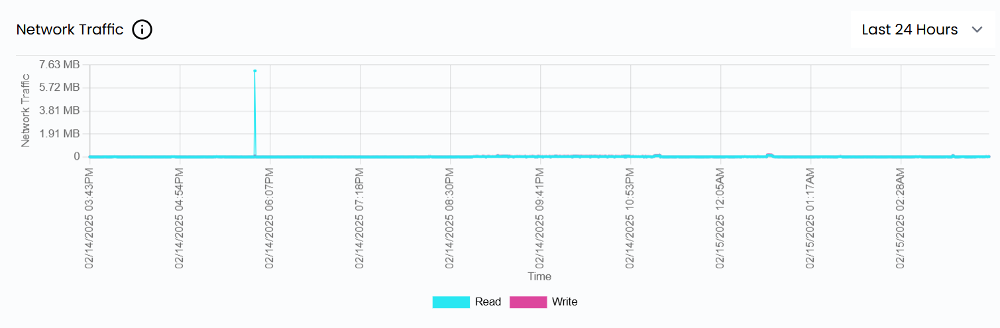
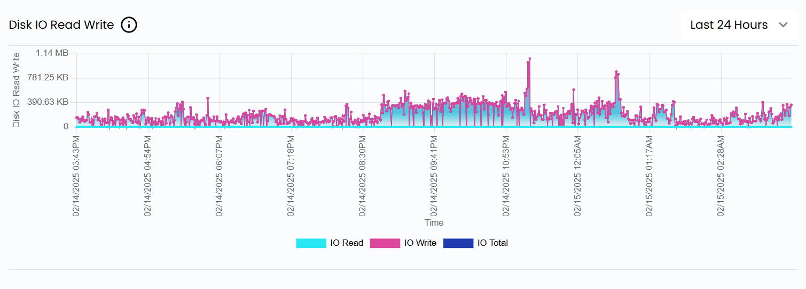
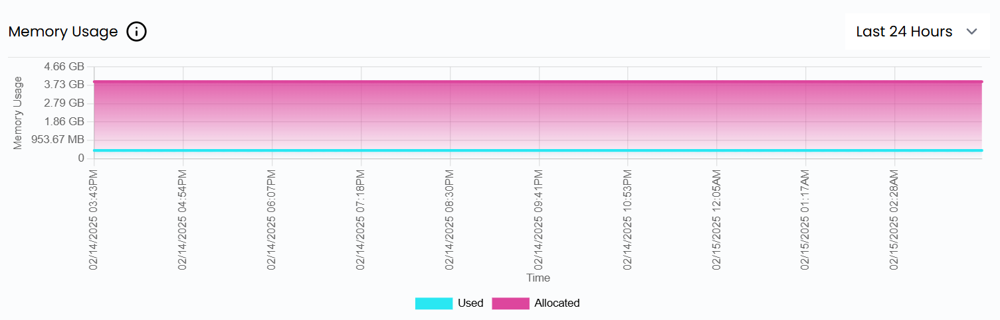
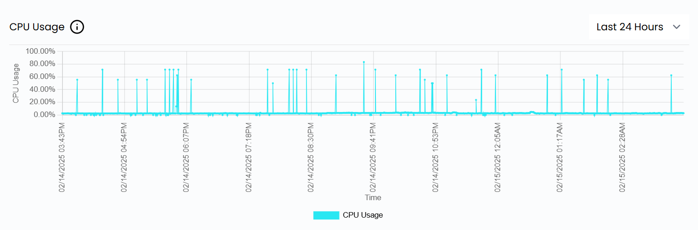
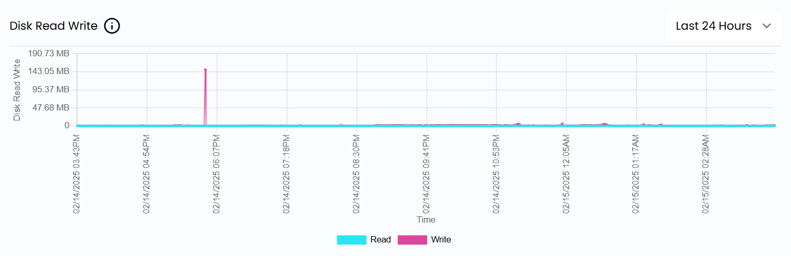

# Resurslar monitoringi

## UzCloud’da resurslar monitoringi

UzCloud’ning **resurslar monitoringi** — ixtiyoriy ulanadigan xizmat boʻlib, virtual mashinalaringiz resurslaridan foydalanishni real vaqtda kuzatish imkonini beradi. Xizmat asosiy unumdorlik metrikalarini yigʻadi va koʻrsatadi, bu esa tizimning mavjudligi, ishonchliligi va umumiy samaradorligini baholashga yordam beradi.

- Resurslarni kuzatish uchun **Usage Graphics** yorligʻini oching.
- **Usage Graphics** sahifasida barcha virtual mashinalar boʻyicha umumiy maʼlumot keltirilgan.

### Tarmoq trafigi

**Network Traffic** grafigi tarmoq orqali maʼlumotlar uzatilishini vaqt boʻyicha koʻrsatadi. Undan tarmoq unumdorligini kuzatish, trafik qonuniyatlarini aniqlash va tarmoq muammolarini tashxislash uchun foydalaning.

### Disk kiritish-chiqarishi (oʻqish/yozish)

**Disk Read/Write** grafigi tanlangan davrdagi xotira bilan bogʻliq amallarni — oʻqilgan va yozilgan maʼlumotlar hajmini koʻrsatadi. U disk unumdorligini tahlil qilish, tor joylarni topish va resurslarni optimallashtirish uchun foydali.

### Xotiradan foydalanish

**Memory Usage** grafigi tizim vaqt davomida qancha operativ xotiradan foydalanayotganini koʻrsatadi. U yordamida xotira isteʼmoli tendensiyalarini kuzatish, ehtimoliy xotira sizib chiqishlarini aniqlash va xotira taqsimotini optimallashtirish mumkin.

### CPU yuklamasi

**CPU Usage** grafigi tanlangan davrdagi protsessor yuklamasini koʻrsatadi: vaqt boʻyicha CPU foydalanish foizi, tizim yuklamasi va samaradorligi, shuningdek tor joylarni aniqlashga yordam beradi.

### Diskni oʻqish/yozish amallari

**Disk Read and Write** grafigi xotira faolligini grafik koʻrinishda aks ettiradi: disk unumdorligini kuzatish, oʻqish va yozish oʻrtasidagi nomutanosiblikni aniqlash va xotira quyi tizimining holatini baholashga yordam beradi.

### Xulosa

UzCloud’dagi ushbu grafiklar yordamida siz tizim unumdorligi haqida dolzarb maʼlumot olasiz, muammolarni ish jarayoniga taʼsir qilishidan oldin bartaraf etasiz va resurslardan foydalanishni optimallashtirasiz. UzCloud’ning **resurslar monitoringi** xizmati bilan virtual mashinalaringiz holatini kuzatib boring va ularning unumdorligini oshiring. Yordam kerak boʻlsa, UzCloud hujjatlarini oʻrganing yoki qoʻllab-quvvatlash xizmatiga murojaat qiling.
