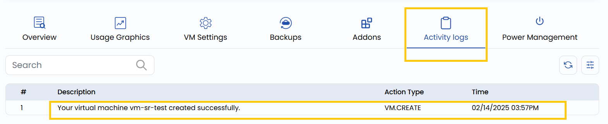

# VM faoliyat jurnali

## UzCloud’da VM faoliyatini kuzatish

UzCloud’dagi virtual mashina faoliyat jurnalida VM bilan bogʻliq barcha amallar va hodisalarning batafsil yozuvlari saqlanadi. U virtual mashinalarni boshqarishda monitoring va ish tahliliga yordam beradi.

- VM faoliyat jurnalini koʻrish uchun **Activity logs** yorligʻini oching.
- Bu yerda VM qachon yaratilgani, toʻxtatilgani, oʻchirilgani, qayta ishga tushirilgani va hokazolarni kuzatish mumkin.

