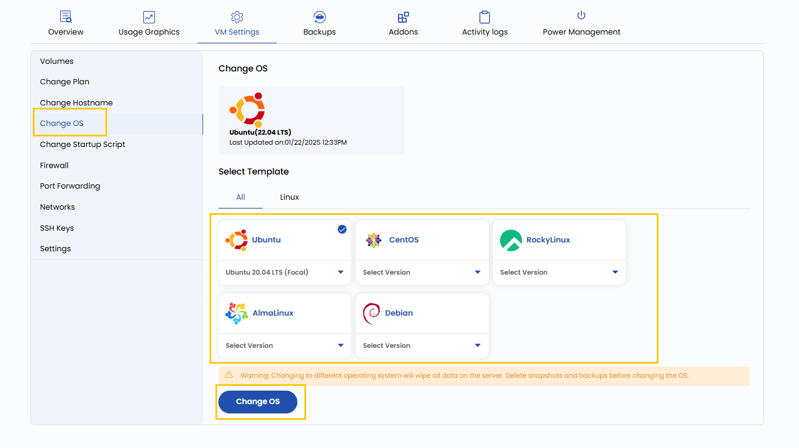

# OT’ni oʻzgartirish

## Operatsion tizimni oʻzgartirish

Ushbu sozlama virtual mashinaning operatsion tizimini (OT) qayta oʻrnatish yoki almashtirish imkonini beradi. Turli OT’larni tanlash mumkin, masalan Linux distributivlari (Ubuntu, CentOS, Debian va boshqalar) yoki Windows Server versiyalari. Eʼtibor bering: OT’ni oʻzgartirish VM’dagi barcha maʼlumotlar va sozlamalarni oʻchiradi, shuning uchun muhim maʼlumotlarning zaxira nusxasini oldindan oling.

---

- Operatsion tizimni oʻzgartirish uchun **VM settings** ni oching va **Change OS** boʻlimiga oʻting.
- **Templates** roʻyxatidan OT va uning versiyasini tanlang, soʻng **Change OS** tugmasini bosing.

> [!WARNING]
> Operatsion tizimni oʻzgartirish serverdagi barcha maʼlumotlarni oʻchiradi. OT’ni oʻzgartirishdan oldin snapshotlar va zaxira nusxalarni oʻchiring.

---

### Xulosa

Virtual mashina OT’sini oʻzgartirish boshqa dasturiy taʼminot talablariga moslashish yoki toza muhit bilan ishni boshlash imkonini beradi. Bu amaldan oldin har doim zaxira nusxa oling, chunki u mavjud sozlamalar va maʼlumotlarni oʻchiradi. Yuklamangizga mos ishonchli va mos keluvchi OT shablonini tanlang.

> [!TIP]
> **Shuningdek qarang:**
>
> - **[Shablon yaratish](../../templates/create-templates.md)**
> - **[ISO import qilish](../../isos/import-iso.md)**
