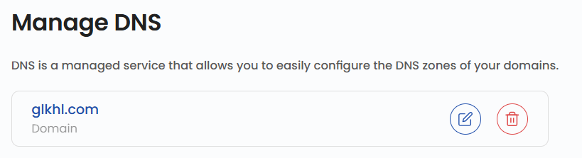
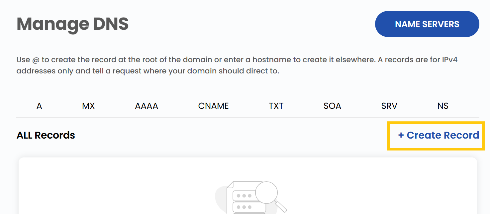
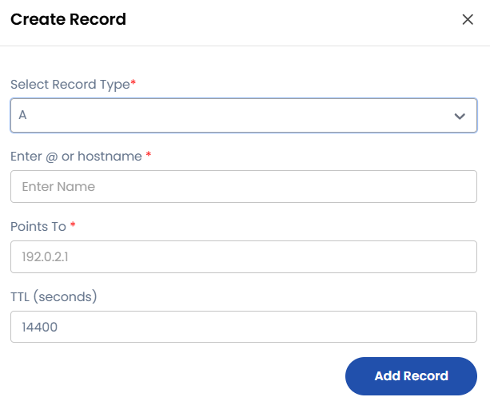

# DNS’ni boshqarish

## UzCloud’da DNS’ni boshqarish

DNS (Domain Name System) yozuvlari — internetning muhim komponentlari boʻlib, domen nomlarini muayyan xizmatlar: veb-saytlar, pochta va xavfsizlik mexanizmlari bilan bogʻlaydi. Har bir yozuv turi oʻz vazifasini bajaradi. Quyida har bir yozuv turi va uning maydonlari batafsil tavsiflangan.

---

DNS faollashtirilgach, nom serverlarini (name servers) koʻrish, yozuvlarni yaratish va boshqarish uchun boshqaruv panelidan foydalaning.



- DNS xizmatidan foydalanish uchun ushbu nom serverlarini domeningiz registratorida koʻrsating.
- Domen ildizi uchun yozuv yaratish uchun `@` dan foydalaning yoki quyi domen uchun xost nomini kiriting. A yozuvlari faqat IPv4 manzillar uchun moʻljallangan va domenga soʻrovlar qayerga yoʻnaltirilishini koʻrsatadi.
- Yozuv yaratish uchun **Create Record** tugmasini bosing.



- Tanlangan yozuv turiga mos maydonlarni toʻldiring.



### A yozuvi (Address Record)

**A** yozuvi domen nomini IPv4 manzil bilan bogʻlaydi. Uning yordamida `example.com` kabi domenni kiritgan foydalanuvchilar kerakli veb-serverning IP manziliga yoʻnaltiriladi.

**Asosiy:**

- **Maqsadi:** domen nomlarini IPv4 manzillar bilan bogʻlaydi.
- **Enter `@` or hostname:** `@` — asosiy domen uchun, xost nomi — quyi domenlar uchun.
- **Points To:** `192.0.2.1`
- **TTL (soniya):** `14400`

**Yozuv namunasi:**

```text
@    A    192.0.2.1    14400
```

### AAAA yozuvi (IPv6 Address Record)

**AAAA** yozuvi domen nomlarini IPv6 manzillar bilan bogʻlaydi.

**Asosiy:**

- **Maqsadi:** domen nomlarini IPv6 manzillar bilan bogʻlaydi.
- **Enter `@` or hostname:** `@` — asosiy domen uchun, xost nomi — quyi domenlar uchun.
- **Points To:** `2001:0db8:85a3:0000:0000:8a2e:0370:7334`
- **TTL (soniya):** `14400`

**Yozuv namunasi:**

```text
@    AAAA    2001:0db8:85a3:0000:0000:8a2e:0370:7334    14400
```

### CNAME yozuvi (Canonical Name Record)

**CNAME** yozuvi domen nomi uchun taxallus yaratadi va soʻrovlarni bir domendan boshqasiga yoʻnaltiradi.

**Asosiy:**

- **Maqsadi:** bir domenni boshqasining taxallusiga aylantiradi.
- **Enter `@` or hostname:** `@` — asosiy domen uchun, xost nomi — quyi domenlar uchun.
- **Target:** `example.com.`
- **TTL (soniya):** `14400`

**Yozuv namunasi:**

```text
blog    CNAME    example.com.    14400
```

### MX yozuvi (Mail Exchange Record)

**MX** yozuvi domen pochtasini kerakli pochta serveriga yoʻnaltiradi.

**Asosiy:**

- **Maqsadi:** pochtani belgilangan pochta serveriga yoʻnaltiradi.
- **Enter `@` or hostname:** `@` — asosiy domen uchun, xost nomi — quyi domenlar uchun.
- **Priority:** `10`
- **Mail Server:** `mail.example.com.`
- **TTL (soniya):** `14400`

**Yozuv namunasi:**

```text
@    MX    10 mail.example.com.    14400
```

### TXT yozuvi (Text Record)

**TXT** yozuvi ixtiyoriy matnni saqlaydi va domenga egalikni tasdiqlash, pochtani himoyalash va boshqa maqsadlarda keng qoʻllaniladi.

**Asosiy:**

- **Maqsadi:** tekshirish yoki xavfsizlik uchun matnli maʼlumotni saqlaydi.
- **Enter `@` or hostname:** `@` — asosiy domen uchun, xost nomi — quyi domenlar uchun.
- **TXT Value:** `v=spf1 mx -all`
- **TTL (soniya):** `14400`

**SPF yozuvi namunasi:**

```text
@    TXT    "v=spf1 mx -all"    14400
```

### NS yozuvi (Name Server Record)

**NS** yozuvi domenning vakolatli DNS serverlarini koʻrsatadi.

**Asosiy:**

- **Maqsadi:** domenning vakolatli nom serverlarini belgilaydi.
- **Enter `@` or hostname:** `@` — asosiy domen uchun, xost nomi — quyi domenlar uchun.
- **Nameserver:** `ns1.example.com.`
- **TTL (soniya):** `14400`

**Yozuv namunasi:**

```text
@    NS    ns1.example.com.    14400
```

### SRV yozuvi (Service Record)

**SRV** yozuvi domendagi muayyan xizmatlarni topish parametrlarini belgilaydi.

**Asosiy:**

- **Maqsadi:** muayyan xizmatlar joylashgan serverlarni koʻrsatadi.
- **Enter `@` or hostname:** `@` — asosiy domen uchun, xost nomi — quyi domenlar uchun.
- **Priority:** `10`
- **Weight:** `60`
- **Port:** `5060`
- **Target:** `sipserver.example.com.`
- **TTL (soniya):** `14400`

**SIP yozuvi namunasi:**

```text
_sip._tcp    SRV    10 60 5060 sipserver.example.com.    14400
```

### SOA yozuvi (Start of Authority Record)

**SOA** yozuvi DNS zonasi haqidagi asosiy maʼmuriy maʼlumotlarni oʻz ichiga oladi.

**Asosiy:**

- **Maqsadi:** DNS zonasini boshqarish uchun asosiy maʼlumotlarni taqdim etadi.
- **TTL (soniya):** `86400`

**Yozuv namunasi:**

```text
@    SOA    ns1.example.com admin.example.com 2024031001 7200 3600 1209600 86400
```

---

### Xulosa

DNS yozuvlari turlarini tushunib va ularni boshqarib, siz domen ishini samarali sozlashingiz mumkin. Trafikni yoʻnaltirayotgan, pochtani himoyalayotgan yoki xizmatlarni sozlayotgan boʻlsangiz ham, DNS yozuvlari internetda ishonchli ishtirok etish uchun zarur. Yordam kerak boʻlsa, UzCloud hujjatlarini oʻrganing yoki qoʻllab-quvvatlash xizmatiga murojaat qiling.

> [!TIP]
> **Shuningdek qarang:**
>
> - **[DNS yaratish](create-dns.md)**
