# Profilni sozlash

## UzCloud’da foydalanuvchi profilini sozlash

**UzCloud** foydalanuvchi profili boʻlimi shaxsiy maʼlumotlarni boshqarish, parolni oʻzgartirish, toʻlov parametrlarini sozlash, foydalanuvchilar va rollarni qoʻshish hamda akkauntdagi faoliyatni kuzatish imkonini beradi. Bu yerda akkaunt haqidagi batafsil maʼlumot va uning sozlamalari jamlangan.

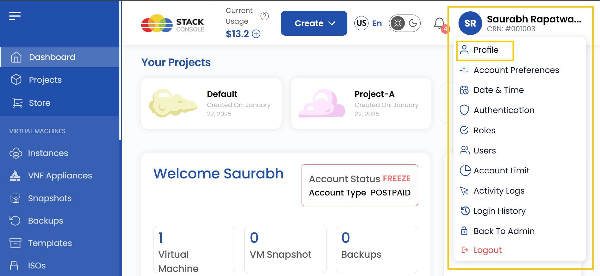

### Shaxsiy maʼlumotlarni yangilash

Profilingizda toʻgʻri maʼlumotlar boʻlishi uchun shaxsiy maʼlumotlaringizni dolzarb holatda saqlang. Ushbu boʻlimda asosiy maydonlarni oʻzgartirish mumkin: ism, telefon raqami va manzil.

- Chap menyudan **Profile** boʻlimiga oʻting.
- Shaxsiy maʼlumotlarni oʻzgartirish uchun **Personal Details** ni tanlang.
- Oʻzgarishlarni saqlash uchun **Submit** tugmasini bosing.

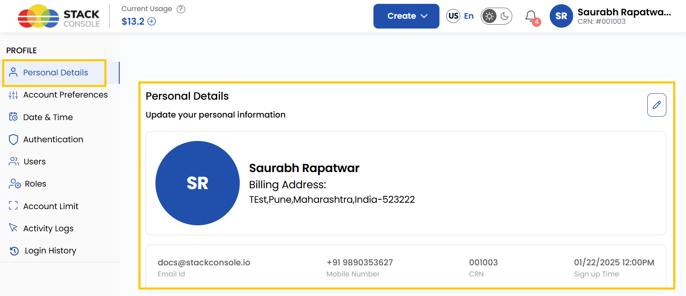

### Toʻlov maʼlumotlarini boshqarish

Obunalar va toʻlovlarni boshqarish uchun toʻgʻri toʻlov maʼlumotlari zarur. Ushbu boʻlimda hisob-fakturalar uchun toʻlov manzili va telefon raqamini qoʻshish yoki oʻzgartirish mumkin.

- Chap menyudan **Profile** boʻlimiga oʻting.
- **Personal Details** ni tanlang va **Billing Details** ga oʻting.
- **Billing Address** va **Phone Number** ni qoʻshing yoki oʻzgartiring.
- Oʻzgarishlarni saqlash uchun **Submit** tugmasini bosing.

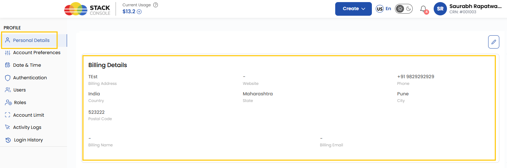

### Akkaunt sozlamalari

Boshqaruv panelining koʻrinishini oʻzingizga moslang: vizual rejimlar oʻrtasida almashing.

- Chap menyudan **Profile** boʻlimiga oʻting.
- **Account Preferences** ni tanlang.
- **Light Mode** (yorugʻ mavzu) yoki **Dark Mode** (qorongʻi mavzu) ni tanlang.
- Kerakli rejimni yoqing — oʻzgarishlar darhol qoʻllaniladi.

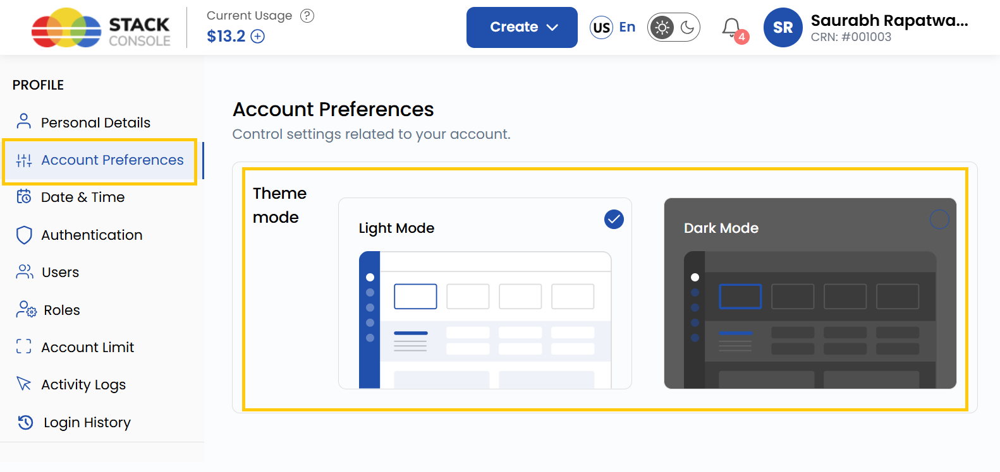

### Sana va vaqt sozlamalari

Sana va vaqt formatini sozlang, ayniqsa turli mintaqalar bilan ishlasangiz.

- Chap menyudan **Profile** boʻlimiga oʻting.
- **Date and Time Settings** ni tanlang.
- **Preferred Time Zone** (vaqt mintaqasi) va **Date Time Format** (sana va vaqt formati) ni belgilang.
- Oʻzgarishlarni qoʻllash uchun **Submit** tugmasini bosing.

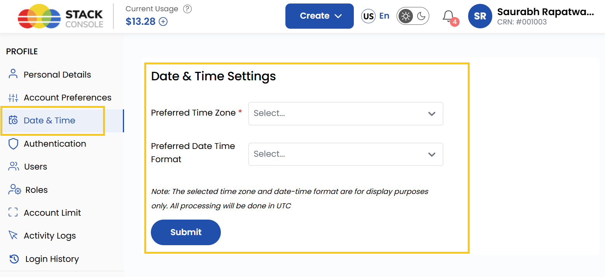

### Ikki bosqichli autentifikatsiya

Xavfsizlikni oshirish uchun **ikki bosqichli autentifikatsiyani (2FA)** yoqing — bu tizimga kirishda qoʻshimcha himoya qatlamini qoʻshadi.

- Chap menyudan **Profile** boʻlimiga oʻting.
- **Authentication** ni tanlang va **Two-Factor Authentication (2FA)** ni toping.
- **Email Authentication** blokida **Set Up** tugmasini bosing.
- **Email ID** ni kiriting va **Send OTP** tugmasini bosing.
- Pochtangizga yuborilgan OTP kodini kiriting.
- Agar 2FA butun tashkilot uchun majburiy boʻlishi kerak boʻlsa, **Enable 2FA for All Users** ni yoqing.

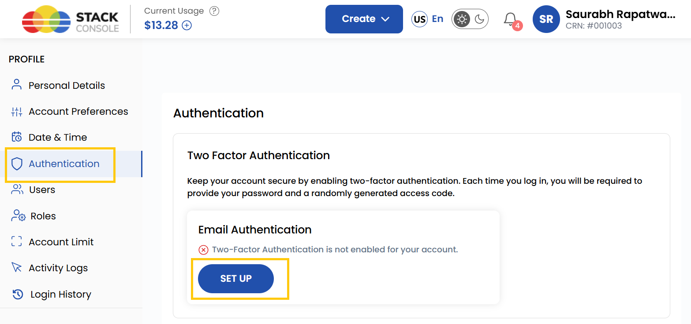

### Parolni oʻzgartirish

Akkaunt xavfsizligi uchun parolni vaqti-vaqti bilan oʻzgartirib turish tavsiya etiladi.

- Chap menyudan **Profile** boʻlimiga oʻting.
- **Authentication** ni tanlang va **Change Password** tugmasini bosing.
- **Current Password** (joriy parol) ni kiriting, soʻng **New Password** (yangi parol) ni kiriting va tasdiqlang, keyin oʻzgarishlarni saqlash uchun **Change Password** tugmasini bosing.

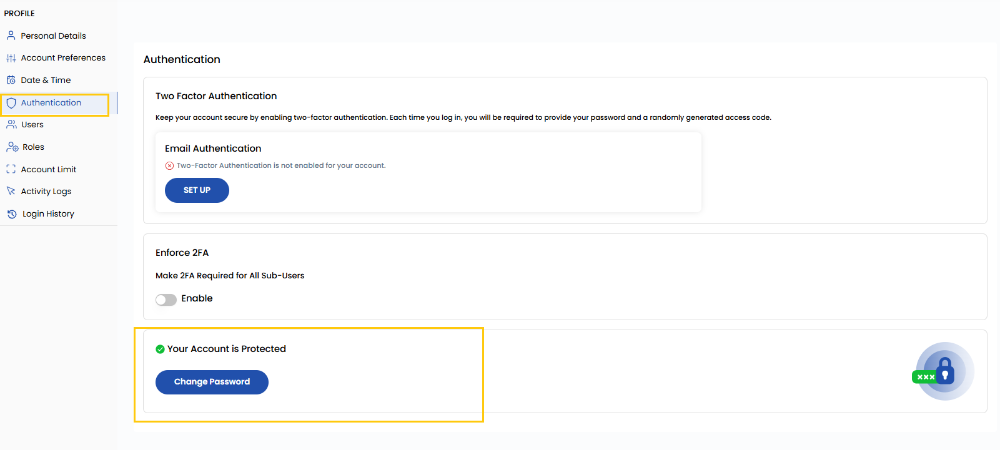

### Yangi foydalanuvchi qoʻshish

**Users** boʻlimi tashkilotga yangi foydalanuvchilarni qoʻshish va ularga rollar hamda huquqlarni tayinlash imkonini beradi.

- Chap menyudan **Profile** boʻlimiga oʻting.
- Bu yerda foydalanuvchilarni koʻrish va amal tugmalari yordamida ularni boshqarish mumkin — tahrirlash va taklifnomani qayta yuborish. Foydalanuvchi qoʻshish uchun **Users** ni tanlang va **Add User** tugmasini bosing.
- Foydalanuvchi maʼlumotlarini kiriting, uning **Role** (roli) ni tanlang va foydalanuvchini yaratish uchun **Submit** tugmasini bosing.

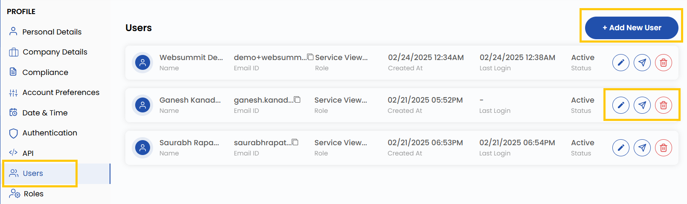

### Foydalanuvchi rollari va huquqlari

**Roles** boʻlimi tashkilotdagi har bir foydalanuvchi uchun rollar va kirish huquqlarini tayinlash hamda sozlash imkonini beradi.

- Chap menyudan **Profile** boʻlimiga oʻting.
- Huquqlarni koʻrish va tayinlash uchun **Roles** ni tanlang.
- Moslashtirilgan huquqlarga ega yangi rol yaratish uchun **Add New Role** tugmasini bosing.

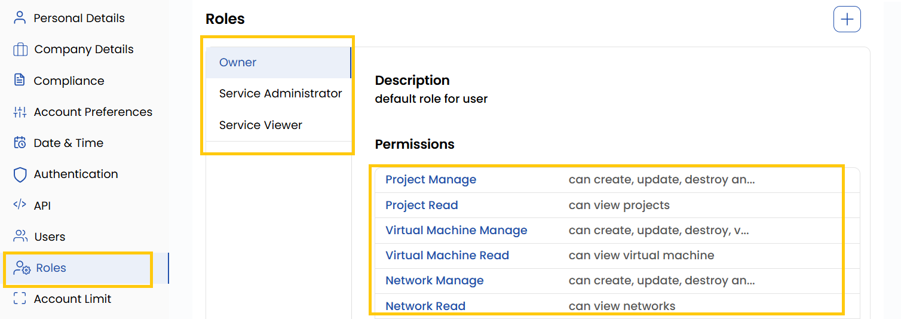

### Akkaunt limitlari

**Account Limits** boʻlimi resurslardan foydalanishni koʻrish va zarur boʻlganda limitlarni oshirishni soʻrash imkonini beradi.

- Chap menyudan **Profile** boʻlimiga oʻting.
- Ajratilgan resurslar jadvalini koʻrish uchun **Account Limit** ni tanlang.
- Qoʻshimcha resurslar uchun soʻrov yuborish maqsadida **Request To Increase** tugmasini bosing.

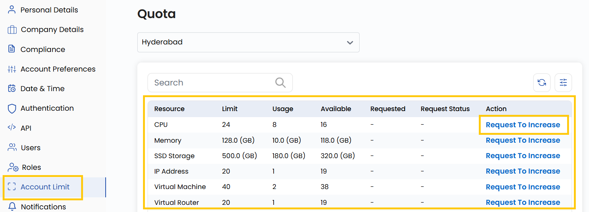

### Faoliyat jurnali

**Activity Logs** boʻlimida platformadagi foydalanuvchilar va tizim harakatlarining batafsil yozuvlari saqlanadi.

- Chap menyudan **Profile** boʻlimiga oʻting.
- Tizimdagi harakatlar va oʻzgarishlarni kuzatish uchun **Activity Logs** ni tanlang.
- Yozuvlarni kalit soʻzlar boʻyicha filtrlash uchun qidiruv satridan foydalaning.

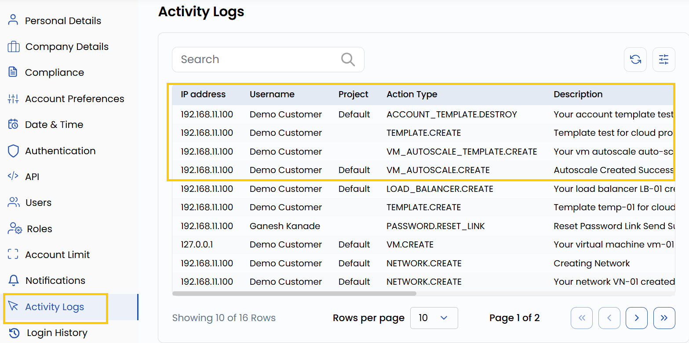

### Kirishlar tarixi

**Login History** boʻlimi kirishlar tarixi orqali akkauntga kirishni kuzatish va xavfsizlikni tekshirish imkonini beradi.

- Chap menyudan **Profile** boʻlimiga oʻting.
- Kirish yozuvlarini koʻrish uchun **Login History** ni tanlang.

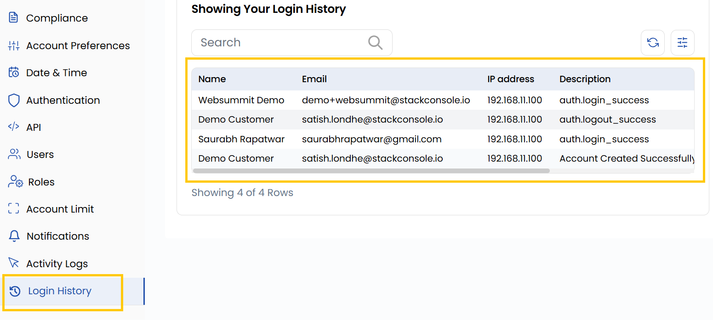

### Xulosa

Ushbu qoʻllanmaga amal qilib, siz UzCloud profilingizni samarali boshqarishingiz, xavfsizlikni kuchaytirishingiz va akkauntni oʻz ehtiyojlaringizga moslashingiz mumkin. Profil maʼlumotlarining dolzarbligi akkauntni qulay boshqarishni taʼminlaydi va platformadagi xavfsizlikni oshiradi.
