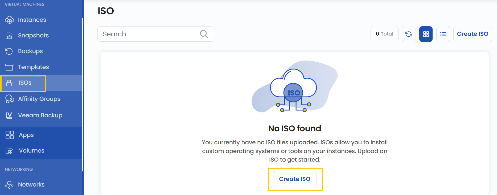
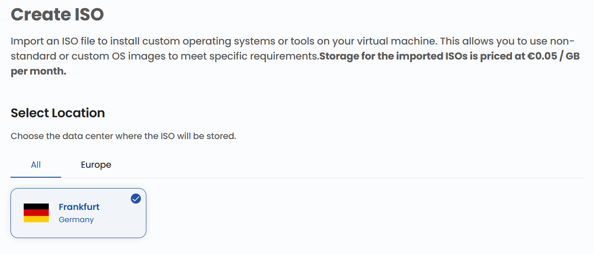
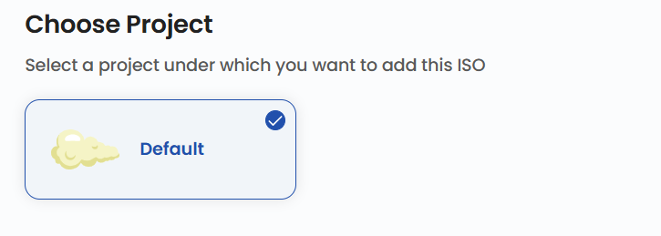
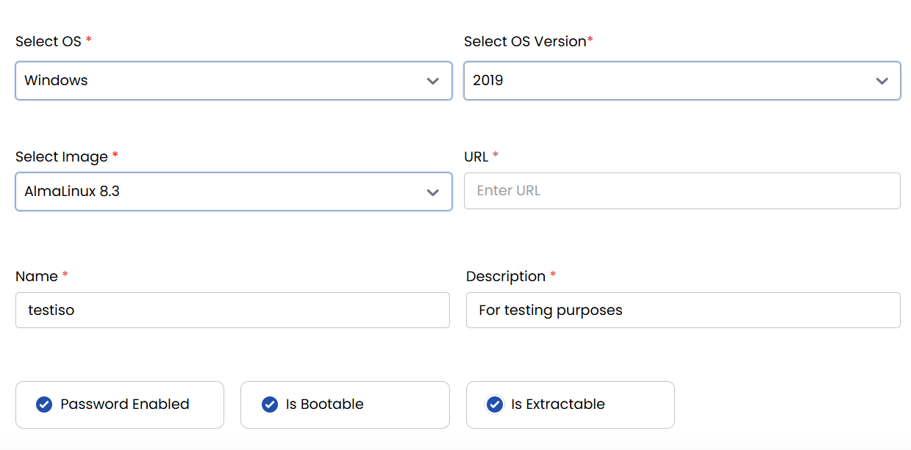

# ISO import qilish

## ISO obraz

**ISO obraz** (ISO — International Organization for Standardization standarti nomidan) — fayl tizimining aniq nusxasini oʻz ichiga olgan disk obrazi fayli. UzCloud’da ISO obrazlar virtual mashinalar yaratish, operatsion tizimlarni oʻrnatish va tizimni tiklash uchun ishlatiladi. Ushbu qoʻllanmada UzCloud’ga ISO obrazni import qilish, uni boshqarish va undan foydalanish tushuntiriladi.

---

### ISO obraz yaratish

- Chap menyuda **ISOs** yorligʻini oching.
- ISO qoʻshish uchun sahifaning oʻng tomonidagi **ISOs** yoki **plyus (+)** belgisini bosing. ISO yaratish menyusi ochiladi.

### Joylashuvni tanlash

- ISO obraz saqlanadigan maʼlumotlar markazini tanlang.
- Mavjud joylashuvlardan birini tanlang.

### Loyihaga biriktirish

- Resurslarni qulay tartibga solish va boshqarish uchun ISO obrazni loyihalaringizdan biriga biriktiring.

### ISO parametrlari

ISO yaratishda bir nechta majburiy maydonlarni toʻldirish kerak:

- **Operating System** — ISO obraz uchun OT (masalan, Windows, Linux, macOS).
- **OS Version** — tanlangan OT’ning aniq versiyasi (masalan, Windows 11, Ubuntu 22.04).
- **Image** — ISO yaratiladigan fayl.
- **URL** — agar ISO obraz internetda joylashgan boʻlsa, toʻgʻri havola.
- **Name** — oson aniqlash uchun ISO fayl nomi.
- **Description** — ISO tarkibi yoki maqsadining qisqacha tavsifi.

Shuningdek, qoʻshimcha parametrlarni tanlash mumkin:

- **Password Enabled** — ISO tarkibiga kirish uchun parol talab qilinadi, bu qoʻshimcha himoya qatlamini qoʻshadi.
- **Is Bootable** — ushbu ISO’dan tizimni yuklash mumkinligini belgilaydi. Parametr yoqilgan boʻlsa, ISO’ni USB/DVD’ga yozib, OT’ni oʻrnatish yoki ishga tushirish uchun ishlatish mumkin.
- **Is Extractable** — ISO’ni maxsus montaj dasturlarisiz oddiy arxiv kabi ochish va chiqarib olish imkonini beradi.

### ISO yaratish

- Kerakli **Billing Cycle** ni tanlang. ISO uchun soatlik toʻlov qoʻllab-quvvatlanadi.
- Qoʻllab-quvvatlanadigan billing qoidalari: Date to Date, Fixed Calendar Month, Unfixed Calendar Month, Fixed Prorata va Unfixed Prorata.
- ISO uchun har bir zonada faqat bitta paket qoʻllab-quvvatlanadi — bu yuklanadigan obrazlardan foydalanishni hisobga olishning oddiy modeli.
- Barcha parametrlarni va umumiy narxni tekshiring. Loyiha uchun ISO yaratish maqsadida **Review & Create ISO** tugmasini bosing.

### Xulosa

Ushbu qoʻllanmaga amal qilib, siz UzCloud’da ISO obrazlarni osongina yaratishingiz va boshqarishingiz mumkin. ISO obrazlar operatsion tizimlarni joylashtirish, virtual mashinalar yaratish va tizimni tiklashning universal usulidir. Yordam kerak boʻlsa, UzCloud hujjatlarini oʻrganing yoki qoʻllab-quvvatlash xizmatiga murojaat qiling.

> [!TIP]
> **Shuningdek qarang:**
>
> - **[VNF qurilmalari](../vnf-appliances/vnf-appliances.md)**
> - **[Virtual mashina](../compute/compute-instance.md)**
> - **[Shablonlar yaratish](../templates/create-templates.md)**
