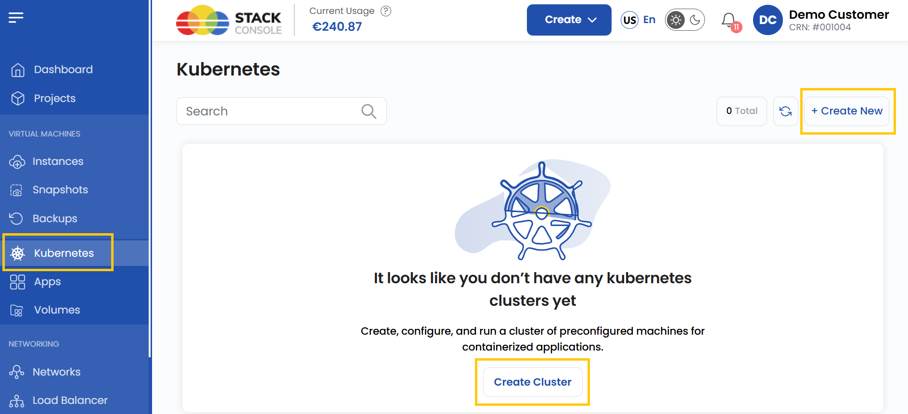
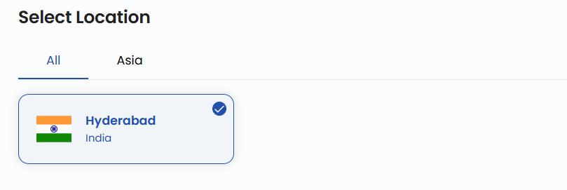
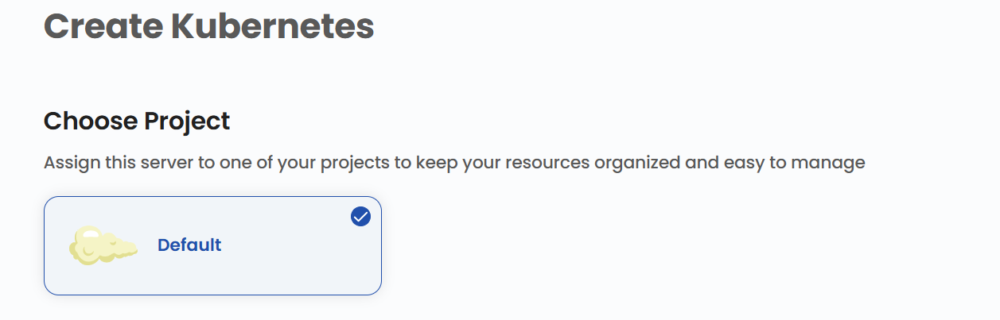
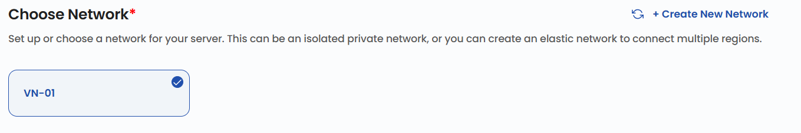
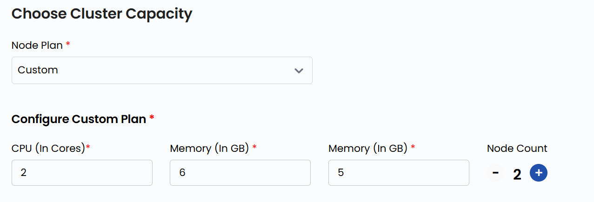
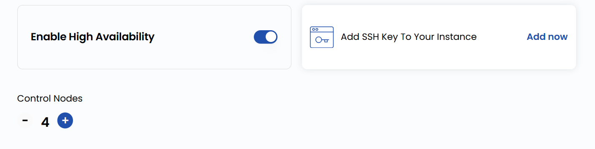
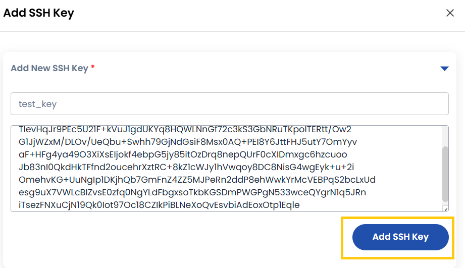
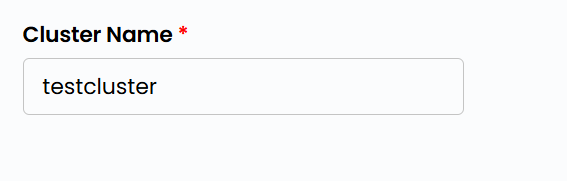

# Kubernetes klasterini yaratish

## Kubernetes klasteri

**Kubernetes** klasteri — konteynerlashtirilgan ilovalarni avtomatik va masshtablanuvchi tarzda birgalikda ishga tushiradigan oldindan sozlangan mashinalar (tugunlar) toʻplami. Kubernetes bir nechta tugunlarda ilova konteynerlarini joylashtirish, masshtablash va ishlashini boshqaradi.

**UzCloud**’da ilovalarni boshqarish, resurslarni masshtablash va yuqori mavjudlikni taʼminlash uchun Kubernetes klasterini osongina yaratish mumkin.

---

### Kubernetes klasterini yaratish

- Chap menyuda **Kubernetes** yorligʻini oching.
- **Kubernetes** sahifasi ochiladi.

- Klaster yaratish uchun sahifaning oʻng tomonidagi **Create Cluster** yoki **Create New** tugmasini bosing.

### Joylashuvni tanlash

- Kubernetes klasteri joylashtiriladigan maʼlumotlar markazini tanlang.
- Mavjud joylashuvlardan birini tanlang.

### Loyihaga biriktirish

- Resurslarni qulay tartibga solish va boshqarish uchun klasterni loyihalaringizdan biriga biriktiring.

### Tarmoqni tanlash

- Klaster uchun tarmoqni sozlang yoki tanlang. Bu izolyatsiya qilingan xususiy tarmoq boʻlishi mumkin; bir nechta hududlarni bogʻlash uchun elastik tarmoq ham yaratish mumkin.
- Yangi tarmoqni **Create New Network** ni tanlab yaratish mumkin.

### Klaster quvvati

- CPU, xotira va disk parametrlari belgilangan tayyor **Node Plan** ni tanlang.
- Aniqroq sozlash uchun CPU, xotira, disk va tugunlar sonini koʻrsatib **Custom Plan** yarating. Tugunlar qancha koʻp boʻlsa, masshtablanuvchanlik shuncha yuqori va yuklama shuncha tekis taqsimlanadi.

### Kengaytirilgan sozlamalar (ixtiyoriy)

- Zaxiralash uchun **Enable High Availability** ni yoqishingiz va nosozliklarda barqaror ishlash uchun **Control Nodes** (boshqaruv tugunlari) qoʻshishingiz mumkin.

- Qoʻshimcha parametrlarni sozlang:

  - Xavfsiz kirish uchun **SSH kalit qoʻshing**. SSH kalit qoʻshish uchun **Add Now** tugmasini bosing.
  - **Eslatma**: baʼzi OT obrazlari, masalan Arch Linux uchun SSH kalit majburiy, chunki parol orqali kirish qoʻllab-quvvatlanmaydi.

- SSH kalit nomi va qiymatini kiriting, soʻng **Add SSH Key** tugmasini bosing.

### Klaster nomi

- Klasterni boshqaruv panelida oson topish uchun noyob **Cluster Name** ni kiriting.

### Klasterni yaratish

- Kerakli **Billing Cycle** ni tanlang. Kubernetes uchun quyidagi davrlar qoʻllab-quvvatlanadi: soatlik, oylik, choraklik, yarim yillik, yillik, ikki yillik va uch yillik.
- Qoʻllab-quvvatlanadigan billing qoidalari: Date to Date, Fixed Calendar Month, Unfixed Calendar Month, Fixed Prorata va Unfixed Prorata.
- Resurslarga boʻlgan ehtiyojga (tugunlar soni, disk hajmi) qarab turli klaster paketlari mavjud — bu turli konteyner yuklamalari uchun mos.
- Barcha parametrlarni va umumiy narxni tekshiring. Klasterni yaratish uchun **Create Cluster** tugmasini bosing.

### Xulosa

Ushbu qoʻllanmaga amal qilib, siz UzCloud’da Kubernetes klasterini osongina yaratishingiz va boshqarishingiz mumkin. Kubernetes klasterlari konteynerlashtirilgan ilovalarni yuqori mavjudlik va samaradorlik bilan joylashtirish, masshtablash va boshqarishning kuchli vositasidir. Yordam kerak boʻlsa, UzCloud hujjatlarini oʻrganing yoki qoʻllab-quvvatlash xizmatiga murojaat qiling.

> [!TIP]
> **Shuningdek qarang:**
>
> - **[Kubernetes klasterini boshqarish](kubernetes-cluster-overview.md)**
> - **[Yuklama muvozanatlagich](../load-balancer/load-balancer.md)**
> - **[Avtomatik masshtablash](../auto-scaling/create-auto-scaling.md)**
> - **[Affinity guruhlari](../affinity-groups/create-affinity-groups.md)**
