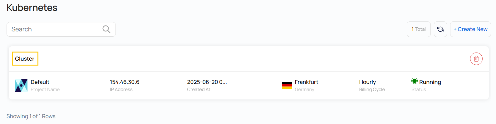
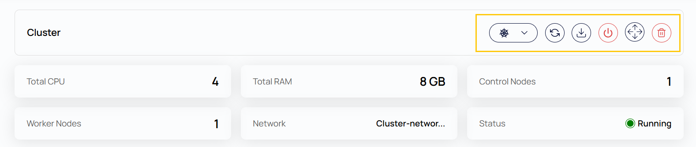
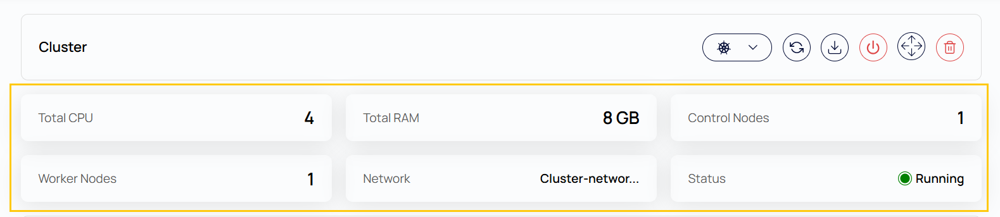
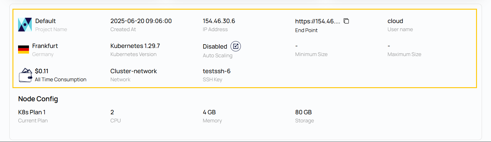
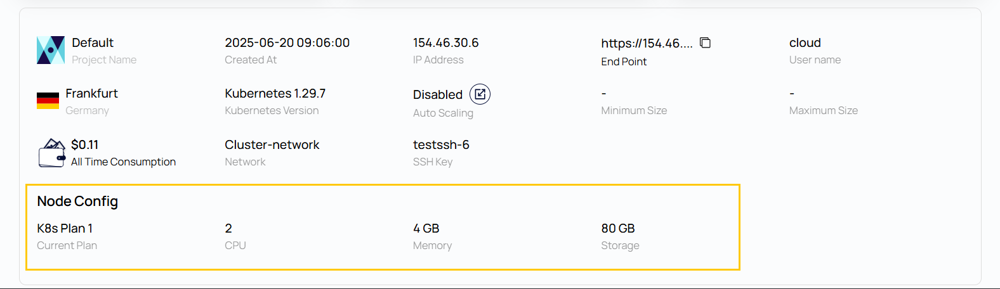
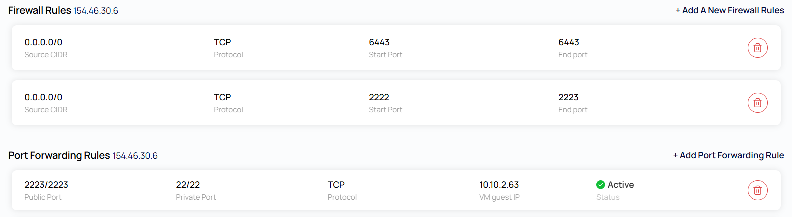

# Kubernetes klasteri sharhi

## UzCloud’da Kubernetes klasteri sharhi

**Kubernetes Cluster Overview** sahifasida Kubernetes klasteri haqida batafsil maʼlumot va uni boshqarish vositalari jamlangan: klaster konfiguratsiyasi, resurs xususiyatlari, foydalanish metrikalari va tezkor amallar.

---

### Amal tugmalari

- Amal tugmalari — Kubernetes bilan asosiy amallarga tezkor kirish.

- Amal tugmalarini koʻrish uchun klaster ustiga bosing — **Kubernetes Cluster** sahifasi ochiladi.

- **Upgrade Kubernetes Version** — klasterni yaxshilanishlar, xatolar tuzatilgan va xavfsizlik yamoqlari bilan yangi Kubernetes versiyasiga yangilaydi.
- **Refresh** — klasterning dolzarb maʼlumotlarini, jumladan holati va resurs metrikalarini yuklaydi.
- **Download Config** — klaster bilan `kubectl` kabi CLI vositalari orqali ishlash uchun `kubeconfig` faylini yuklab oladi.
- **Power Off** — butun Kubernetes klasterini toʻgʻri oʻchiradi.
- **Delete** — klaster va unga bogʻliq barcha resurslarni butunlay oʻchirib tashlaydi.

### Klaster sharhi

- **Total CPU** — klasterning barcha tugunlaridagi virtual protsessorlar (vCPU) umumiy soni.
- **Total RAM** — klasterga ajratilgan xotiraning umumiy hajmi (GB’da).
- **Control Nodes** — klaster holatini boshqaradigan va ishchi tugunlarni muvofiqlashtiradigan tugunlar.
- **Worker Nodes** — konteyner yuklamalari va ilovalar ishlaydigan tugunlar.
- **Network** — klaster joylashtirilgan virtual tarmoq.
- **Status** — klasterning joriy holati (masalan, Running, Stopped).

### Klaster haqida maʼlumot

- **Project Name** — klaster yaratilgan loyiha nomi.
- **Created At** — klaster yaratilgan sana va vaqt.
- **IP Address** — klasterning ommaviy IP manzili.
- **End Point** — klasterga kirish uchun API server manzili.
- **Cloud** — klaster joylashgan bulut hududi yoki provayderi.
- **Username** — klaster resurslariga kirish uchun standart foydalanuvchi nomi.
- **Location** — maʼlumotlar markazining geografik joylashuvi.
- **Kubernetes Version** — klasterdagi Kubernetes’ning joriy versiyasi.
- **Auto Scaling** — yoqilgan boʻlsa, klaster yuklamaga qarab tugunlar sonini avtomatik oʻzgartiradi.
- **Minimum Size / Maximum Size** — avtomatik masshtablash uchun tugunlarning minimal va maksimal soni (agar yoqilgan boʻlsa).
- **All Time Consumption** — klaster yaratilgandan beri ishlashining umumiy qiymati.
- **Network** — klaster ishlayotgan tarmoq nomi.
- **SSH Key** — klaster tugunlariga xavfsiz kirish uchun SSH kalit.

### Tugunlar konfiguratsiyasi

- **Current Plan** — har bir tugun resurslarini belgilovchi tanlangan infratuzilma rejasi (masalan, K8s Plan 1).
- **CPU** — har bir tugundagi vCPU soni.
- **Memory** — har bir tugundagi RAM hajmi.
- **Storage** — har bir tugundagi disk hajmi.

### Kubernetes xizmatlarini tekshirish

Kubernetes xizmatlari maʼlum bir portda ishlaydi. Ushbu portni UzCloud konsolidagi tarmoqlararo ekranda oching va quyidagi skrinshotda koʻrsatilganidek, u uchun portlarni yoʻnaltirish qoidasini yarating.

---

### Xulosa

**Kubernetes Cluster Overview** sahifasi klaster holati, konfiguratsiyasi va resurslardan foydalanish haqida markazlashgan tasavvur beradi. Amal tugmalari klasterga xizmat koʻrsatishni soddalashtiradi, batafsil xususiyatlar esa monitoring va rejalashtirishga yordam beradi.

> [!TIP]
> **Shuningdek qarang:**
>
> - **[Kubernetes klasterini yaratish](create-kubernetes-cluster.md)**
> - **[CLI orqali Kubernetes klasteri](kubernetes-cluster-via-cli.md)**
> - **[Kubernetes Dashboard’ga kirish](kubernetes-dashboard-ui-access.md)**
