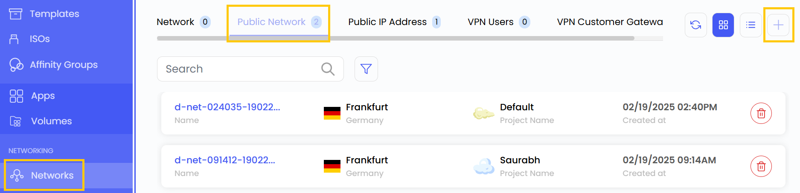
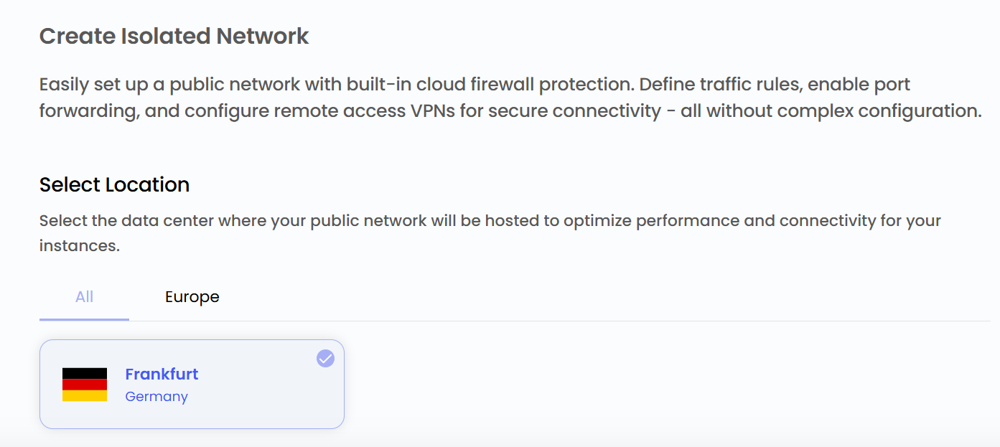
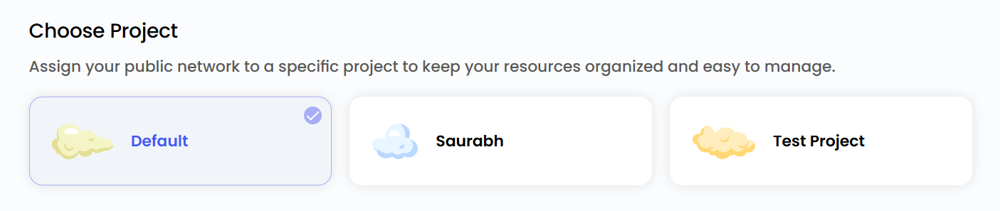
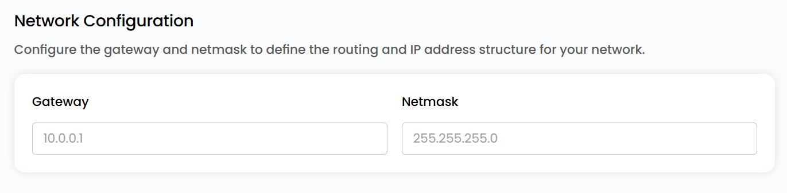
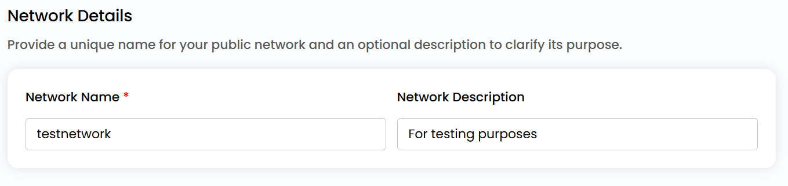

# Ommaviy tarmoq yaratish

## Ommaviy tarmoq yaratish

UzCloud’dagi **ommaviy tarmoq** bulutli resurslarga internetdan kirishni taʼminlaydi. U virtual mashinalar, ilovalar va boshqa bulutli xizmatlarga tashqi tizimlar bilan internet orqali aloqa qilish imkonini beradi. Ommaviy tarmoqlar hamma joydan foydalanish mumkin boʻlishi kerak boʻlgan veb-ilovalar, API va boshqa xizmatlarni joylashtirish uchun zarur.

- Chap menyuda **Networks** yorligʻini oching.
- **Networks** sahifasi ochiladi. **Public Network** yorligʻiga oʻting.

- Ommaviy tarmoq yaratish uchun sahifaning oʻng tomonidagi **plyus (+)** belgisini bosing.

### Joylashuvni tanlash

- Tarmoq jismoniy joylashadigan maʼlumotlar markazini tanlang.
- Mavjud joylashuvlardan birini tanlang.

### Loyihaga biriktirish

- Resurslarni qulay tartibga solish va boshqarish uchun tarmoqni loyihalaringizdan biriga biriktiring.

### Tarmoq sozlamalari

- Marshrutlash va IP manzillar tuzilmasini belgilash uchun shlyuz va tarmoq niqobini kiriting.

### Ommaviy tarmoq nomi

- Ommaviy tarmoqni oson topish uchun noyob nom kiriting va xohlasangiz, uning maqsadi haqida tavsif qoʻshing.

### Ommaviy tarmoqni yaratish

- Kerakli **Billing Cycle** ni tanlang: soatlik yoki oylik.
- Barcha parametrlarni va umumiy narxni tekshiring. Ommaviy tarmoqni yaratish uchun **Create** tugmasini bosing.

### Xulosa

Ommaviy tarmoq bulutli resurslarni internetga ulaydi va ularni hamma joydan foydalanish mumkin qiladi. Joylashuv, loyiha va tarmoq parametrlarini sozlab, siz moslashuvchan toʻlov variantlariga ega ishonchli va boshqariladigan tarmoqqa ega boʻlasiz.

> [!TIP]
> **Shuningdek qarang:**
>
> - **[Ommaviy tarmoq sharhi](network-overview.md)**
> - **[Ommaviy IP manzillar](public-ip-addresses.md)**
