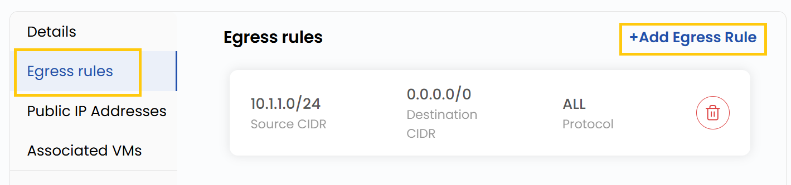
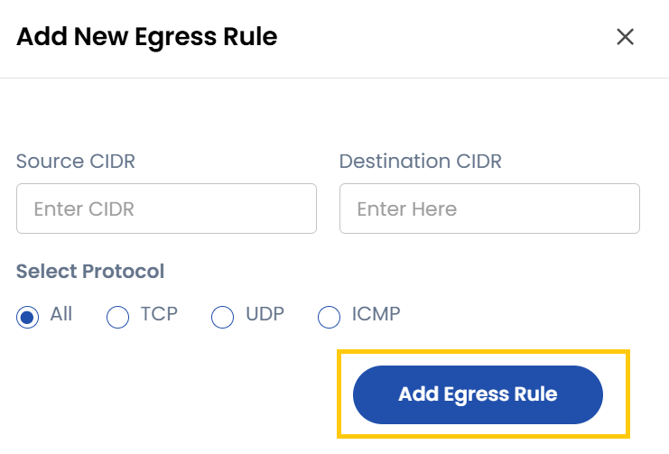

# Chiquvchi trafik qoidalari

## Chiquvchi trafik qoidalari (Egress Rules)

- Chiquvchi trafik qoidasi (egress rule) protokollar va IP manzillar diapazonlari asosida manbadan belgilangan manzilga yoʻnaltirilgan trafikni boshqaradi.
- **Egress Rules** yorligʻida barcha chiquvchi trafik qoidalari koʻrsatiladi.
- Qoida qoʻshish uchun **Add Egress Rule** tugmasini bosing — qoidani sozlash shakli ochiladi.

### Chiquvchi trafik qoidasini qoʻshish

- **Source CIDR** (manba) va **Destination CIDR** (manzil) ni kiriting.
- Trafik turiga qarab protokolni tanlang: TCP, UDP, ICMP yoki All.
- Qoidani qoʻshish uchun **Add Egress Rule** tugmasini bosing.

### Xulosa

**Chiquvchi trafik qoidalari** ruxsat etilgan protokollar, manbalar va manzillarni belgilab, chiquvchi trafikni nazorat qilishga yordam beradi. Ular xavfsizlik va moslashuvchanlikni oshiradi hamda tarmoqdan faqat kerakli trafik chiqishini kafolatlaydi.
