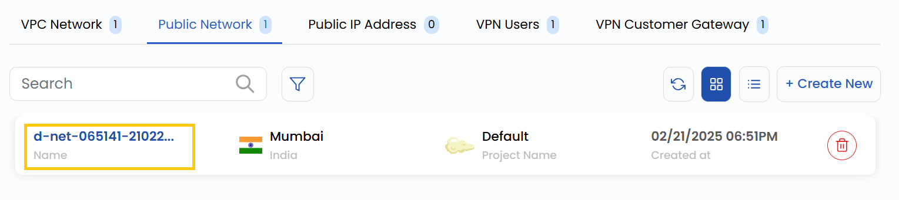
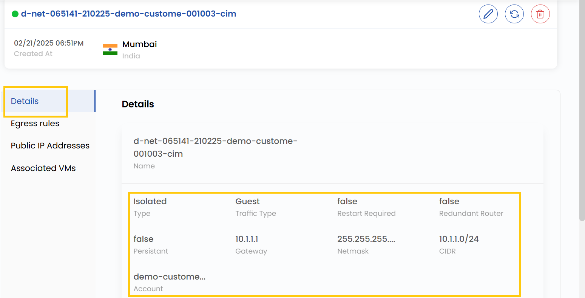

# Tarmoq sharhi

## Ommaviy tarmoq sharhi

**Ommaviy tarmoq** — bulut muhitidagi mantiqiy izolyatsiya qilingan tarmoq. U tarmoq parametrlarini boshqarish imkonini beradi: IP manzillash, quyi tarmoqlar, marshrutlash va xavfsizlik.

- Tarmoqni koʻrish uchun **Networks** ni oching va **Public Networks** boʻlimiga oʻting — bu yerda ommaviy tarmoqlar va ularning hajmi koʻrsatiladi.

- **Details** yorligʻida ommaviy tarmoq haqida batafsil maʼlumot koʻrsatiladi.

- **Public ID** — ommaviy tarmoq identifikatori.
- **Network Type** — Isolated (tashqi kirishsiz) yoki Cached (vaqtinchalik saqlashni optimallashtirish).
- **Traffic Types** — trafik turlari: Guest (foydalanuvchilar trafigi) yoki Public (internetga kirish).
- **Required Files** — tarmoq ishlashi uchun zarur fayllar.
- **Redundant Router Files** — marshrutizatorning zaxira konfiguratsiyalari.
- **Persistent Files** — qayta ishga tushirishdan keyin saqlanadigan konfiguratsiya fayllari.
- **Gateway** — tarmoqlar oʻrtasidagi kirish nuqtasi.
- **Netmask** — quyi tarmoq IP manzillari diapazonini belgilovchi niqob.
- **CIDR** — tarmoqning IP manzillar diapazoni.
- **Account** — tarmoq nomi yoki identifikatori.

### Xulosa

**Ommaviy tarmoq sharhi** uning konfiguratsiyasi haqidagi asosiy maʼlumotlarni oʻz ichiga oladi: turi, trafikka ishlov berish va asosiy parametrlar — shlyuz, niqob va CIDR. Bu tarmoqni kuzatish, boshqarish va uning samarali ishlashini taʼminlashga yordam beradi.

> [!TIP]
> **Shuningdek qarang:**
>
> - **[Ommaviy tarmoq yaratish](create-public-network.md)**
> - **[Ommaviy IP manzillar](public-ip-addresses.md)**
