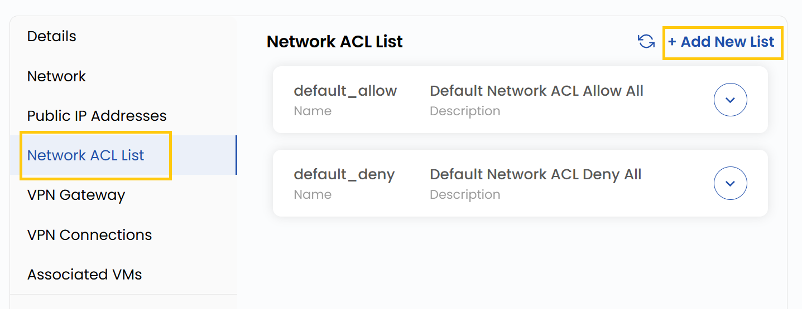

# Tarmoq ACL roʻyxati

## Tarmoq ACL roʻyxati

**Tarmoq ACL**’i (Access Control List) VPC ichidagi quyi tarmoqlarning kiruvchi va chiquvchi trafigini boshqaradigan tarmoqlararo ekran vazifasini bajaradi.

- Network ACL List yorligʻida VPC’da sozlangan barcha ACL’lar koʻrsatiladi.
- Yangi ACL yaratish uchun **Add New List** tugmasini bosing. **Name** va qoidalarning qisqacha tavsifi bilan **Description** ni kiriting.
- ACL yaratish uchun **Submit** tugmasini bosing.

### Xulosa

**Tarmoq ACL roʻyxati** VPC quyi tarmoqlarining kiruvchi va chiquvchi trafik qoidalarini markazlashgan holda boshqarish usulidir. ACL’larni yaratib va tartibga solib, siz xavfsizlikni oshirasiz va tarmoq aloqasini yaxshiroq nazorat qilasiz.

> [!TIP]
> **Shuningdek qarang:**
>
> - **[VPC tarmogʻi sharhi](network-overview.md)**
> - **[VPC tarmogʻini yaratish](create-vpc-network.md)**
> - **[VPN shlyuzi](vpn-gateway.md)**
> - **[VPN ulanishlari](vpn-connections.md)**
