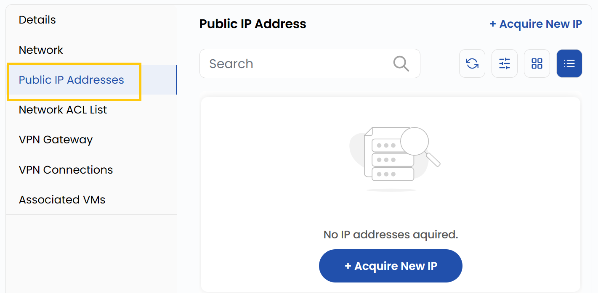
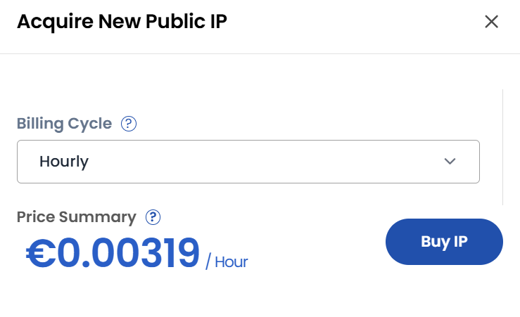

# Ommaviy IP manzil

## Ommaviy IP manzil

- Ommaviy IP manzillar VPC resurslariga internet bilan aloqa qilish imkonini beradi.
- **Public IP Addresses** yorligʻida barcha tayinlangan ommaviy IP manzillar koʻrsatiladi.

- Yangi ommaviy IP manzil soʻrash uchun **Aquire New IP** tugmasini bosing.
- Kerakli **Billing Cycle** ni tanlang va **Buy IP** tugmasini bosing.

### Xulosa

VPC’dagi **ommaviy IP manzillar** bulutli resurslarning internet bilan aloqasini taʼminlaydi. Public IP yorligʻida IP manzillarni moslashuvchan toʻlov variantlari bilan osongina olish, koʻrish va boshqarish mumkin.

> [!TIP]
> **Shuningdek qarang:**
>
> - **[VPC tarmogʻi sharhi](network-overview.md)**
> - **[VPC tarmogʻini yaratish](create-vpc-network.md)**
> - **[VPN shlyuzi](vpn-gateway.md)**
> - **[VPN ulanishlari](vpn-connections.md)**
