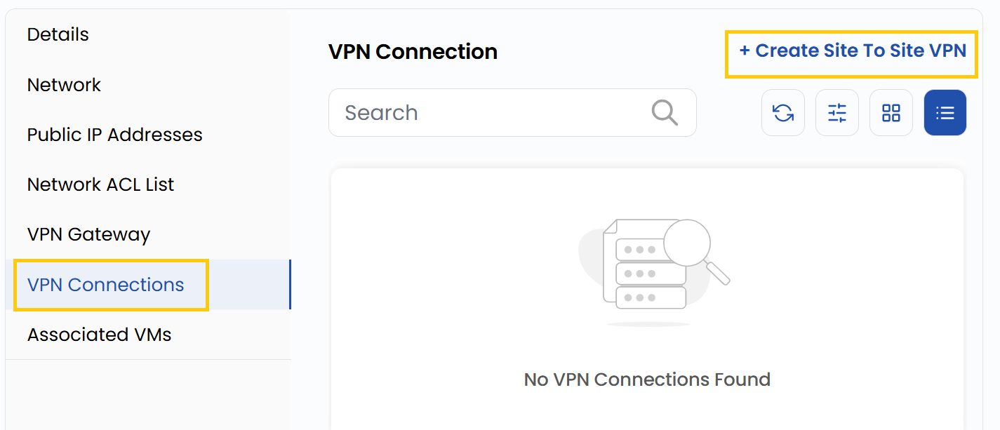
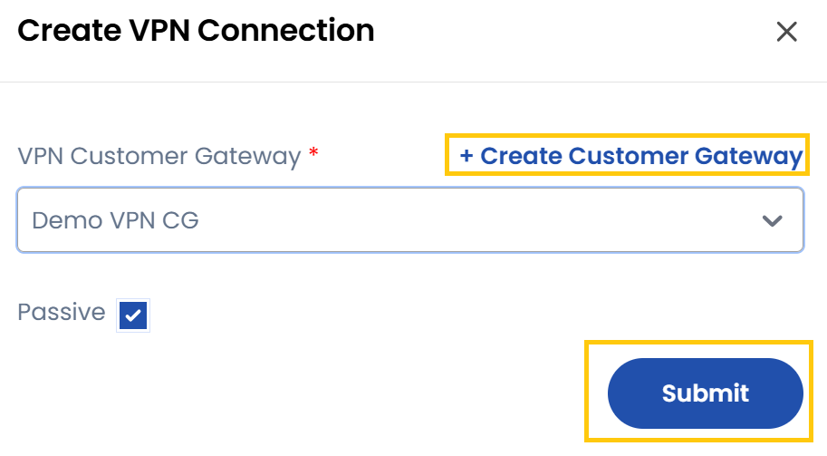

# VPN ulanishlari

## VPN ulanishlari

VPN ulanishi VPC va tashqi tarmoqlar, masalan mahalliy maʼlumotlar markazlari yoki boshqa bulutli tarmoqlar oʻrtasida himoyalangan aloqani taʼminlaydi.

- VPN ulanishlarini boshqarish uchun **VPN Connections** yorligʻiga oʻting.
- Bu yerda ikkita tarmoqni xavfsiz bogʻlaydigan site-to-site VPN ulanishini yaratish mumkin.
- **Create Site To Site VPN** tugmasini bosing.

- **VPN Customer Gateway** ni tanlang yoki yarating, kerak boʻlsa **Passive** (passiv ulanish) ni belgilang va **Submit** tugmasini bosing.

### Xulosa

**VPN ulanishlari** himoyalangan site-to-site VPN’larni sozlash va boshqarish imkonini beradi hamda VPC va tashqi tarmoqlar — maʼlumotlar markazlari yoki boshqa bulutlar oʻrtasida ishonchli aloqani taʼminlaydi.

> [!TIP]
> **Shuningdek qarang:**
>
> - **[VPC tarmogʻi sharhi](network-overview.md)**
> - **[Tarmoq ACL roʻyxati](network-acl-list.md)**
> - **[VPN shlyuzi](vpn-gateway.md)**
> - **[Mijoz VPN shlyuzi](../vpn-customer-gateway.md)**
